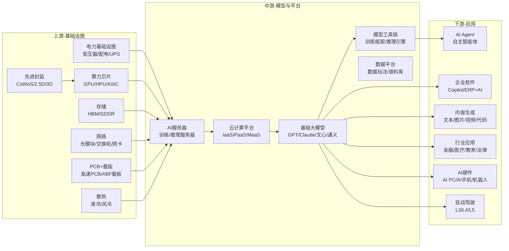
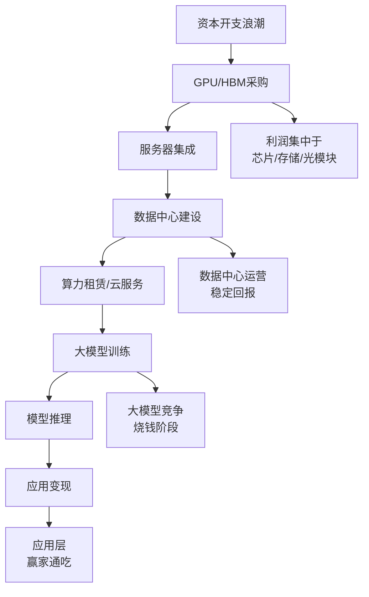
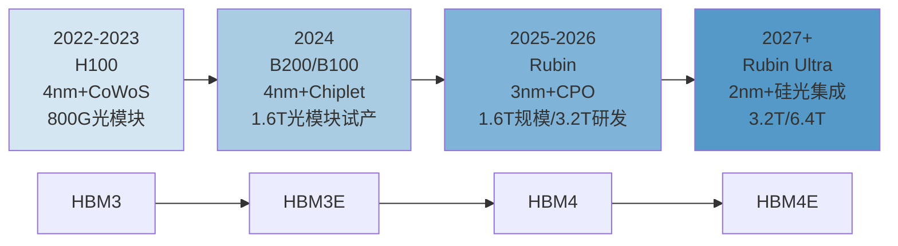

# 人工智能产业链总纲

> 产业链深度：★★★★★
> 行情属性：景气成长 + 主题驱动
> 核心驱动：技术迭代 + 资本开支 + 政策支持

## 关联节点

### 核心关联
[[A股产业研究库/03 产业链图谱/AI产业链/GPU]] | [[A股产业研究库/03 产业链图谱/AI产业链/HBM]] | [[A股产业研究库/03 产业链图谱/AI产业链/光模块]] | [[A股产业研究库/03 产业链图谱/AI产业链/PCB]] | [[A股产业研究库/03 产业链图谱/AI产业链/AI服务器]] | [[A股产业研究库/03 产业链图谱/AI产业链/数据中心]] | [[A股产业研究库/03 产业链图谱/AI产业链/液冷]] | [[A股产业研究库/03 产业链图谱/AI产业链/大模型]] | [[A股产业研究库/03 产业链图谱/AI产业链/AI Agent]]

### 交叉产业链
[[A股产业研究库/03 产业链图谱/半导体产业链/总纲|半导体产业链]] | [[A股产业研究库/03 产业链图谱/AI产业链/先进封装|先进封装]] | [[A股产业研究库/03 产业链图谱/AI产业链/交换机]] | [[A股产业研究库/03 产业链图谱/AI产业链/高速SerDes]] | [[A股产业研究库/03 产业链图谱/新能源产业链/总纲|电力基础设施]]

### 下游应用
[[A股产业研究库/03 产业链图谱/AI产业链/AI办公|AI办公]] | [[A股产业研究库/03 产业链图谱/AI产业链/AI医疗|AI医疗]] | [[A股产业研究库/03 产业链图谱/金融科技产业链/AI金融]] | [[A股产业研究库/03 产业链图谱/AI产业链/AI教育|AI教育]] | [[A股产业研究库/03 产业链图谱/AI产业链/具身智能]] | [[A股产业研究库/03 产业链图谱/机器人产业链/总纲|机器人]]

---

## 一、产业链全景图



---

## 二、价值传导链



**价值传导逻辑**: 每一轮AI投资始于基础设施资本开支（GPU/光模块/服务器），经过集成与部署后转化为算力供给，再通过模型训练与推理最终传导至应用层变现。当前（2026H1）处于推理需求超越训练需求的转折点，价值重心正从基础设施向应用端迁移。

---

## 三、利润分配格局

| 环节 | 毛利率 | 净利率 | 定价权 | 核心壁垒 | 代表公司(全球) | 代表公司(A股) |
|:----:|:------:|:------:|:------:|:---------|:--------------|:-------------|
| GPU/算力芯片 | 65-75% | 35-45% | ★★★★★ | 架构+CUDA生态+制程 | NVIDIA | 寒武纪/海光信息 |
| HBM存储 | 45-55% | 20-30% | ★★★★ | TSV先进封装+良率 | SK海力士/三星 | 华海诚科/联瑞新材 |
| 光模块 | 35-45% | 15-25% | ★★★★ | 光芯片+高速封装 | Coherent | 中际旭创/新易盛 |
| AI服务器 | 10-15% | 3-5% | ★★ | 供应链管理+客户认证 | SuperMicro/Dell | 工业富联/浪潮信息 |
| PCB/载板 | 25-35% | 10-15% | ★★★ | 工艺精度+良率 | Ibiden | 沪电股份/深南电路 |
| 液冷散热 | 25-30% | 8-12% | ★★ | 系统集成+客户验证 | Boyd | 英维克/高澜股份 |
| 数据中心运营 | 30-40% | 10-15% | ★★★ | 区位+电力合约+客户 | Equinix | 万国数据/世纪互联 |
| 大模型平台 | 50-65% | 亏损-15% | ★★★★ | 数据飞轮+算力规模 | OpenAI/Google | 百度/科大讯飞 |
| AI应用软件 | 60-80% | 10-25% | ★★★ | 场景理解+数据积累 | Microsoft/Salesforce | 金山办公/同花顺 |

**数据来源**：各公司2024年年报，巨潮资讯网 www.cninfo.com.cn；Gartner/IDC相关报告

**核心观察**: 产业链利润呈"哑铃型"分布——上游芯片和下游应用软件利润率最高，中游制造集成环节利润率最低。这与智能手机产业链的结构高度相似。

---

## 四、市场规模

| 细分市场 | 2025E 全球规模 | 同比增速 | 2028E 预测 | CAGR(2025-2028) |
|:--------:|:-------------:|:--------:|:----------:|:--------------:|
| GPU/AI芯片 | 1200亿美元 | +45% | 2500亿美元 | 28% |
| HBM | 350亿美元 | +60% | 800亿美元 | 32% |
| AI服务器 | 1800亿美元 | +55% | 3200亿美元 | 21% |
| 光模块(数通) | 200亿美元 | +40% | 450亿美元 | 31% |
| 数据中心建设 | 800亿美元 | +25% | 1400亿美元 | 20% |
| 大模型API/云 | 500亿美元 | +80% | 2000亿美元 | 59% |
| AI应用软件 | 600亿美元 | +70% | 2500亿美元 | 61% |
| AI终端硬件 | 300亿美元 | +90% | 1200亿美元 | 59% |

**数据来源**: Gartner、IDC、LightCounting、各公司财报综合估算

---

## 五、技术演进路线



**关键节点**:
- **2024**: B200发布，1.6T光模块开始出货，HBM3E量产，液冷成为标配
- **2025**: Rubin架构发布，CPO（共封装光学）进入导入期，HBM4研发，推理算力需求首次超过训练
- **2026**: Rubin规模部署，1.6T全面放量，3.2T光模块样品，先进封装产能大扩张
- **2027+**: 2nm制程GPU量产，硅光集成成为主流，AI芯片进入"万卡集群"时代

---

## 六、行情三阶段复盘

### 第一阶段（2023-2024）：基础设施先行

**驱动因子**: OpenAI大模型引发全球AI投资竞赛，北美四大云厂商Capex指引连续上调

**行情节奏**:
1. **2023年1-6月**: 光模块最先受益（中际旭创10倍涨幅），逻辑是"算力基建必然拉动光互联需求"
2. **2023年7-12月**: 扩散至PCB/服务器/液冷，沪电股份/工业富联接力上涨
3. **2024年1-6月**: HBM和先进封装成为主线，华海诚科/联瑞新材走强
4. **2024年7-12月**: 应用端开始预热，金山办公/同花顺启动，但主旋律仍是算力

**关键变量**: 英伟达数据中心收入连续6个季度超预期；HBM供不应致价格持续上涨

### 第二阶段（2025）：应用起势

**驱动因子**: AI Agent（Manus/GPT-4o等）引爆生产力场景；DeepSeek等中国模型追赶拉低应用成本

**行情节奏**:
1. **AI Agent概念爆发**: 底层工程化平台（恒生电子/用友网络）最先受益
2. **AI金融/医疗/教育细分**: 同花顺问财/卫宁健康AI辅助诊断/科大讯飞教育大模型
3. **AI硬件终端的出现**: AI PC/AI手机换机预期，消费电子产业链激活
4. **端侧AI芯片**: 瑞芯微/全志科技等SoC公司大涨

**关键变量**: 推理成本下降90%；国内大模型能力接近GPT-4水平；智能体商业化落地

### 第三阶段（2026至今）：产业深化

**驱动因子**: 推理算力需求超越训练端，国产替代全面加速，AI应用收入进入可验证阶段

**行情节奏**:
1. **推理芯片国产替代**: 寒武纪思元系列大规模出货，海光信息深算系列突破
2. **算力基建迭代升级**: 1.6T光模块放量，液冷渗透率突破50%，CPO导入
3. **AI应用收入兑现**: 金山办公AI订阅收入占比超20%，同花顺问财MAU爆发
4. **AI与实体产业融合**: AI+制造业/AI+军工/AI+医药成为新主线

**关键变量**: 国内AI芯片差距从3-4年缩短到1-2年；AI应用付费用户规模化

---

## 七、资金传导路径

```
全球风险投资/产业资本
        │
        ▼
北美云厂商Capex ──────→ 英伟达/AMD ──→ 台积电CoWoS产能
        │                      │
        ▼                      ▼
  光模块/PCB/服务器        HBM/先进封装
        │                      │
        ▼                      ▼
  数据中心建设 ──────→ 液冷/电力基础设施
        │
        ▼
  中国算力基建（自主可控）
        │
   ┌────┴────┐
   ▼         ▼
AI芯片国产   AI服务器
        │
        ▼
   大模型创业/云厂商MaaS
        │
        ▼
   AI应用/AI Agent/AI终端
```

**A股资金轮动规律**:

```
第一阶段: 光模块 → PCB → 服务器(液冷) → 数据中心
第二阶段: 大模型 → AI应用 → AI终端
第三阶段: 国产AI芯片 → 推理芯片 → AI+垂直行业
```

---

## 八、A股全映射表

### 8.1 算力基础设施

| 产业链环节 | 分类 | 核心公司 | 投资逻辑 | 关注时点 |
|:----------:|:----:|:---------|:---------|:--------:|
| GPU(国产) | 龙头 | 寒武纪 | 思元系列大规模出货，推理芯片市占率持续提升 | 2026H1 |
| GPU(国产) | 核心 | 海光信息 | 深算系列性能接近A100，信创+运营商集采 | 2026H1 |
| GPU(国产) | 弹性 | 景嘉微 | 军用GPU向民用延伸，国产替代概念 | 2026H2 |
| HBM材料 | 龙头 | 华海诚科 | EMC材料供应HBM封装 | 2025H2 |
| HBM材料 | 核心 | 联瑞新材 | 球硅/球铝填料，受益先进封装放量 | 2025H2 |
| HBM设备 | 弹性 | 雅克科技 | 前驱体/SOD材料，SK海力士供应链 | 2026H1 |
| 光模块 | 龙头 | 中际旭创 | 全球800G/1.6T光模块出货量第一，英伟达主供 | 持续 |
| 光模块 | 核心 | 新易盛 | 400G/800G光模块快速放量，客户谷歌+英伟达 | 持续 |
| 光模块 | 核心 | 天孚通信 | FA/MT/AWG无源器件龙头，下游绑定中际旭创 | 持续 |
| 光模块 | 弹性 | 光迅科技 | 国内光芯片自主+光模块，国产替代逻辑 | 2026H1 |
| 高速PCB | 龙头 | 沪电股份 | AI服务器高多层板主力供应商，英伟达HDI路线 | 持续 |
| 高速PCB | 核心 | 深南电路 | 封装基板突破，FC-BGA载板国产化 | 持续 |
| 高速PCB | 核心 | 兴森科技 | ABF载板客户验证通过，BT载板稳定 | 2025H2 |
| PCB | 弹性 | 胜宏科技 | AI服务器/GPU加速卡HDI板放量 | 2026H1 |
| AI服务器 | 龙头 | 工业富联 | 英伟达HGX/GB200主力代工，液冷方案领先 | 持续 |
| AI服务器 | 核心 | 浪潮信息 | 国内AI服务器市占率第一，昇腾生态 | 持续 |
| AI服务器 | 核心 | 中科曙光 | 超算+AI服务器，海光深度绑定 | 持续 |
| AI服务器 | 弹性 | 紫光股份 | 新华三集团AI服务器，运营商集采 | 2026H1 |
| 液冷 | 龙头 | 英维克 | 数据中心液冷全栈方案，客户覆盖头部云厂商 | 持续 |
| 液冷 | 核心 | 高澜股份 | 冷板式液冷，服务器级液冷模块 | 2025H2 |
| 液冷 | 弹性 | 申菱环境 | 数据中心精密空调+液冷，华为合作 | 2026H1 |
| 交换机 | 核心 | 锐捷网络 | 数据中心交换机，400G/800G产品导入 | 2025H2 |
| 交换机 | 弹性 | 菲菱科思 | 白牌交换机ODM，受益AI网络升级 | 2026H1 |

### 8.2 数据中心与基础设施

| 产业链环节 | 分类 | 核心公司 | 投资逻辑 |
|:----------:|:----:|:---------|:---------|
| 数据中心 | 龙头 | 万国数据 | A股/港股算力租赁龙头，一线城市IDC资源 |
| 数据中心 | 核心 | 世纪互联 | 第三方数据中心，受益AI算力租赁需求 |
| 数据中心 | 核心 | 光环新网 | 北京核心区位数据中心，AWS合作 |
| 数据中心 | 弹性 | 奥飞数据 | 一线数据中心建设，算力调度概念 |
| 变压器 | 核心 | 金盘科技 | AI数据中心变压器供应商，北美出口 |
| 变压器 | 弹性 | 伊戈尔 | 服务器电源用变压器，受益数据中心建设 |
| UPS电源 | 核心 | 科华数据 | 数据中心UPS+液冷，算力基础设施概念 |

### 8.3 大模型与平台

| 产业链环节 | 分类 | 核心公司 | 投资逻辑 |
|:----------:|:----:|:---------|:---------|
| 大模型 | 第一梯队 | 百度(港股) | 文心大模型4.0，MaaS平台商业化 |
| 大模型 | 核心 | 科大讯飞 | 星火大模型+教育/医疗场景，估值重估 |
| 大模型 | 弹性 | 三六零 | AI大模型+浏览器场景，安全AI概念 |
| 大模型 | 弹性 | 拓尔思 | 行业大模型（政务/媒体），数据资产驱动 |

### 8.4 AI应用

| 细分方向 | 分类 | 核心公司 | 投资逻辑 |
|:--------:|:----:|:---------|:---------|
| AI办公 | 龙头 | 金山办公 | WPS AI订阅用户渗透率快速提升，ARPU翻倍 |
| AI办公 | 弹性 | 万兴科技 | 视频创意AIGC产品，出海概念 |
| AI金融 | 龙头 | 同花顺 | 问财AI投顾MAU爆发，AI金融数据入口 |
| AI金融 | 核心 | 恒生电子 | AI智能投研+量化平台，金融IT底座 |
| AI金融 | 弹性 | 东方财富 | 东方财富AI研报，金融数据+流量入口 |
| AI医疗 | 核心 | 卫宁健康 | AI辅助诊断/病历质控，医疗信息化龙头 |
| AI医疗 | 弹性 | 创业慧康 | 医疗AI大模型，公共卫生场景 |
| AI教育 | 龙头 | 科大讯飞 | 星火大模型赋能教育，AI学习机 |
| AI教育 | 核心 | 视源股份 | 交互智能平板+AI教学助手 |
| AI营销 | 核心 | 蓝色光标 | AIGC内容营销，出海AI广告 |
| AI营销 | 弹性 | 三人行 | 多模态AI创意生成，客户互联网大厂 |
| AI设计 | 弹性 | 广联达 | AI+BIM建筑设计，施工图智能生成 |
| AI编程 | 弹性 | 普联软件 | AI低代码/编程助手，政企数字化 |
| AI耳机 | 弹性 | 漫步者 | AI语音助手+耳机硬件 |
| AI眼镜 | 弹性 | 歌尔股份 | VR/AR+AI眼镜整机代工 |

---

## 九、核心结论

1. **长期主线明确**: AI是未来十年最大的产业变革，从"算力基建"到"应用落地"到"端侧爆发"的演进路径清晰。每一轮基础设施迭代（H100→B200→Rubin）都创造新的投资机会。

2. **投资节奏把握**: 算力先行→应用跟上→推理爆发→算力再次升级，螺旋上升。当前正处于从算力主导向应用主导切换的拐点期，性价比在向应用端倾斜。

3. **利润分层结构**: 产业链超额利润集中在两个端——上游芯片（GPU/HBM/光芯片）壁垒最高利润率最高，下游应用软件（AI SaaS）毛利率最高但竞争格局未定。中游集成制造利润率最低。

4. **国产替代主线**: AI芯片（寒武纪/海光）、先进封装材料（华海诚科/联瑞新材）、高速PCB（沪电股份/深南电路）、光模块（中际旭创）是A股AI产业链最核心的投资方向。国产推理芯片在2026-2027年有望实现从"可用"到"好用"的跨越。

5. **风险关注**: 英伟达技术路线若发生大的变化（如CPO/Chiplet架构重大调整）可能重构供应链格局；美国对华AI芯片出口管制持续升级是最大不确定性；大模型应用商业化的变现节奏可能低于市场预期，导致估值泡沫局部破裂。

---

## 十、关键跟踪指标

| 指标 | 当前状态 | 重要性 | 更新频率 |
|:----|:---------|:------:|:--------:|
| 北美四大云厂商Capex | 2026E资本开支合计突破3500亿美元 | ★★★★★ | 季度 |
| 英伟达数据中心收入 | 连续8个季度超预期，FY26Q1收入360亿美元 | ★★★★★ | 季度 |
| 1.6T光模块出货量 | 2026H1开始大规模放量 | ★★★★ | 月度 |
| HBM3E/HBM4渗透率 | HBM3E已量产，HBM4预计2026H2 | ★★★★ | 季度 |
| 国内AI芯片出货量 | 寒武纪思元590大规模出货 | ★★★★ | 季度 |
| AI应用活跃用户 | 金山办公AI付费用户超300万 | ★★★ | 月度 |
| 推理/训练算力比 | 推理算力占比首次超过50% | ★★★★★ | 季度 |

**数据来源**：各公司财报/行业研究报告综合整理

---

## 主要风险

1. **技术迭代风险**：GPU架构代际升级加速，落后一代即面临市场份额大幅下滑
2. **供应链集中风险**：先进制程/CoWoS/HBM产能高度集中于台积电/SK海力士
3. **地缘政治风险**：美国对华AI芯片出口管制可能进一步升级
4. **估值泡沫风险**：AI算力板块估值处于历史高位，业绩不及预期将面临戴维斯双杀
5. **需求波动风险**：云厂商Capex增速放缓可能导致订单低于预期
## 政策法规

### 中美AI博弈：芯片出口管制体系

| 管制措施 | 时间 | 核心内容 | 对AI产业链的影响 |
|:---------|:----|:---------|:----------------|
| BIS出口管制(2022.10) | 2022年10月 | 禁止向中国出口高端AI芯片(NVIDIA A100/H100)和超算芯片；限制半导体设备出口 | 国内AI训练被迫转向国产芯片（寒武纪/海光），英伟达推出阉割版A800/H800 |
| BIS升级版(2023.10) | 2023年10月 | 扩大管制范围：限制更多AI芯片(包括阉割版A800/H800)、14nm以下半导体设备、先进封装设备、HBM | 国产AI芯片加速替代窗口打开，寒武纪思元系列/海光深算系列获得发展机遇 |
| BIS"长臂管辖"扩展(2024) | 2024年 | 限制面向中国AI芯片集成的服务器出口；限制AI模型权重参数的跨境转移；扩大"最终用户"审查范围 | 影响中国获取海外AI算力的间接渠道（如通过东南亚/中东采购），加速算力全链自主化 |
| 实体清单演变 | 持续更新 | 华为/中芯国际/海光/寒武纪等1000+中国实体被列入 | 被列入实体清单的企业必须停止使用美国EDA/设备/技术，被迫走完全自主化路线 |

**管制对AI产业的三层影响**:
- **算力层**: 高端AI芯片进口受限→国产AI芯片迫切换代（寒武纪/海光/景嘉微等加速追赶）
- **工具层**: EDA工具受限→国产EDA（华大九天/概伦电子）替代加速
- **制程层**: 先进制程代工受限→中国AI芯片被迫使用成熟制程+先进封装（Chiplet方案）缩小性能差距

### 美国AI芯片出口管制"全谱系"梳理

| 管制类别 | 具体内容 | 中国AI产业应对 |
|:---------|:---------|:--------------|
| AI芯片(算力>一定阈值) | 禁止出口TPP(总处理性能)超阈值的AI芯片 | 国产AI芯片（寒武纪思元590/海光深算）追赶 |
| 半导体制造设备 | 14nm以下逻辑、128层以上NAND受限 | 中芯国际N+1/N+2工艺推进 |
| 先进封装 | CoWoS/2.5D封装设备受限 | 长电科技/通富微电自主先进封装 |
| HBM(高带宽存储) | HBM2E/HBM3/HBM4受限 | 国内HBM处于研发早期，短期受制约 |
| EDA软件 | 先进制程EDA受限 | 华大九天/概伦电子国产EDA |
| AI模型参数 | 限制模型权重/参数的跨境转移 | 国内大模型自主训练 |
| 云算力服务 | 限制通过云服务获取受限AI算力 | 国产算力云（百度云/华为云/阿里云） |

### 中国AI立法与监管

| 法规/文件 | 时间 | 核心内容 | 影响 |
|:---------|:----|:---------|:-----|
| [生成式人工智能服务管理暂行办法](https://www.cac.gov.cn/2023-07/13/c_1690898327029107.htm)(生成式AI管理办法) | 2023年8月施行 | 生成式AI服务需备案，内容需合规（不得生成违法有害信息），算法需公平透明 | 国内大模型备案制管理，已备案的模型（文心/通义/星火等）获得合法性，有利于市场化推广；但生成内容需合规增加了运营成本 |
| 互联网信息服务算法推荐管理规定 | 2022年3月施行 | 算法推荐需透明、可解释、用户可关闭 | 影响AI推荐系统的信息茧房/大数据杀熟问题 |
| 人工智能法(草案/征求意见中) | 2025-2026年 | 中国首部AI综合立法，覆盖AI研发/应用/治理全链条 | AI行业监管从"碎片化"走向"体系化"，预计将设AI安全审查制度 |
| AI安全治理框架 | 2025年发布 | 安全风险等级分类（不可接受风险/高风险/有限风险/极低风险） | 高风险AI应用（人脸识别/深度合成/自动驾驶）需通过安全评估 |
| 大模型备案制度 | 2023年8月起实施 | 大模型上线前需通过备案审核 | 已备案大模型超200个，未备案模型不得对公众提供服务 |
| AI训练数据合规指引 | 2025年 | 要求AI训练数据来源合法、不侵犯知识产权、不涉及非法信息 | 约束AI公司使用爬虫数据训练，利好有合规数据源的训练数据公司（海天瑞声） |

### 算力基建政策

| 政策 | 时间 | 核心内容 | 影响 |
|:-----|:----|:---------|:-----|
| 东数西算工程 | 2022年2月启动 | 在京津冀/长三角/粤港澳/成渝/内蒙古/贵州/甘肃/宁夏建设8个国家算力枢纽 | 西部地区算力中心建设规模化展开，利好IDC（光环新网/奥飞数据）、液冷（英维克/高澜）、光模块（中际旭创） |
| 各地算力补贴政策 | 2023-2025年密集出台 | 北京/上海/深圳/杭州/成都等城市对企业采购AI算力提供30-50%补贴 | 大幅降低中小企业AI训练成本，加速AI应用落地速度 |
| [算力基础设施高质量发展行动计划](https://www.gov.cn) | 2023年10月 | 到2025年算力规模超300EFLOPS，智能算力占比35% | 推动地方政府和运营商加速建设AI算力中心 |
| 智算中心建设规划 | 2024-2026年 | 各地规划超100座智算中心，总投资规模超5000亿元 | 智算中心建设周期短（6-12个月），对AI服务器/GPU/光模块需求集中释放 |
| 算力互联互通政策 | 2025年 | 推动国家算力网建设，实现各地算力资源统一调度 | 利好算力调度平台（中科曙光/并行科技），提升算力资源利用率 |

### 数据跨境流动规则

| 法规 | 时间 | 内容 | 对AI影响 |
|:-----|:----|:------|:---------|
| 数据出境安全评估办法 | 2022年9月 | 重要数据和个人信息出境需通过安全评估 | 影响跨国AI公司的数据跨境训练和模型部署 |
| 促进和规范数据跨境流动规定 | 2024年3月 | 对非敏感数据出境简化流程，对跨境AI训练数据给予"豁免清单" | 一定程度上便利了AI训练数据跨境流动，但重要数据出境仍需评估 |
| 自贸区数据跨境流动"负面清单" | 2024年起试点 | 自贸区内实施数据跨境流动负面清单管理 | 上海/北京/海南自贸区的AI企业数据跨境流动便利化 |

### AI伦理与安全政策

| 政策/倡议 | 时间 | 内容 | 影响 |
|:---------|:----|:------|:-----|
| 新一代人工智能伦理规范 | 2021年 | 提出AI伦理六项原则（人类福祉/公平公正/隐私保护等） | 奠定中国AI伦理治理框架基础 |
| 全球AI治理倡议 | 2023年 | 中国提出的AI治理"五条原则"（发展/安全/公平/包容/合作） | 中美欧在AI治理领域的话语权竞争 |
| AI安全风险测试与评估 | 2025年 | 要求大模型上线前进行安全测试（对抗测试/鲁棒性测试） | 增加大模型上市成本，利好AI安全厂商 |
| AI内容标识(水印)制度 | 2024-2025年 | AI生成内容必须添加标识（文字/图片/视频水印） | 利好AI内容安全/溯源技术厂商 |

---

## 舆论风向

### "AGI泡沫"vs"产业革命"的大辩论

**泡沫论（知名学者/基金经理/技术怀疑派）**:
- AI当前估值已经超过2000年的互联网泡沫：英伟达PE 80-100倍，即便业绩高增长也透支了未来3-5年的预期
- AI目前的核心应用场景（代码生成/内容生成/搜索增强）尚未创造出匹配其投资规模的商业价值，AI独角兽公司普遍亏损
- 大模型"炼金术"的本质是统计模式匹配而非真正理解，AGI路径不清晰，Scaling Law可能面临天花板（数据耗尽/算力成本极限）

**革命论（科技巨头/风险资本/AI研究员）**:
- AI是"通用技术"（蒸汽机/电力/互联网级别的变革），当前估值反映的是未来10年的产业变革价值，而非短期业绩
- AI的商业化正在加速：企业级AI Copilot（微软/金山）付费用户快速增长，代码生成（GitHub Copilot/Devin）正在改变软件开发效率
- 从PC互联网（15年）到移动互联网（5年）到AI（2年），技术渗透速度越来越快，用传统估值框架评估AI是刻舟求剑

### 大模型"百模大战"的烧钱争议

**质疑派（产业观察/长期投资者）**:
- 中国有200+个大模型，但真正能用的不超过10个，大量重复建设造成巨大的资源浪费
- 大模型训练一次成本数千万到数亿元人民币，推理成本对于规模化落地也居高不下，商业模式远未跑通
- "百模大战"的终局一定是90%的公司倒闭或被收购，类似2010年的"百团大战"和2016年"百播大战"
- 大模型创业公司估值虚高，一级市场已经出现"估值倒挂"（C轮估值低于B轮），融资环境趋冷

**辩护派（AI创业者/投资机构）**:
- 大模型是AI时代的基础设施，"百模大战"是市场竞争的必然过程，胜出的公司（大概率3-5家）将获得垄断性回报
- 开源模型（LLaMA/DeepSeek/千问）大幅降低了AI应用的门槛，真正的价值创造在应用层而非基础模型层
- AI投资是"投入期长但退出回报极大"的赛道，对标亚马逊/谷歌在2000年互联网泡沫后的表现

### AI替代人类工作的焦虑与机会

**焦虑叙事（主流媒体/白领社区）**:
- AI替代白领工作的速度远超预期：客服/翻译/插画/初级编程/法务/会计助理已大量被AI取代
- 大模型+AI Agent的进步意味着不仅是"替代重复劳动"，更在替代"初级分析决策"——初级分析师/记者/设计师面临失业风险
- 中国就业市场本身已经承压（青年失业率偏高），AI加速替代可能加剧就业矛盾和社会不稳定

**适应论（经济学家/AI研究者）**:
- AI替代的不是"工作"而是"任务"——历史上每次技术革命都是消灭某些岗位同时创造新岗位
- AI时代的新岗位：AI训练师/提示工程师/AI伦理师/数据标注师/人机协作专家
- 中国的人口结构（老龄化加剧+劳动力减少）反而需要AI来弥补劳动力缺口，而非单纯替代

### DeepSeek开源引发的中美AI差距讨论

**追赶派（国内科技媒体/政策研究）**:
- DeepSeek-V2/R1的开源表现证明中国大模型能力已接近GPT-4水平（在一些基准测试上甚至超过），中美AI差距从3-4年缩短到6-12个月
- DeepSeek的MoE架构创新证明中国在AI工程化（模型压缩/推理效率/成本优化）方面有独特优势
- 开源模式帮助中国AI快速构建生态，DeepSeek+千问+百川+GLM形成开源阵营，对抗OpenAI的闭源霸权

**谨慎派（产业界/海外分析师）**:
- 中国大模型与GPT-4o/Claude 4的差距在"场景能力"而非"基准测试"——在复杂推理/多模态理解/长文本生成方面仍有明显差距
- 美国AI的优势是"算力生态+人才密度+资本市场"三位一体，中国在算力受限（芯片管制）和人才流失（AI人才赴美）两个核心要素上处于劣势
- DeepSeek的成功不能代表整体——仅少数头部公司接近前沿，大多数中国AI公司（包括大厂）与OpenAI的差距仍然很大

### A股AI概念股"估值透支"的预警声音

**看空逻辑（价值投资者/雪球大V）**:
- A股AI概念股（寒武纪/海光/中际旭创/天孚通信）PE普遍在50-200倍，PS普遍在10-30倍，已经充分定价了未来3年的高增长
- 很多AI概念公司实质与AI关系不大（"贴AI标签"蹭概念的超过50%），如果AI订单和业绩不能兑现估值将面临大幅回调
- 2023-2025年A股AI板块上涨幅度（光模块10倍/寒武纪5倍/沪电5倍）已超过基本面改善幅度，技术性调整压力大

**看多逻辑（趋势投资者/主题基金）**:
- AI是A股未来3-5年最确定的主线，每一次回调都是上车机会
- 光模块/PCB/液冷等环节的业绩确定性高（中际旭创2025年净利润增长50%+），估值有业绩支撑
- AI国产替代（寒武纪/海光信息）的市值空间对标英伟达，还有10倍以上的增长空间

## 参考资料

[1] 相关A股公司（如适用）. 2024年年度报告[R]. 巨潮资讯网.
    http://www.cninfo.com.cn

[2] IDC. 中国加速计算市场跟踪报告[R]. 2025.
    https://www.idc.com

[3] NVIDIA Corporation. FY2025 10-K[R]. SEC.
    https://www.sec.gov

[4] TrendForce集邦咨询. AI服务器与GPU市场展望[R]. 2025.
    https://www.trendforce.com
