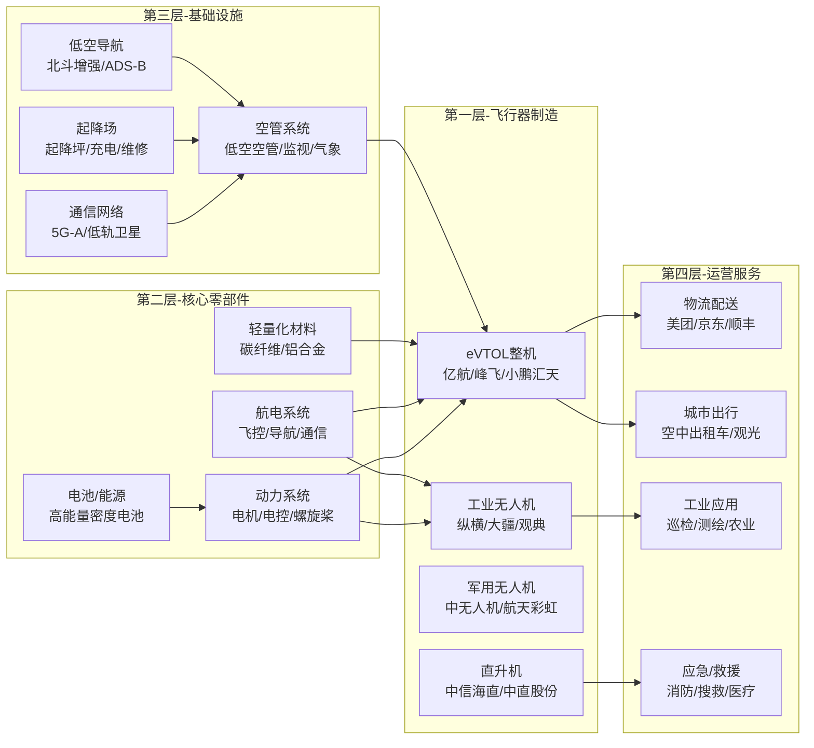
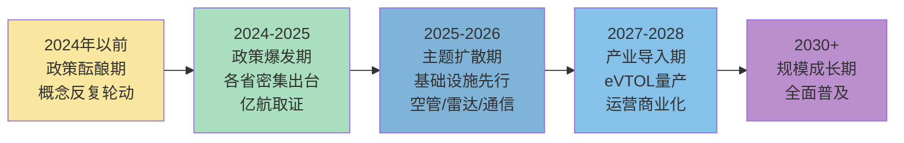

# 低空经济产业链总纲

> 产业链深度：★★★★
> 行情属性：主题驱动（政策催化）+ 成长早期
> 核心驱动：政策开放 + 技术成熟 + 场景落地
> 当前阶段：政策驱动→产业落地的过渡期，主题投资属性强

## 关联概念

- 细分赛道:: [[A股产业研究库/03 产业链图谱/低空经济产业链/eVTOL]]
- 细分赛道:: [[A股产业研究库/03 产业链图谱/低空经济产业链/无人机]]
- 基础设施:: [[A股产业研究库/03 产业链图谱/低空经济产业链/空管与基础设施]]
- 应用层:: [[A股产业研究库/03 产业链图谱/低空经济产业链/低空运营]]
- 配套通信:: [[A股产业研究库/03 产业链图谱/低空经济产业链/低空通信]]
- 关联产业:: [[A股产业研究库/03 产业链图谱/军工产业链/总纲|军工产业链]]
- 关联产业:: [[A股产业研究库/03 产业链图谱/新能源汽车产业链/总纲|新能源汽车]]
- 核心技术:: [[A股产业研究库/03 产业链图谱/AI产业链/总纲|AI产业链]]
- 关联产业:: [[A股产业研究库/03 产业链图谱/机器人产业链/总纲|机器人]]

---

## 一、四层全景图

---

## 二、三大子领域

### 2.1 eVTOL（电动垂直起降飞行器）

**行业定位**: 低空经济的核心载体，被称为"飞行汽车"。2024年被称为"eVTOL元年"。

**产业化进度**:
- 亿航智能（EHang）EH216-S已获中国民航局TC证（2023年10月），全球首张
- 峰飞航空（AutoFlight）V2000CG获TC证（2024年3月），货运型
- 沃飞长空（吉利系）AE200适航取证推进中
- 小鹏汇天飞行汽车X3预计2025-2026年量产交付

**核心零部件价值量分布**:

| 零部件 | 价值量占比 | 技术壁垒 | A股标的 |
|:------|:---------:|:--------:|:--------|
| 电机/电驱系统 | 20-25% | ★★★★ | 卧龙电驱、英博尔 |
| 飞控系统 | 15-20% | ★★★★★ | 暂无纯正标的 |
| 航电系统 | 10-15% | ★★★★ | — |
| 电池包 | 10-15% | ★★★ | 宁德时代、亿纬锂能 |
| 结构件/复材 | 10-15% | ★★★ | 光威复材、中复神鹰 |
| 通讯/导航 | 5-10% | ★★★★ | 海格通信、北斗星通 |

**数据来源**：各公司2024年年报，巨潮资讯网 www.cninfo.com.cn；中国民航局；中国低空经济产业联盟

### 2.2 工业无人机

**行业定位**: 低空经济中商业化最成熟的领域，物流/巡检/测绘/农业等场景已实现规模化。

**A股映射**:

| 细分 | 核心公司 | 投资逻辑 |
|:----|:---------|:---------|
| 工业无人机整机 | 纵横股份 | 固定翼/复合翼无人机，电力巡检+物流 |
| 工业无人机整机 | 观典防务 | 禁毒无人机+低空防务 |
| 军用无人机 | 中无人机 | 翼龙系列，军贸+国内列装 |
| 军用无人机 | 航天彩虹 | 彩虹系列，军贸出口 |
| 无人机发动机 | 宗申动力 | 小型航空发动机，工业/军用无人机 |
| 物流无人机 | 顺丰控股 | 丰翼科技无人机配送 |
| 农业植保 | 大疆(未上市) | 全球农业无人机龙头 |

### 2.3 空管与基础设施

**行业定位**: 低空空域开放的"钥匙"，基础设施先行是低空经济的前提。当前投资热度最高、政策催化最密集的环节。

**A股映射**:

| 细分 | 核心公司 | 投资逻辑 |
|:----|:---------|:---------|
| 空管系统 | 莱斯信息 | 低空空管龙头，军民融合平台 |
| 空管系统 | 川大智胜 | 空管仿真+低空空管系统 |
| 空管系统 | 四创电子 | 空管雷达/监视系统 |
| 雷达探测 | 纳睿雷达 | 相控阵气象雷达，低空探测 |
| 通信设备 | 海格通信 | 低空通信+北斗导航 |
| 北斗导航 | 北斗星通 | 北斗高精度定位芯片 |
| 基础设施规划 | 深城交 | 低空经济规划+起降场设计 |
| 低空空域管理 | 中科星图 | 数字地球+低空空域数字底座 |

---

## 三、当前投资阶段判断

**当前（2026H1）处于"主题扩散期→产业导入期"过渡阶段**。

投资主线从"政策催化"切换为"基础设施落地+产业链订单验证"。空管/雷达/通信等基础设施环节作为低空经济的"先导"细分，订单确定性最强。eVTOL整机企业仍处于适航取证和试飞阶段，业绩兑现还需1-2年。

---

## 四、A股全映射表

### 4.1 主机厂/eVTOL相关

| 公司 | 概念类型 | 纯正度 | 投资逻辑 |
|:----|:--------|:------:|:---------|
| 亿航智能(美股) | eVTOL整机 | ★★★★★ | 全球首张TC证，先发优势明显 |
| 小鹏汽车(港股) | eVTOL整机 | ★★★★ | 小鹏汇天飞行汽车，汽车渠道 |
| 万丰奥威 | eVTOL合作 | ★★★ | 与Volocopter合作，钻石飞机 |
| 纵横股份 | 工业无人机 | ★★★★★ | A股最纯正工业无人机标的 |
| 观典防务 | 无人机+防务 | ★★★★ | 禁毒无人机细分龙头 |
| 中无人机 | 军用无人机 | ★★★★★ | 翼龙系列，军贸龙头 |
| 航天彩虹 | 军用无人机 | ★★★★★ | 彩虹系列，全球市场 |

### 4.2 供应链（零部件/材料）

| 公司 | 供应品类 | 投资逻辑 |
|:----|:---------|:---------|
| 卧龙电驱 | 电机/电驱 | 电动航空电机，eVTOL+无人机 |
| 英搏尔 | 电控 | eVTOL电控系统 |
| 宁德时代 | 电池 | 凝聚态电池能量密度500Wh/kg |
| 亿纬锂能 | 电池 | 大圆柱电池，eVTOL标准 |
| 光威复材 | 碳纤维复材 | 无人机/eVTOL结构件 |
| 中复神鹰 | 碳纤维 | 高性能碳纤维 |
| 中航高科 | 航空复材 | 军民用航空复材，低空经济 |

### 4.3 基础设施

| 公司 | 细分类别 | 投资逻辑 |
|:----|:---------|:---------|
| 莱斯信息 | 空管系统 | 低空空管龙头，受益空域开放 |
| 川大智胜 | 空管+仿真 | 低空空管系统+训练仿真 |
| 四创电子 | 空管雷达 | 空管一次/二次雷达 |
| 纳睿雷达 | 气象雷达 | 相控阵气象雷达，低空安全 |
| 海格通信 | 通信+导航 | 低空通信+北斗，军工底子 |
| 北斗星通 | 北斗芯片 | 高精度定位，低空导航 |
| 深城交 | 规划设计 | 低空起降场规划+设计 |
| 中科星图 | 空域数字底座 | GEOVIS数字地球，低空管理 |
| 海特高新 | 低空模拟 | 飞行模拟器+航空培训 |

### 4.4 运营服务

| 公司 | 运营类型 | 纯正度 | 投资逻辑 |
|:----|:---------|:------:|:---------|
| 中信海直 | 直升机通航 | ★★★★★ | 中国最大通航运营商，eVTOL运营预备 |
| 观典防务 | 无人机巡检 | ★★★★ | 禁毒+工业巡检服务 |
| 华测检测 | 低空检测 | ★★★ | 低空飞行器检测认证 |
| 顺丰控股 | 物流配送 | ★★★ | 丰翼无人机，末端配送 |

---

## 五、核心结论

1. **基础设施先行，确定性最高**: 低空经济的核心瓶颈不是飞行器而是空域管理。空管系统（莱斯信息）、雷达（纳睿雷达/四创电子）、通信（海格通信）是低空经济最早兑现订单的环节。

2. **eVTOL产业化仍需时间**: 适航取证门槛极高（亿航首张TC证耗时3年+），2026年仍处于小批量试产阶段，2027-2028年才可能看到规模化交付。投资节奏上注意不要过早追高整机概念。

3. **工业无人机商业化最成熟**: 相比eVTOL，工业无人机（纵横股份/中无人机）已有成熟收入和利润，是低空经济中"攻守兼备"的方向。

4. **主题投资的节奏属性**: 低空经济行情高度依赖政策催化（中央级文件+试点城市+适航取证），脉冲式上涨后往往伴随较长时间调整。建议在政策催化后回调期布局，追高风险大。

5. **风险关注**: 空域开放进度不及预期是最大风险；eVTOL适航取证和安全性验证周期可能远超预期；执行器/飞控等核心部件被海外垄断的替代风险；主题行情退潮后的估值回归风险。

---

## 代表公司

### eVTOL整机

| 排序 | 公司 | 代码 | 核心逻辑 |
|:----:|:----|:----:|:---------|
| 龙头 | 亿航智能 | EH.US | 全球首张eVTOL TC证（EH216-S），先发优势绝对领先，城市观光+物流先行 |
| 核心 | 小鹏汽车 | 9868.HK | 小鹏汇天飞行汽车X3，汽车供应链复用+智驾技术迁移，量产能力最强 |
| 核心 | 万丰奥威 | 002085 | 与Volocopter合作+钻石飞机品牌，eVTOL整机+通航制造双驱动 |
| 弹性 | 吉利科技 | 未上市 | 沃飞长空AE200适航取证中，吉利益布局

### 工业/军用无人机

| 排序 | 公司 | 代码 | 核心逻辑 |
|:----:|:----|:----:|:---------|
| 龙头 | 中无人机 | 600760 | 翼龙系列军贸+国内列装，军用无人机绝对龙头，业绩确定性强 |
| 龙头 | 航天彩虹 | 002389 | 彩虹系列全球军贸，军民融合+出口双驱动 |
| 核心 | 纵横股份 | 688070 | A股最纯正工业无人机标的，复合翼固定翼，电力巡检+物流 |
| 核心 | 观典防务 | 688287 | 禁毒无人机细分龙头+低空防务，特有行业壁垒 |
| 弹性 | 宗申动力 | 001696 | 小型航空发动机，工业/军用无人机动力系统核心供应商 |
| 弹性 | 中信海直 | 000099 | 通航运营龙头，eVTOL运营服务预备 |

### 供应链（零部件/材料）

| 排序 | 公司 | 代码 | 核心逻辑 |
|:----:|:----|:----:|:---------|
| 龙头 | 宁德时代 | 300750 | 凝聚态电池能量密度500Wh/kg，eVTOL电池标准制定者 |
| 核心 | 卧龙电驱 | 600580 | 电动航空电机，eVTOL+无人机电驱动核心供应商 |
| 核心 | 光威复材 | 300699 | 碳纤维复材龙头，无人机/eVTOL结构件唯一A股量产标的 |
| 核心 | 中复神鹰 | 688295 | 高性能碳纤维，低空轻量化材料需求受益者 |
| 弹性 | 英搏尔 | 300681 | eVTOL电控系统，电动车电控技术迁移 |
| 弹性 | 亿纬锂能 | 300014 | 大圆柱电池，eVTOL应用标准适配 |
| 弹性 | 中航高科 | 600862 | 航空复材+低空经济，集团背景资源丰富 |

### 基础设施（空管/雷达/通信）

| 排序 | 公司 | 代码 | 核心逻辑 |
|:----:|:----|:----:|:---------|
| 龙头 | 莱斯信息 | 688631 | 低空空管系统龙头，军民融合平台，订单确定性最高 |
| 龙头 | 海格通信 | 002465 | 低空通信+北斗导航+军工底子，基础设施综合供应商 |
| 核心 | 纳睿雷达 | 688522 | 相控阵气象雷达，低空探测核心设备，技术壁垒高 |
| 核心 | 四创电子 | 600990 | 空管一次/二次雷达，低空监视系统 |
| 核心 | 北斗星通 | 002151 | 北斗高精度定位芯片，低空导航核心 |
| 核心 | 深城交 | 301091 | 低空经济规划设计龙头，起降场+空域规划 |
| 弹性 | 川大智胜 | 002253 | 空管仿真+低空空管系统，博弈性强 |
| 弹性 | 中科星图 | 688568 | GEOVIS数字地球，低空空域数字底座 |
| 弹性 | 海特高新 | 002023 | 低空模拟器+航空培训，运营服务配套 |

### 运营服务

| 排序 | 公司 | 代码 | 核心逻辑 |
|:----:|:----|:----:|:---------|
| 龙头 | 中信海直 | 000099 | 最大通航运营商，eVTOL运营预备，央企背景 |
| 核心 | 顺丰控股 | 002352 | 丰翼无人机物流配送，末端配送场景已验证 |
| 弹性 | 华测检测 | 300012 | 低空飞行器检测认证，第三方检测服务 |

---

### 关键跟踪指标

| 指标 | 重要性 | 更新频率 | 数据来源 |
|:-----|:------:|:--------:|:--------|
| 低空经济政策文件出台频率 | ★★★★★ | 月度 | 国务院/民航局官网 |
| eVTOL适航取证进度（TC/PC/AC） | ★★★★★ | 不定 | 民航局/企业公告 |
| 通航/无人机飞行架次 | ★★★★ | 月度 | 民航局运行监控中心 |
| 低空经济试点城市数量 | ★★★★ | 季度 | 地方政府公告 |
| 亿航智能/Joby等企业进展 | ★★★★ | 不定 | 企业公告/财报 |
| 5G-A通感基站部署数量 | ★★★ | 季度 | 运营商公告 |
| 低空产业基金规模 | ★★★ | 季度 | 各地政府公告 |

### 主要风险

- 空域开放进度不及预期是最大风险（低空空域分类管理细则尚未完全落地）
- eVTOL适航取证和安全性验证周期可能远超预期
- 低空运营的商业化变现进度慢于市场预期
- 主题行情退潮后的估值回归风险（低空经济板块PE普遍偏高）
- 安全事故可能引发监管收紧，短期冲击板块情绪

## 政策法规

### 低空空域管理改革（底层制度突破）

| 政策/法规 | 发布时间 | 核心内容 | 影响 |
|:---------|:-------:|:---------|:---------|
| 低空空域管理改革指导意见 | 2023.12 | 国家空管委发布，明确低空空域分类标准（管制/监视/报告三类），简化飞行审批流程 | 低空经济最底层制度突破，空域开放迈出关键一步 |
| [无人驾驶航空器飞行管理暂行条例](https://www.gov.cn) | 2024.01实施 | 对无人机进行分类管理（微型/轻型/小型/中型/大型），明确飞行要求和审批程序 | 无人机商业运营合法化，规范行业发展 [资料卡片:: [[A股产业研究库/14 资料库/01 政策文件/无人驾驶航空器飞行管理暂行条例]]] |
| 低空空域协同管理改革试点 | 2021-2025 | 湖南/安徽/四川等省份开展低空空域协同管理试点，实现"一站式"飞行审批 | 验证空域管理模式，为全国推广提供经验 |
| 全国低空空域管理改革2025行动计划 | 2024起草 | 推动低空空域全面开放，建设全国低空飞行服务体系 | 预计2026-2027年实现全国低空空域管理改革落地 |

### eVTOL适航认证体系

| 阶段 | 证书类型 | 核心内容 | 进展 |
|:----|:---------|:---------|:----|
| TC（型号合格证） | 航空器设计批准 | 证明eVTOL设计符合适航标准（安全/可靠性/性能） | 亿航EH216-S已获TC（2023.10），全球首张；峰飞V2000CG获TC（2024.03） |
| PC（生产许可证） | 航空器生产批准 | 证明制造过程符合质量标准，可批量生产 | 亿航正在申请PC，预计2-4年；PC门槛高于TC |
| AC（适航证） | 单架航空器适航批准 | 证明每一架出厂飞行器符合TC标准 | 亿航已交付首架EH216-S并获得AC |

**适航认证对投资的影响**：
- TC取证是最大的主题催化剂（亿航取证前后股价涨超3倍）
- PC取证是eVTOL量产的关键节点，目前尚无企业获得eVTOL的PC证
- 适航认证周期通常3-5年，决定了eVTOL产业化的节奏

### 各地低空经济产业政策

| 地区 | 政策/规划 | 发布时间 | 核心目标 |
|:----|:---------|:-------:|:---------|
| 深圳 | [深圳经济特区低空经济产业促进条例](https://www.szrd.gov.cn) | 2024.02 | 全国首部低空经济地方法规，到2025年低空经济规模达1000亿元 [资料卡片:: [[A股产业研究库/14 资料库/01 政策文件/深圳低空经济产业促进条例]]] |
| 深圳 | 深圳市低空经济高质量发展行动计划 | 2024 | 建设低空智能融合基础设施（SILAS），打造"低空之城" |
| 合肥 | 合肥市低空经济发展行动计划（2024-2026） | 2024 | 建成低空经济先行区和示范城市，引进亿航/峰飞等企业 |
| 广州 | 广州市低空经济发展实施方案 | 2024 | 到2027年低空经济规模达1500亿元，打造大湾区核心节点 |
| 四川 | 四川省低空空域协同管理改革试点方案 | 2021-2025 | 低空协同管理先行试点，开放3000米以下空域 |
| 安徽 | 安徽省低空经济高质量发展行动计划 | 2024 | 依托芜湖航空产业园，建设低空经济示范区 |
| 全国 | 低空经济写入国家"十四五"规划及政府工作报告 | 2024 | 首次纳入国家战略规划，定位为"新增长引擎" |

---

## 舆论风向

### 核心争论一：低空经济"政策驱动"vs"产业落地"的预期差

低空经济行情高度依赖政策催化，但对产业落地节奏的预期分歧巨大：

**"政策驱动"（偏乐观）方观点**：
- "低空经济写入政府工作报告+深圳/合肥等地方法规密集出台，政策的力度和密度超预期。这波政策红利至少持续3-5年。"（雪球低空经济板块）
- "深圳SILAS系统已经在建，1000亿规模的产业规划不是空话。基建先行，后面产业自然会跟上。"
- "低空经济和之前的任何主题都不一样——它有明确的政策路线图、试点城市、产业扶持基金。不是纯概念炒作。"

**"产业落地还需时间"（偏谨慎）方观点**：
- "政策文件写得再好，也要看落地。空域开放涉及到军方/民航/地方政府的多方协调，改革阻力很大。"（知乎低空经济话题高赞回答）
- "eVTOL的TC证虽然发了，但PC证才是量产的关键。亿航到现在还没有PC证，说明适航认证的节奏比市场预期的慢得多。"
- "飞行汽车真正的商业化至少需要3-5年。现在A股炒的都是预期和概念，估值已经透支了2027年以后的业绩。"
- "龙头莱斯信息/纳睿雷达的订单确实在增长，但体量还很小，不足以支撑目前的估值。"

**争议焦点**：低空经济的产业落地速度能否跟上政策节奏？"2027年eVTOL量产"的预期是否过于乐观？

### 核心争论二：亿航智能获证——"真突破"还是"假繁荣"

亿航EH216-S获全球首张eVTOL TC证后，市场分歧巨大：

**"真突破"方观点**：
- "全球首张TC证的意义再怎么强调也不为过。这不是概念，这是中国在eVTOL整机领域的全球里程碑。"（雪球@无人机投资笔记）
- "亿航已经在广州/深圳/合肥等地开展商业化运营（观光旅游），营收从零到一的意义重大。"
- "亿航的TC证为后来者铺平了道路。峰飞/沃飞长空/小鹏汇天的取证预期将进一步催化板块。"

**"假繁荣"方观点**：
- "EH216-S是无人驾驶载人航空器，严格来说不是'eVTOL'——它没有垂直起降的固定翼飞行能力，航程只有35公里，就是个'空中观光车'。"
- "亿航的产量几乎没有——首年交付不到50架。TC证≠量产能力，PC证还遥遥无期。"
- "亿航的股价从TC证前的20美元涨到了80美元，然后跌回了30美元。说明市场也在重新定价。"
- "真正意义的eVTOL（沃飞AE200/峰飞V2000CG）的TC证至少还要1-2年。亿航只是'概念先行'，不是行业全面突破。"

**争议焦点**：亿航的TC证是"中国eVTOL产业化的里程碑"还是"阶段性个案"？对A股的影响更多是催化还是透支？

### 核心争论三：无人机物流——"大规模商用"何时实现

美团/京东/顺丰都在布局无人机配送，但商业化进展存在分歧：

**乐观方观点**：
- "美团无人机在深圳已经完成了10万+单的配送。虽然还处于'示范阶段'，但商业模式（外卖配送）已经跑通。"
- "顺丰丰翼在长三角开通了20+条航线，日均派送5000+单，效率显著高于传统配送。"
- "随着适航条例落地和空域开放，2026-2027年将是无人机物流的规模化元年。"

**谨慎方观点**：
- "10万单听起来很多，但和美团每天7000万单的外卖体量比，几乎是零。"
- "无人机物流的规模化瓶颈不是技术，是空域管理和噪音/安全监管。城市密集区域的法规障碍短期内很难解决。"
- "无人机配送成本目前是传统配送的3-5倍，在没有补贴的情况下完全没有经济性。"
- "资本市场对无人机物流的关注'昙花一现'，真正的商业价值还需要更长时间验证。"

**争议焦点**：无人机物流的规模化拐点何时到来？2027年前能否出现盈利的商业模型？

### 社交平台热度标签

| 平台 | 热门话题/标签 | 情绪倾向 |
|:----|:-------------|:--------|
| 雪球 | #低空经济是真是假# #莱斯信息还能追吗# #eVTOL量产时间表# #亿航智能# | 分歧极大，政策催化期偏乐观，回调期迅速转向悲观 |
| 微博 | #低空经济政策# #飞行汽车# #深圳低空之城# #亿航EH216# | 官方媒体和科技媒体唱多为主，流量话题 |
| 知乎 | 低空经济投资逻辑深度分析；亿航TC证的意义和局限 | 偏理性，基础设施环节认可度高，eVTOL整机偏谨慎 |
| 深圳/合肥本地自媒体 | 低空示范航线开通、SILAS系统进展、起降场建设情况 | 偏乐观，关注本地产业落地动态 |
| 航空技术论坛 | eVTOL技术路线对比（多旋翼vs复合翼vs倾转旋翼）、适航认证进展 | 技术讨论为主，对量产时间表持务实态度 |

## 参考资料

[1] 相关A股公司（如适用）. 2024年年度报告[R]. 巨潮资讯网.
    http://www.cninfo.com.cn

[2] 国家统计局. 中国统计年鉴[R]. 2025.
    http://www.stats.gov.cn

[3] 相关行业协会/研究机构. 行业市场研究报告[R]. 2025.
