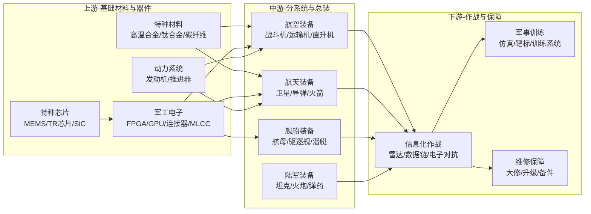

# 军工产业链总纲

> 产业链深度：★★★★
> 行情属性：逆周期 + 计划驱动 + 事件催化
> 核心驱动：国防预算 + 装备列装 + 实战化训练 + 卫星互联网
> 当前阶段：十四五最后一年（2025），十五五规划开启（2026），装备换装加速期

## 关联概念

- 细分赛道:: [[A股产业研究库/03 产业链图谱/军工产业链/航空装备]]
- 细分赛道:: [[A股产业研究库/03 产业链图谱/军工产业链/航天装备]]
- 细分赛道:: [[A股产业研究库/03 产业链图谱/军工产业链/军工电子]]
- 细分赛道:: [[A股产业研究库/03 产业链图谱/军工产业链/船舶装备]]
- 细分赛道:: [[A股产业研究库/03 产业链图谱/军工产业链/兵器装备]]
- 配套通信:: [[A股产业研究库/03 产业链图谱/军工产业链/军事信息化]]
- 关联产业:: [[A股产业研究库/03 产业链图谱/低空经济产业链/总纲|低空经济]]
- 关联产业:: [[A股产业研究库/03 产业链图谱/AI产业链/总纲|AI产业链]]
- 核心产品:: [[A股产业研究库/03 产业链图谱/半导体产业链/总纲|半导体]]
- 上游材料:: [[A股产业研究库/03 产业链图谱/新材料产业链/总纲|新材料]]

---

## 一、上中下游全景图

---

## 二、6个子领域景气度表

| 子领域 | 景气度 | 2025-2026预期增速 | 核心驱动 | 估值状态 |
|:------|:-----:|:----------------:|:---------|:--------:|
| 航空装备（军机） | ★★★★ 高景气 | 15-20% | 新型号列装加速，换装缺口大 | 中偏低 |
| 航空发动机 | ★★★★★ 最高景气 | 20-30% | 国产航发批产放量+维修后市场 | 合理 |
| 航天装备（卫星） | ★★★★★ 爆发 | 30-50% | 卫星互联网星座建设（GW+G60） | 中高 |
| 导弹/弹药 | ★★★★ 高景气 | 20-25% | 实战化训练消耗+备货 | 中偏低 |
| 军工电子 | ★★★★ 高景气 | 15-20% | 信息化率提升+国产替代 | 中 |
| 船舶/海军装备 | ★★★ 中等 | 10-15% | 第二批055/福建舰后续 | 中低 |

**数据来源**：各公司2024年年报，巨潮资讯网 www.cninfo.com.cn；国防部/中国军工集团公开信息

---

## 三、行业特点分析

### 军工行业与民用行业的本质差异

| 维度 | 军工行业 | 民用制造业 |
|:----|:---------|:-----------|
| 需求驱动力 | 国防预算+国家规划 | 市场需求+自由竞争 |
| 竞争格局 | 计划配置，国企主导 | 市场化竞争 |
| 利润率 | 受军审价约束（净利率5-10%） | 市场定价 |
| 收入确认 | 按节点确认（批次/合同） | 按出货确认 |
| 定价机制 | 军审定价（成本加成5%） | 市场定价 |
| 增长模式 | 型号驱动（单型号上量带来爆发） | 需求驱动 |
| 周期特征 | 逆经济周期 | 顺经济周期 |
| 估值特征 | 事件驱动+主题驱动 | 业绩驱动 |

**关键认知**: 军工不是"制裁受益"逻辑，而是**国家计划型的装备采购**。投资的核心是判断哪个型号处于"批产上量"阶段——型号一旦定型列装，往往有3-5年的高景气放量期。

### 十五五规划展望（2026-2030）

十五五国防预算有望保持7-8%的增速。重点方向包括:
- 航空装备: 新型隐身战斗机/远程轰炸机/大型运输机
- 航天装备: 卫星互联网（GW星座6000+颗卫星）、导弹防御
- 军工电子: 特种芯片自主化、军事AI应用
- 无人装备: 无人作战飞机/无人潜航器

---

## 四、A股全映射表

### 4.1 航空装备

| 细分 | 龙头 | 核心 | 弹性 | 投资逻辑 |
|:----:|:----:|:----:|:----:|:---------|
| 歼击机 | 中航沈飞 | 成飞集成(未上市) | — | 歼-20/歼-16批量交付，新型号定型 |
| 运输机 | 中航西飞 | — | — | 运-20批产，C919民机双驱动 |
| 直升机 | 中直股份 | — | — | 直-20批量列装，陆军航空兵扩编 |
| 航空发动机 | 航发动力 | 航发控制 | 应流股份 | 涡扇-10/涡扇-15批产，维修后市场 |
| 航空锻件 | 中航重机 | — | 三角防务 | 航空锻件龙头，新机型订单 |
| 航电系统 | 中航电子(已吸并) | — | — | 航空电子系统，国产化率提升 |
| 航空材料 | 西部超导 | 抚顺特钢 | 图南股份 | 高温合金/钛合金，航发+军机 |

### 4.2 航天装备

| 细分 | 龙头 | 核心 | 弹性 | 投资逻辑 |
|:----:|:----:|:----:|:----:|:---------|
| 卫星制造 | 中国卫星 | 航天电子 | 上海瀚讯 | 卫星互联网+北斗 |
| 卫星通信 | 中国卫通 | — | — | 卫星通信运营商，6G空天地一体化 |
| 导弹整机 | 航天长峰 | — | — | 防空导弹/反舰导弹 |
| 导弹零部件 | 航天电器 | 新雷能 | 菲利华 | 连接器/电源/石英 |
| 火箭发动机 | 航天动力 | — | — | 液体/固体火箭发动机 |
| 卫星载荷 | 铖昌科技 | 盟升电子 | 国博电子 | TR芯片/相控阵天线 |

### 4.3 军工电子与信息化

| 细分 | 龙头 | 核心 | 弹性 | 投资逻辑 |
|:----:|:----:|:----:|:----:|:---------|
| 特种FPGA | 紫光国微 | 复旦微电 | 安路科技 | 军工FPGA核心供应商 |
| 军用连接器 | 中航光电 | 航天电器 | — | 武器装备互联，受益信息化率提升 |
| MLCC | 振华科技 | 火炬电子 | 宏达电子 | 军用MLCC+钽电容龙头 |
| 红外/光电 | 睿创微纳 | 高德红外 | 大立科技 | 红外焦平面探测器，制导+侦查 |
| 军用电源 | 新雷能 | — | — | 模块电源，军工+通信 |
| 军用GPU | 景嘉微 | — | — | 军用GPU+图形显控 |
| 相控阵TR | 国博电子 | 铖昌科技 | — | 有源相控阵雷达核心T/R组件 |
| 雷达整机 | 国睿科技 | 四创电子 | — | 预警雷达/火控雷达 |
| 电子对抗 | 盟升电子 | 四川九洲 | — | 电子对抗+导航对抗 |

### 4.4 船舶与陆军装备

| 公司 | 细分 | 投资逻辑 |
|:----|:----|:---------|
| 中国船舶 | 军船总装 | 驱逐舰/潜艇订单饱满，民船周期向上 |
| 中船防务 | 军船+海工 | 海军装备建设，军船+集装箱船景气 |
| 内蒙一机 | 主战坦克 | 陆战装备出口+国内换装 |
| 中兵红箭 | 弹药+智能弹药 | 制导弹药+精确打击 |
| 北摩高科 | 军机刹车 | 飞机刹车盘+起落架，航空配套 |

---

## 五、核心结论

1. **军工板块最大特点是逆周期**: 不受宏观经济和消费需求影响，是弱市中较好的防御配置。国防预算保持7-8%增长，行业增速确定性高。

2. **选股看型号放量节奏**: 军工投资最核心的变量是"哪个型号进入批产阶段"。当前确定性最高的是航空发动机（涡扇-10/涡扇-15批产）、新型号军机（歼-20/运-20）、卫星互联网（GW星座）。

3. **航天装备是未来3年增速最快的子领域**: 卫星互联网星座建设拉动全链景气度——卫星制造（中国卫星/航天电子）、卫星通信（中国卫通）、TR芯片（铖昌科技）等环环受益。

4. **军工电子国产替代是穿越周期的主线**: 特种FPGA（紫光国微）、军用连接器（中航光电）、军用MLCC（振华科技）等军工电子企业受益于武器装备信息化率持续提升，且不受军工订单季度波动影响。

5. **风险关注**: 军品采购付款节奏波动（季度收入确认不均衡）；军审定价影响利润率（成本加成5%）；军工板块行情高度依赖事件催化（政策/地缘冲突），情绪退潮后调整幅度大；军工国企改革进度不确定性。

---

## 代表公司

### 航空装备

| 环节 | 龙头 | 核心 | 弹性 | 核心逻辑 |
|:----:|:----:|:----:|:----:|:---------|
| 战斗机总装 | 中航沈飞 | — | — | 歼-15/歼-16批量交付，歼-35/歼-31新型号定型，十四五末加速放量 |
| 运输机/轰炸机总装 | 中航西飞 | — | — | 运-20系列批产加速，轰-6系列持续改进，C919民机业务补充 |
| 直升机总装 | 中直股份 | — | — | 直-20系列批量列装，陆军航空兵扩编，民用直升机国产替代 |
| 航空发动机整机 | 航发动力 | — | — | 涡扇-10/涡扇-15批产，国产航发从"配装"到"主力"跨越 |
| 发动机控制系统 | 航发控制 | — | — | 发动机FADEC控制系统，伴随航发批产同步放量 |
| 航空锻件/铸件 | 中航重机 | — | 三角防务 | 航空大型锻件龙头，新机型订单饱满，军民融合双驱动 |
| 航空刹车系统 | 北摩高科 | — | — | 飞机刹车盘+起落架，航空配套耗材属性 |
| 航空材料-钛合金 | 西部超导 | 宝钛股份 | 西部材料 | 军机钛合金用量提升，3C钛合金中框新增长极 |
| 航空材料-高温合金 | 抚顺特钢 | 钢研高纳 | 图南股份 | 航发批产拉动高温合金需求翻倍 |
| 航空材料-复材预浸料 | 中航高科 | — | — | 航空复材预浸料龙头，受益军机复材化率提升 |

### 航天装备

| 环节 | 龙头 | 核心 | 弹性 | 核心逻辑 |
|:----:|:----:|:----:|:----:|:---------|
| 卫星总装 | 中国卫星 | — | — | 小卫星制造龙头，卫星互联网星座批量制造 |
| 卫星通信运营 | 中国卫通 | — | — | 卫星通信运营商（稀缺牌照），6G空天地一体核心 |
| 卫星载荷-TR芯片 | 铖昌科技 | 国博电子 | — | 相控阵TR芯片核心供应商，卫星互联网最大弹性标的 |
| 卫星载荷-相控阵天线 | 盟升电子 | — | — | 卫星通信天线+电子对抗 |
| 火箭发动机 | 航天动力 | — | — | 液体/固体火箭发动机，商业航天盈利模式 |
| 导弹总装 | 航天长峰 | — | — | 防空导弹/反舰导弹，实战化训练消耗 |
| 导弹连接器 | 航天电器 | — | — | 军用连接器龙头，导弹+卫星+电子全链覆盖 |
| 石英材料 | 菲利华 | — | — | 石英纤维/石英玻璃，导弹天线罩+半导体石英 |

### 舰船装备

| 公司 | 定位 | 核心逻辑 |
|:----|:-----|:---------|
| 中国船舶 | 军船总装 | 055驱逐舰/052D驱逐舰/常规潜艇批量建造，民船周期向上共振 |
| 中船防务 | 军船辅助舰 | 军辅船+特种船，海军装备体系化建设受益 |
| 海兰信 | 航海电子 | 船载导航/海底观测网，军民融合+海洋信息化 |

### 兵器装备

| 公司 | 定位 | 核心逻辑 |
|:----|:-----|:---------|
| 内蒙一机 | 主战坦克 | 99A/15式轻坦批量列装，陆军装备出口一带一路 |
| 中兵红箭 | 智能弹药 | 制导弹药+精确打击，实战化训练消耗拉动 |
| 长城军工 | 弹药+引信 | 炮弹/火箭弹/引信，弹药消耗量增长直接受益 |
| 国博电子 | 军工电子 | TR组件+模块电源，武器系统核心电子部件 |

### 军工电子与信息化

| 环节 | 龙头 | 核心 | 弹性 | 核心逻辑 |
|:----:|:----:|:----:|:----:|:---------|
| 特种FPGA | 紫光国微 | 复旦微电 | 安路科技 | 军工FPGA核心供应商，国产替代+信息化率提升双驱动 |
| 军用GPU | 景嘉微 | — | — | 军用GPU+图形显控，向民用延伸 |
| 军用连接器 | 中航光电 | 航天电器 | — | 武器装备互联，信息化率提升拉动用量增长 |
| 军用MLCC/电容 | 振华科技 | 火炬电子 | 宏达电子、鸿远电子 | 军用MLCC+钽电容，武器装备电子化率提升 |
| 红外探测器 | 睿创微纳 | 高德红外 | 大立科技 | 红外焦平面探测器，精确制导+夜视+侦查 |
| 军用电源 | 新雷能 | — | — | 模块电源，军工配套+通信双驱动 |
| 雷达整机 | 国睿科技 | 四创电子 | — | 预警雷达/火控雷达/气象雷达 |
| 电子对抗 | 盟升电子 | 四川九洲 | — | 电子对抗+导航对抗，信息化作战核心 |
| 军工仿真 | 华力创通 | — | — | 卫星导航仿真+雷达仿真，装备训练系统 |

### 军工新材料（详见[[A股产业研究库/03 产业链图谱/新材料产业链/总纲]]）

| 公司 | 细分 | 核心逻辑 |
|:----|:-----|:---------|
| 光威复材 | 碳纤维 | 军机碳纤维主力供应商，T800级突破 |
| 中简科技 | 碳纤维(高端) | ZT7系列航空航天碳纤维，高毛利率 |
| 西部超导 | 钛合金+超导 | 军机钛合金+超导材料双主线 |

---

### 关键跟踪指标

| 指标 | 重要性 | 更新频率 | 数据来源 |
|:-----|:------:|:--------:|:--------|
| 国防预算增速 | ★★★★★ | 年度 | 全国人大/财政部 |
| 军工央企订单同比增速 | ★★★★★ | 季度 | 中航沈飞/航发动力财报 |
| 军品采购招标数据 | ★★★★ | 月度 | 全军武器装备采购信息网 |
| 大额预付款/预付账款变化 | ★★★★ | 季度 | 主机厂财报 |
| 地缘政治事件频率 | ★★★ | 不定 | 新闻 |
| 军工企业股权激励计划 | ★★★ | 季度 | 企业公告 |
| 军贸出口数据 | ★★★ | 年度 | SIPRI/国防科工局 |

### 主要风险

- 军品采购付款节奏波动大（季度收入确认不均衡）
- 军审定价影响利润率（成本加成率约5%，利润空间有限）
- 军工板块行情高度依赖事件催化（政策/地缘冲突），情绪退潮后调整幅度大
- 军工国企改革进度和资产注入进度不确定
- 军工电子等细分领域竞争加剧导致毛利率承压

## 政策法规

### 国防预算政策

| 政策/内容 | 时间 | 核心内容 | 影响 |
|:---------|:----|:---------|:-----|
| 国防预算年度增长 | 2016-2025年均约7-8% | 2025年国防预算约1.8万亿元，增速约7.2% | 国防预算增速稳定，军工行业收入增长有保证，但增速不会大幅提升（GDP占比仍低于美俄） |
| 十五五规划(2026-2030) | 2026年启动 | 重点方向：新质战斗力（无人/智能/网络）、战略威慑（核/高超/航天）、新域新质（太空/电磁/网空） | 十五五投资方向明确，无人装备、军工AI、卫星互联网、高超音速等新方向获得专项预算支持 |
| 实战化训练经费增长 | 持续 | 增加训练弹药消耗、靶标/仿真系统采购 | 弹药消耗类（中兵红箭/长城军工）和训练仿真类（华力创通）直接受益 |

### 军工央企改革

| 改革方向 | 政策/事件 | 影响 |
|:---------|:---------|:-----|
| 资产证券化 | 军工集团资产注入上市公司（中航电子吸并中航机电/成飞借壳） | 提升上市公司资产质量和盈利能力，是军工板块最大的估值催化剂之一 |
| 股权激励 | 央企推行股权激励（中航沈飞/中航西飞/振华科技等已实施） | 绑定管理层和核心技术人员利益，改善国企经营效率 |
| 科研院所改制 | 军工科研院所转企改制 | 大量优质军工资产（设计所/研究所）有望注入上市公司，打开市值空间 |
| 混合所有制改革 | 引入战略投资者（国改基金/产业资本） | 改善治理结构，引入市场化机制 |

### 装备采购与定价改革

| 改革 | 核心内容 | 影响 |
|:-----|:---------|:-----|
| 装备采购制度改革 | 推行竞争性采购、批量采购、寿命周期费用评估 | 竞争加剧压制传统主机厂利润率，但利好有核心技术壁垒的配套企业 |
| 军品定价机制改革 | 从"成本加成5%"向"目标价格管理+激励约束"转变 | 总装企业（沈飞/西飞/航发动力）有望从"赚固定成本加成"变为"降本增效赚激励利润"，利润弹性打开 |
| 军品增值税政策调整 | 军品免税目录调整 | 影响产业链各环节的税收负担和利润 |
| 军贸政策 | 鼓励高技术兵器出口（翼龙/彩虹无人机、VT4坦克、054A护卫舰） | 帮助军工企业打开海外市场，降低对国内军费的依赖，提升规模效应 |

### 出口管制与军贸

| 政策 | 内容 | 影响 |
|:-----|:-----|:-----|
| 中国《出口管制法》(2020) | 对军民两用物项和军品出口实施许可管理 | 规范军工出口，高技术装备出口审批更严 |
| 军贸审批提速 | 2024年起军贸出口审批流程优化 | 利好无人机（航天彩虹/中无人机）、陆军装备（内蒙一机）、舰船（中国船舶）出口 |
| 国际军贸市场格局变化 | 俄乌冲突后俄罗斯军贸供应能力下降，中国军工出口迎来窗口期 | 中国军工在全球军贸份额有望从5%提升至10%+ |

---

## 舆论风向

### 军工"计划属性"vs"成长属性"的估值争论

**计划属性派（传统军工投资者）**:
- 军工是典型的计划经济行业，订单由国家计划分配，定价受军审价约束，利润率上限明确，不能按成长股估值，PS 3-5倍已是合理上限
- 军工企业收入确认不规律，季度波动大，不适合PE估值框架，更适合PB和PS估值
- 军工板块行情高度依赖地缘政治事件催化，事件一过迅速回调，是典型的"事件驱动脉冲型"行情

**成长属性派（新兴军工投资者）**:
- 军工已经发生结构性变化：股权激励+定价机制改革+军工电子国产替代，正在从"计划"走向"市场+计划"的混合模式
- 军工电子（紫光国微/振华科技/中航光电）等公司已经展现出成长股特征——毛利率持续提升、客户多元化、民品拓展
- 航天/商业航天/军工AI等新方向打开了军工的天花板，不能再用传统框架看待

### 军品集采"降价"担忧（类似医药集采叙事）

**担忧情绪（雪球/股吧主流）**:
- 2023年军品集采文件出台后，市场担心军品价格大幅下降→利润率压缩→估值中枢下移，叙事逻辑类似医药集采
- 军工板块在集采消息后跌幅明显，资金避险情绪重

**反驳观点（产业/机构）**:
- 军品集采和医药集采有本质区别：军品对质量可靠性要求极高，不能简单"低价中标"
- 军品集采主要影响的是标准化通用部件（紧固件/标准件等），高壁垒的核心部件（FPGA/发动机叶片/TR芯片）不存在集采降价逻辑
- 军品定价机制改革的目标不是降价，而是"激励约束"——通过目标价格管理激励企业降本增效，企业可以通过降本获得超额利润

### 商业航天"泡沫化"的争议

**泡沫论**:
- 中国商业航天公司（星际荣耀/蓝箭/天兵科技等）尚未实现盈亏平衡，"卖火箭不如卖卫星赚钱"的盈利模式存疑
- 商业航天资本开支巨大（单次发射成本数千万），商业化闭环（低轨通信/遥感）远未实现
- A股商业航天概念股（航天动力/航天电子/中国卫星）主要炒主题，EPS贡献微乎其微

**趋势论**:
- 商业航天是"SpaceX模式"的必然复制，Starlink已证明低轨卫星通信的商业价值
- 中国GW星座+上海G60星座共2万颗卫星的发射需求是确定性的政府订单，卫星制造/发射服务企业有3-5年的高景气度
- 商业航天是政策重点支持方向，十五五规划明确写入，不缺催化剂

### 军工电子国产替代："真进展"vs"假概念"

**笃定派**:
- 紫光国微特种FPGA已经大规模装备，复旦微电、安路科技也在替代低端市场，国产替代率从2020年的20%提升至2025年的40%+
- 振华科技、火炬电子等军用MLCC已实现全面国产替代，进口依赖度降至10%以下
- 军用电源（新雷能）、军用连接器（中航光电）国产化率已达80%+，供应链自主可控基本实现

**质疑派**:
- 高端军工FPGA（7nm级、千万门级）仍依赖进口，国产替代需要3-5年
- 军工电子公司的收入增长中有相当比例来自行业景气（军工采购总量增长），而非替代份额提升
- 军工电子产品毛利率偏高（50-70%）的部分原因是缺乏充分竞争，一旦放开竞争毛利将承压

## 参考资料

[1] 相关A股公司（如适用）. 2024年年度报告[R]. 巨潮资讯网.
    http://www.cninfo.com.cn

[2] 国家统计局. 中国统计年鉴[R]. 2025.
    http://www.stats.gov.cn

[3] 相关行业协会/研究机构. 行业市场研究报告[R]. 2025.
