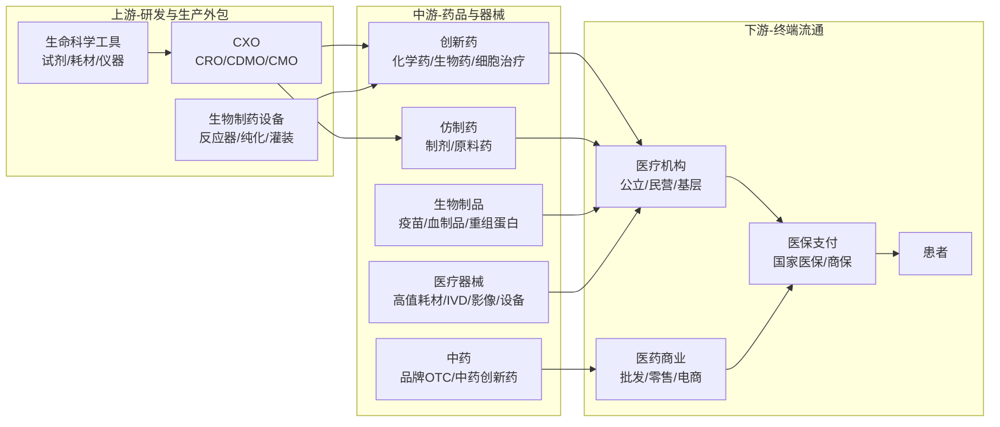
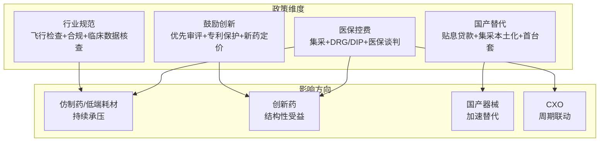

# 医药生物产业链总纲

> 产业链深度：★★★★★
> 行情属性：防御成长 + 政策驱动 + 结构分化
> 核心驱动：老龄化 + 医保控费 + 创新出海 + 国产替代
> 当前阶段：集采出清见底，创新周期向上

## 关联节点

### 核心关联
[[A股产业研究库/03 产业链图谱/医药生物产业链/创新药]] | [[A股产业研究库/03 产业链图谱/医药生物产业链/CXO]] | [[A股产业研究库/03 产业链图谱/医药生物产业链/医疗器械]] | [[A股产业研究库/03 产业链图谱/医药生物产业链/中药]] | [[A股产业研究库/03 产业链图谱/医药生物产业链/生物制品]] | [[A股产业研究库/03 产业链图谱/医药生物产业链/医药流通]]

### 交叉产业链
[[A股产业研究库/03 产业链图谱/AI产业链/AI医疗|AI医疗]] | [[A股产业研究库/03 产业链图谱/消费电子产业链/总纲|消费医疗]] | [[A股产业研究库/03 产业链图谱/新能源汽车产业链/总纲|医美/自费医疗]]

---

## 一、产业链全景

---

## 二、四维政策框架

医药行业是强政策驱动行业，投资必须理解政策周期。

**当前政策周期判断**: 集采已过最严阶段（国家集采已覆盖300+品种），政策重心转向"腾空间+调结构"——压缩仿制药/低端器械支付空间，为创新药/高值耗材谈判留出预算弹性。

---

## 三、A股三级公司全映射

### 3.1 创新药

| 细分领域 | 龙头公司 | 核心标的 | 弹性标的 | 投资逻辑 |
|:--------:|:--------:|:--------:|:--------:|:---------|
| 肿瘤创新药 | 百济神州 | 恒瑞医药 | 荣昌生物 | BTK/PD-1出海放量，国际化龙头 |
| 肿瘤创新药 | — | 信达生物 | 康方生物 | PD-1+双抗，研发管线丰富 |
| 肿瘤创新药 | — | 君实生物 | 贝达药业 | PD-1出海+肺癌靶向 |
| 自身免疫 | — | 百济神州 | 康诺亚 | 自免药物全球市场>肿瘤 |
| 代谢疾病 | — | 信达生物 | 甘李药业 | GLP-1减重赛道爆发 |
| 神经/精神 | — | — | 恩华药业 | 中枢神经麻醉用药龙头 |
| 血液制品 | 天坛生物 | 华兰生物 | 博雅生物 | 浆站拓展+血制品涨价 |

**数据来源**：各公司2024年年报，巨潮资讯网 www.cninfo.com.cn；中国医药工业信息中心；国家医保局

### 3.2 CXO（医药研发/生产外包）

| 细分领域 | 龙头公司 | 核心标的 | 弹性标的 | 投资逻辑 |
|:--------:|:--------:|:--------:|:--------:|:---------|
| 一体化CRO | 药明康德 | 康龙化成 | — | 全球CRO龙头，全流程服务 |
| 临床CRO | 泰格医药 | — | — | 中国临床CRO龙头，行业景气回升 |
| CDMO(小分子) | 凯莱英 | 博腾股份 | 药石科技 | 小分子化药CDMO，在手订单回暖 |
| CDMO(大分子) | 药明生物(港股) | — | — | 生物药CDMO全球前三 |
| 安评/CRO | 昭衍新药 | — | — | GLP毒理安评龙头 |
| 生命科学试剂 | 百普赛斯 | 义翘神州 | 优宁维 | 生物试剂国产替代 |

**CXO周期判断**: 2023-2024是CXO行业低谷（生物医药投融资大幅缩减）。2025年起全球生物医药融资回暖（+25%），CXO在手订单回升，2026年有望进入上行周期。药明康德/康龙化成是行业回暖的核心受益标的。

### 3.3 医疗器械

| 细分领域 | 龙头公司 | 核心标的 | 弹性标的 | 投资逻辑 |
|:--------:|:--------:|:--------:|:--------:|:---------|
| 综合器械 | 迈瑞医疗 | — | — | 生命信息+IVD+影像三大平台 |
| 大影像 | 联影医疗 | — | — | CT/MR/PET-CT国产龙头 |
| 内窥镜 | — | 澳华内镜 | 开立医疗 | 国产软镜替代进口 |
| CT/DR | — | 万东医疗 | 普门科技 | 基层医疗设备采购 |
| 高值耗材-心血管 | 微创医疗(港股) | 乐普医疗 | 赛诺医疗 | 支架集采出清+介入瓣膜 |
| 高值耗材-骨科 | 威高骨科 | 春立医疗 | 大博医疗 | 关节/脊柱集采，出清中 |
| IVD(化学发光) | 迈瑞医疗 | 安图生物 | 新产业生物 | 化学发光国产替代 |
| IVD(分子诊断) | — | 华大基因 | — | NGS+肿瘤早筛 |
| POCT | 万孚生物 | 基蛋生物 | — | 心标+传染病快速检测 |
| 家用器械 | 鱼跃医疗 | — | — | 家用制氧+血压+血糖 |

### 3.4 中药

| 细分 | 龙头公司 | 核心标的 | 弹性标的 | 投资逻辑 |
|:----:|:--------:|:--------:|:--------:|:---------|
| 品牌OTC | 片仔癀 | 云南白药 | 同仁堂 | 国家保密配方+品牌溢价+提价 |
| 中药创新 | — | 以岭药业 | 康缘药业 | 中药创新药获批数量增加 |
| 中药配方颗粒 | — | 华润三九 | 中国中药(港股) | 配方颗粒国标推进 |
| 中药OTC | — | 江中药业 | 羚锐制药 | 品牌+渠道+消费品化 |
| 中药处方药 | — | 步长制药 | — | 院内中药处方承压 |

---

## 四、四条投资主线

### 主线一：创新药出海（长期最具弹性）

**逻辑**: 中国创新药研发能力已达到全球同步水平，百济神州（泽布替尼全球销售超15亿美元）证明了中国创新药出海商业化的可行性。2025-2026年是中国创新药出海收获期。

**核心标的**: 百济神州、信达生物、康方生物、恒瑞医药
**关键催化剂**: FDA获批进展、海外授权交易（license-out）、关键临床数据读出

### 主线二：CXO周期复苏（困境反转）

**逻辑**: CXO行业经历2023-2024年低谷后，2025年全球生物医药融资复苏开始传导至CXO订单。2026年CXO板块存在"业绩改善+估值修复"的双击机会。

**核心标的**: 药明康德（龙头最先受益）、康龙化成（全流程+弹性大）、凯莱英（CDMO订单周期）
**关键催化剂**: 药明康德在手订单增速转正、生物医药融资同比数据、大客户管线推进

### 主线三：医疗器械国产替代（确定性强）

**逻辑**: 政策持续支持国产医疗器械替代进口（贴息贷款+首台套+集采本土化）。影像/内窥镜/化学发光/高值耗材四大细分赛道的国产化率均低于30%，替代空间广阔。

**核心标的**: 迈瑞医疗（综合平台龙头）、联影医疗（影像替代）、澳华内镜（软镜替代）、安图生物（化学发光）
**关键催化剂**: 医疗新基建投资落地、集采本土化政策、县级医院设备采购

### 主线四：中药品牌消费（防御+成长）

**逻辑**: 中药板块兼具防御属性和政策支持。品牌OTC（片仔癀/云南白药）享有定价权+消费品属性，中药创新药审批加速打开成长空间。

**核心标的**: 片仔癀（核心产品提价）、华润三九（OTC+处方药双驱动）、同仁堂（品牌壁垒高）
**关键催化剂**: 基药目录调整、中药注册管理办法、品牌提价

---

## 五、核心结论

1. **医药是长坡厚雪的赛道**: 老龄化（60岁以上人口占比>20%）+ 健康消费升级是底层驱动力，医药行业长期增速稳定在8-10%，远高于GDP增速。

2. **集采出清是重要的选股条件**: 大部分仿制药和低值耗材集采风险已释放完毕（集采覆盖>80%品种），集采出清的龙头（乐普医疗/威高骨科等）正在迎来盈利拐点。

3. **CXO是当前最具性价比的板块**: 估值处于5年低位，行业周期处于底部回升阶段。药明康德/康龙化成在手订单已开始改善，2026年有望迎来业绩和估值双修复。

4. **器械国产替代的空间>药品**: 国产器械在高端影像/内窥镜/高值耗材的渗透率普遍低于20-30%，替代空间远大于仿制药。且器械集采价格压力小于药品。

5. **风险关注**: 医保收支压力持续加大（收入增速<支出增速），医保谈判降价幅度可能超预期；创新药出海面临FDA审批风险和地缘政治障碍；集采扩面至生物类似药/中成药可能导致新一轮降价。

---

## 代表公司

### 创新药

| 排序 | 公司 | 代码 | 核心逻辑 |
|:----:|:----|:----:|:---------|
| 龙头 | 百济神州 | 688235 | 泽布替尼全球销售超15亿美元，替雷利珠单抗FDA获批，国际化最强 |
| 龙头 | 恒瑞医药 | 600276 | 国内研发投入第一（60亿+），多条管线出海，GLP-1/ADC/双抗全面布局 |
| 核心 | 信达生物 | 01801.HK | PD-1+双抗+GLP-1管线，玛仕度肽减重药前景可观 |
| 核心 | 康方生物 | 09926.HK | 双抗龙头，PD-1/VEGF双抗AK112疗效数据亮眼 |
| 核心 | 荣昌生物 | 688331 | ADC龙头，维迪西妥单抗+泰它西普，出海潜力 |
| 核心 | 君实生物 | 688180 | PD-1出海，特瑞普利单抗FDA获批，新冠/自免管线 |
| 弹性 | 康诺亚 | 02162.HK | 自免药物（IL-4Rα/TSLP），管线差异化 |
| 弹性 | 贝达药业 | 300558 | 肺癌靶向药平台，恩沙替尼/贝福替尼 |
| 弹性 | 甘李药业 | 603087 | 三代胰岛素龙头，GLP-1受体激动剂布局 |
| 弹性 | 科伦博泰 | 06990.HK | ADC管线丰富，默沙东license-out超百亿 |

### CXO（医药研发/生产外包）

| 排序 | 公司 | 代码 | 核心逻辑 |
|:----:|:----|:----:|:---------|
| 龙头 | 药明康德 | 603259 | 全球CRO/CDMO龙头，全流程一体化，在手订单回升 |
| 龙头 | 康龙化成 | 300759 | 实验室化学+CMC+临床CRO全流程，弹性大于药明 |
| 核心 | 泰格医药 | 300347 | 临床CRO国内龙头，创新药临床需求回升最受益 |
| 核心 | 凯莱英 | 002821 | 小分子CDMO龙头，连续流技术领先，大订单周期 |
| 核心 | 昭衍新药 | 603129 | 药物安评（GLP毒理）龙头，临床前CRO稀缺标的 |
| 弹性 | 博腾股份 | 300363 | CDMO弹性标的，大客户依赖度降低中 |
| 弹性 | 九洲药业 | 603456 | CDMO+原料药，诺华核心供应商 |
| 弹性 | 百普赛斯 | 301080 | 重组蛋白试剂龙头，生命科学上游国产替代 |

### 医疗器械

| 排序 | 公司 | 代码 | 核心逻辑 |
|:----:|:----|:----:|:---------|
| 龙头 | 迈瑞医疗 | 300760 | 生命信息+IVD+影像三大平台，全球综合器械龙头，海外占比40%+ |
| 龙头 | 联影医疗 | 688271 | CT/MR/PET-CT高端影像国产龙头，打破GPS垄断 |
| 核心 | 安图生物 | 603658 | 化学发光龙头，免疫诊断国产替代，装机量持续提升 |
| 核心 | 新产业生物 | 300757 | 化学发光+生化诊断，海外市场快速拓展 |
| 核心 | 鱼跃医疗 | 002223 | 家用医疗器械龙头，制氧机/呼吸机/血糖仪 |
| 核心 | 华大基因 | 300676 | NGS基因检测龙头，肿瘤早筛+生育健康 |
| 弹性 | 澳华内镜 | 688212 | 国产软镜龙头，AQ-300系统对标奥林巴斯 |
| 弹性 | 开立医疗 | 300633 | 超声+内窥镜双布局，高端彩超突破 |
| 弹性 | 乐普医疗 | 300003 | 心血管器械龙头，支架集采出清，介入瓣膜+AI医疗 |
| 弹性 | 威高骨科 | 688161 | 骨科国产替代龙头，关节/脊柱集采出清中 |
| 弹性 | 万孚生物 | 300482 | POCT龙头，心标+传染病快速检测 |

### 中药

| 排序 | 公司 | 代码 | 核心逻辑 |
|:----:|:----|:----:|:---------|
| 龙头 | 片仔癀 | 600436 | 国家保密配方，核心产品提价逻辑，品牌天花板高 |
| 龙头 | 云南白药 | 000538 | 品牌中药+消费品（牙膏），兼具防御和成长 |
| 核心 | 同仁堂 | 600085 | 中药品牌壁垒最高，安宫牛黄丸提价，国企改革 |
| 核心 | 华润三九 | 000999 | OTC+处方药双驱动，999感冒灵品牌力强 |
| 核心 | 以岭药业 | 002603 | 中药创新药龙头，连花清瘟+通心络/芪苈强心 |
| 弹性 | 东阿阿胶 | 000423 | 阿胶龙头，产品提价+数字化转型 |
| 弹性 | 江中药业 | 600750 | OTC品牌，健胃消食片/复方草珊瑚含片 |
| 弹性 | 康缘药业 | 600557 | 中药创新药，银杏二萜内酯/热毒宁注射液 |
| 弹性 | 羚锐制药 | 600285 | 贴膏剂龙头，骨科中药OTC

---

### 关键跟踪指标

| 指标 | 重要性 | 更新频率 | 数据来源 |
|:-----|:------:|:--------:|:--------|
| 医保谈判降价幅度 | ★★★★★ | 年度 | 国家医保局 |
| 创新药FDA获批数量 | ★★★★ | 不定 | FDA官网/企业公告 |
| 集采品种扩围进度 | ★★★★★ | 季度 | 国家联采办 |
| 医药制造业收入/利润增速 | ★★★★ | 月度 | 国家统计局 |
| 医院诊疗量恢复情况 | ★★★ | 季度 | 卫健委/行业调研 |
| CXO龙头订单增速 | ★★★★ | 季度 | 药明康德/康龙化成财报 |
| 医保基金收支增速 | ★★★★ | 季度 | 国家医保局 |

### 主要风险

- 医保收支压力持续加大，医保谈判降价超预期风险
- 创新药出海面临FDA审批不确定性和地缘政治障碍
- 集采扩面至生物类似药/中成药可能导致新一轮降价
- 医药行业合规整顿（反腐/商业贿赂）影响短期院内销售
- BIOSECURE法案等限制中国CXO企业的海外订单风险

## 政策法规

### 国家集采政策演进（最大政策变量）

| 政策/阶段 | 时间 | 核心内容 | 市场影响 |
|:---------|:---:|:---------|:---------|
| [第一批国家集采（4+7试点）](https://www.nhsa.gov.cn) | 2018.12 | 31个品种平均降价52%，最大降幅96% | 医药股暴跌，仿制药估值体系重构 |
| 第二批至第九批国家集采 | 2019-2025 | 覆盖300+品种，涉及化学药/生物类似药/中成药/高值耗材 | 仿制药和低值耗材利润大幅压缩，行业加速出清 |
| 国家集采进入常态化 | 2024-2025 | 每年2批，每批30-50品种，集采覆盖范围达80%+ | 集采影响边际递减，"集采出清"成为选股逻辑 |
| 生物类似药集采 | 2024启动 | 贝伐珠单抗/曲妥珠单抗/利妥昔单抗等生物类似药纳入集采 | 生物药利润率承压，利好龙头以价换量 |
| 中成药集采扩面 | 2025 | 中成药省际联盟集采范围扩大，注射剂纳入 | 中药处方药面临降价压力，品牌OTC影响有限 |
| 高值耗材集采（心脏支架/骨科/人工晶体等） | 2020-2025 | 心脏支架均价从1.3万降至700元；关节/脊柱集采平均降价80%+ | 高值耗材行业出清，集采出清企业迎来业绩拐点 |

### 医保谈判与创新药支付政策

| 政策/法规 | 时间 | 核心内容 | 影响 |
|:---------|:---:|:---------|:---------|
| 医保目录动态调整机制 | 2020年起 | 每年谈判一次，创新药上市后1-2年内可申请进医保 | 创新药进医保速度加快（过去5-8年→1-2年），但谈判降价幅度50-80% |
| 创新药进医保谈判 | 2023-2025年轮次 | 2023年谈判降价约62%；2024年创新药谈判成功率提升至72% | 降价预期逐步稳定，创新药"以价换量"逻辑成立 |
| 双通道政策 | 2021 | 定点零售药店纳入医保统筹，解决创新药"进院难" | 拓宽创新药销售渠道，利好新药放量 |
| 医保支付标准改革 | 2024-2025 | 对创新药试行医保支付标准（在集采/谈判价基础上动态调整） | 创新药获得更稳定的价格预期和支付保障 |

### 创新药审评审批改革

| 政策/措施 | 时间 | 核心内容 | 影响 |
|:---------|:---:|:---------|:---------|
| CDE药品审评改革 | 2017-2025持续 | 优化审评流程，建立优先审评/突破性疗法/附条件批准等多通道 | 缩短新药上市周期（从3-5年降至1-2年），推动创新药密集获批 |
| 药品专利链接制度 | 2021.06 | 建立药品专利早期解决机制，允许在仿制药审批前解决专利争议 | 保护创新药专利期限，延长独占期 |
| 药品专利期限补偿 | 2021.06 | 对创新药因审批延迟损失的专利期限给予最多5年补偿 | 延长创新药市场独占期，提升研发回报 |
| 真实世界证据支持监管决策 | 2024 | CDE允许使用真实世界数据支持药品审评和适应症扩展 | 加速罕见病/儿科药物获批 |

### DRG/DIP支付改革

| 政策/措施 | 时间 | 核心内容 | 影响 |
|:---------|:---:|:---------|:---------|
| DRG/DIP支付方式改革三年行动计划 | 2021-2024 | 到2024年底所有统筹地区全面实施DRG/DIP支付方式改革 | 医院控费动力增强，利好性价比高的国产药械 |
| DRG/DIP 2.0版分组方案 | 2025 | 优化分组方案，增加创新药械除外支付机制 | 缓解对创新药械的不利影响，部分创新药获得"豁免" |

### 中药政策

| 政策/法规 | 时间 | 核心内容 | 影响 |
|:---------|:---:|:---------|:---------|
| 中药传承创新发展意见 | 2023.02 | 国务院办公厅发文，全面支持中药传承创新，简化经典名方注册 | 中药板块获得政策红利，中药创新药和品牌OTC受益 |
| 中药注册管理办法改革 | 2023-2025 | 建立中医药理论/人用经验/临床试验"三结合"审评证据体系 | 中药创新药获批数量大幅增加（2024年获批12个） |
| 基药目录调整（中药增补） | 2024-2025 | 新版基药目录增加中药品种，重点支持中药创新药和经典名方 | 中药进院渠道拓宽，利好以岭药业/康缘药业等 |

---

## 舆论风向

### 核心争论一：集采"伤创新"vs"促转型"

**"伤创新"方观点**：
- "集采压缩仿制药利润，药企被迫'砍研发'求生。国内药企研发投入增速从2019年的25%降到了2024年的5%以下。"（微博@医药投资笔记）
- "心脏支架从1.3万降到700元，企业没有利润怎么投入创新？很多创新药公司实际上在靠融资续命。"
- "集采降价幅度太大，导致一些小企业直接转型做'me-too'和'fast follow'，反而回避了真正的创新。"

**"促转型"方观点**：
- "集采是倒逼产业升级的'鲶鱼效应'。过去卖仿制药躺着赚钱，谁愿意做高风险的原研药？现在不做创新就是等死。"（雪球医药板块）
- "看看百济神州/信达生物的成长路径——集采逼出来的中国创新药出海，反而在全球舞台上证明了自己。"
- "恒瑞医药在集采压力下研发投入不减反增（从40亿到60亿），态度说明一切。"
- "集采后的医药行业格局更健康了——龙头份额提升，创新药成了真正的'皇冠上的明珠'。"

**争议焦点**：集采是"压垮创新的最后一根稻草"还是"产业升级的催化剂"？

### 核心争论二：BIOSECURE法案与CXO板块的冲击

美国BIOSECURE法案（生物安全法案）是2024年以来CXO板块最大的政策变量：

**法案背景**：美国拟禁止联邦政府与药明康德/药明生物等中国生物科技企业签订合同，目的是减少对华依赖

**市场恐慌方观点**：
- "BIOSECURE法案一旦通过，药明康德/药明生物的美国客户将大量流失，行业将长期承压。"
- "即使法案不通过，美国客户也会'用脚投票'——分散供应链，减少对中国CDMO的依赖。"
- "CXO板块已经不再是'卖水人'，而是'地缘政治博弈的棋子'。估值逻辑已经变了。"

**看好方观点**：
- "BIOSECURE法案通过的概率很低——美国生物医药行业强烈反对，因为没有中国CDMO的代工，美国创新药的研发成本将大幅上升。"
- "药明康德的竞争力（速度+成本+质量）是经过全球市场验证的。客户粘性极高，不会因为一个没有落地的法案就放弃合作。"
- "法案的受影响范围很窄（主要是政府合同），占药明收入不到5%。绝大部分商业合同不受影响。"
- "CXO板块的估值已经打满了悲观预期，一旦法案落空就是超级弹性。"

**争议焦点**：BIOSECURE法案对CXO板块是"生死劫"还是"短痛"？药明康德国际化前景如何？

### 核心争论三：创新药"出海"的乐观与风险

2025-2026年是中国创新药出海的收获期（百济神州/君实/康方等产品海外上市），但市场对出海前景存在分歧：

**乐观方观点**：
- "泽布替尼证明了中国人也能做出全球重磅药（年销15亿+美元）。这不是偶然，中国创新药的研发效率已经开始全球领先。"
- "License-out交易金额连创新高——2024年中国创新药海外授权交易总额超200亿美元。"
- "中国的临床成本优势和患者招募速度是美国的1/5到1/3——这个优势短期内不会消失。"
- "全球至少有20个中国创新药处于临床晚期，2026-2028年是密集获批窗口。"

**谨慎方观点**：
- "出海成功的案例还是太少。目前只有百济神州君实特瑞普利真正实现了美国商业化销售。"
- "FDA对中国创新药的审批标准在收紧——体现在CMC要求/临床数据质量/远程核查等环节。"
- "出海最大的障碍不是FDA审批而是商业化能力。在美国建立千人学术推广团队的费用远超中国药企的预算。"
- "泽布替尼的特殊性在于——它是BTK抑制剂，是一个已经被验证的靶点。真正的FIC（First-in-class）出海成功还有待证明。"

**争议焦点**：中国创新药出海是"趋势确立"还是"个案特例"？FDA审批收紧是否意味着窗口期在关闭？

### 社交平台热度标签

| 平台 | 热门话题/标签 | 情绪倾向 |
|:----|:-------------|:--------|
| 雪球 | #CXO触底了吗# #百济神州还能拿吗# #医药集采出清# #创新药出海# | CXO和医药整体偏悲观，创新药出海是少数亮点 |
| 微博 | #医保谈判# #BIOSECURE法案# #集采降价# | 散户情绪受政策波动大，集采和BIOSECURE是最大关注点 |
| 知乎 | 医药生物行业投资逻辑梳理；集采对创新的影响分析 | 偏深度分析，普遍认同集采出清后的结构性机会 |
| 医药行业微信群 | 药品获批信息、临床数据解读、医保谈判降幅预测 | 产业视角偏谨慎，对创新药出海持中性态度 |
| 股吧 | CXO/医药板块跟随大盘波动，题材炒作以中药和政策驱动力为主 | 情绪化明显，缺乏深度讨论

## 参考资料

[1] 相关A股公司（如适用）. 2024年年度报告[R]. 巨潮资讯网.
    http://www.cninfo.com.cn

[2] 国家医保局. 国家组织药品集中采购文件[R]. 2025.
    http://www.nhsa.gov.cn

[3] Frost & Sullivan. 中国医药市场报告[R]. 2025.
    https://www.frost.com

[4] 国家药品监督管理局. 药品审评报告[R]. 2025.
    http://www.nmpa.gov.cn
