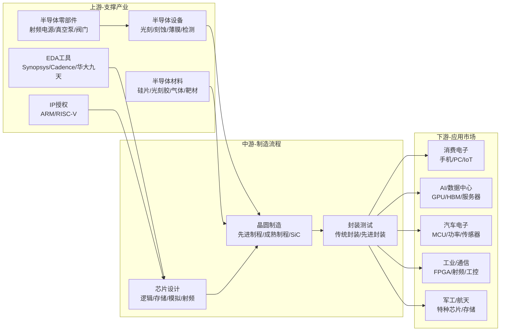
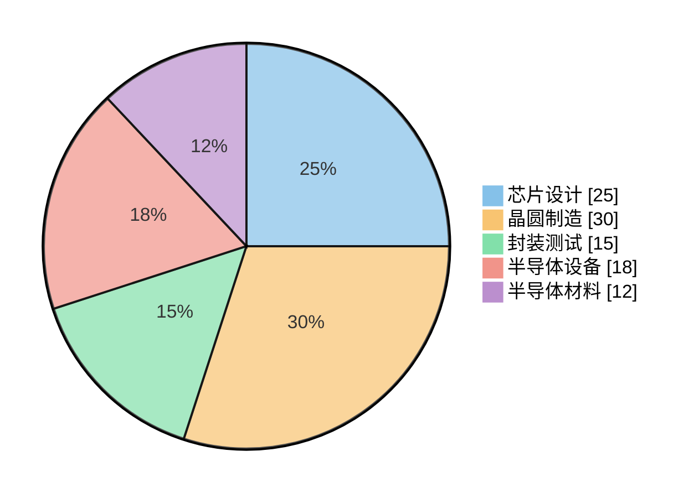
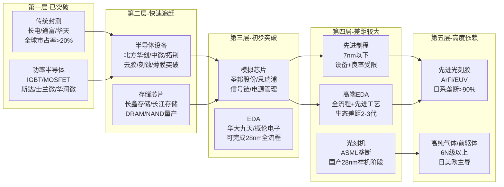
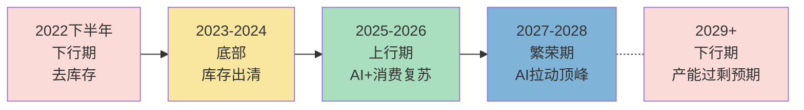

# 半导体产业链总纲

> 产业链深度：★★★★★
> 行情属性：周期成长 + 国产替代 + 主题驱动
> 核心驱动：技术突破 + 产能周期 + 国产替代进度 + AI算力拉动

## 关联概念

- 细分赛道:: [[A股产业研究库/03 产业链图谱/半导体产业链/芯片设计]]
- 细分赛道:: [[A股产业研究库/03 产业链图谱/半导体产业链/晶圆制造]]
- 细分赛道:: [[A股产业研究库/03 产业链图谱/半导体产业链/封装测试]]
- 上游材料:: [[A股产业研究库/03 产业链图谱/半导体产业链/半导体设备]]
- 上游材料:: [[A股产业研究库/03 产业链图谱/半导体产业链/半导体材料]]
- 配套技术:: [[A股产业研究库/03 产业链图谱/半导体产业链/EDA]]
- 核心产品:: [[A股产业研究库/03 产业链图谱/AI产业链/GPU]]
- 关联产业:: [[A股产业研究库/03 产业链图谱/AI产业链/总纲|AI产业链]]
- 制造技术:: [[A股产业研究库/03 产业链图谱/AI产业链/先进封装|先进封装]]
- 配套存储:: [[A股产业研究库/03 产业链图谱/AI产业链/HBM]]
- 下游:: [[A股产业研究库/03 产业链图谱/消费电子产业链/总纲|消费电子]]
- 下游:: [[A股产业研究库/03 产业链图谱/新能源汽车产业链/总纲|汽车芯片]]
- 下游:: [[A股产业研究库/03 产业链图谱/军工产业链/总纲|军工芯片]]

---

## 一、产业链全景图

---

## 二、价值分布与利润池

### 各环节利润率格局

| 环节 | 毛利率 | 净利率 | 定价权 | 壁垒 | 竞争格局 |
|:----:|:------:|:------:|:------:|:----|:--------|
| EDA/IP | 80-90% | 25-35% | ★★★★★ | 生态锁定+专利墙 | 三巨头垄断90%+ |
| 芯片设计(逻辑) | 40-60% | 15-25% | ★★★★ | 架构+人才+生态 | 头部集中 |
| 芯片设计(存储) | 25-50% | 5-20% | ★★★ | 产能+规模效应 | 三强鼎立 |
| 芯片设计(模拟) | 40-55% | 12-20% | ★★★★ | 工艺经验累积 | 细分分散 |
| 晶圆制造(先进) | 45-55% | 25-35% | ★★★★★ | 制程+良率+资本 | 台积电独大 |
| 晶圆制造(成熟) | 20-35% | 5-15% | ★★★ | 规模+客户关系 | 竞争加剧 |
| 先进封装 | 25-40% | 10-18% | ★★★ | 工艺+设备 | 日月光/台积电 |
| 传统封测 | 15-25% | 3-8% | ★★ | 规模+成本 | 竞争激烈 |
| 半导体设备 | 40-55% | 15-25% | ★★★★ | 技术+客户认证 | 细分市场寡头 |
| 半导体材料 | 25-45% | 10-20% | ★★★ | 纯度+认证周期 | 日系主导 |

**数据来源**：各公司2024年年报，巨潮资讯网 www.cninfo.com.cn；Gartner/IC Insights相关报告；中国半导体行业协会

---

## 三、国产替代五层成熟度

**五大层次对应投资策略**:

| 层次 | 投资策略 | 关注时段 | 预期回报 |
|:----:|:--------|:--------:|:--------:|
| 第一层（已突破） | 周期景气+龙头溢价 | 周期底部布局 | 中低但确定性高 |
| 第二层（快速追赶） | 成长+市占率提升 | 持续跟踪 | 高中等确定性 |
| 第三层（初步突破） | 主题+业绩拐点 | 突破节点 | 高但波动大 |
| 第四层（差距较大） | 长期跟踪+政策催化 | 政策时点 | 弹性最大但不确定 |
| 第五层（高度依赖） | 主题炒作+事件驱动 | 紧爭催化 | 短线机会 |

---

## 四、三条投资主线

### 主线一：国产替代（贯穿五年以上）

**底层逻辑**: 半导体全产业链自主可控是国家战略，美国出口管制持续加码反向加速国产替代。

**核心标的**:
- 设备龙头: 北方华创（刻蚀/薄膜/清洗全栈）、中微公司（CCP刻蚀突破5nm）、拓荆科技（PECVD国产替代）
- 材料龙头: 沪硅产业（300mm硅片）、安集科技（CMP抛光液）、彤程新材（光刻胶）
- EDA: 华大九天（模拟IC全流程）、概伦电子（存储EDA）

**关键催化剂**: 每轮制裁升级→国产设备订单加速；每轮大基金注资→设备材料板块上涨

### 主线二：景气周期（中短期弹性）

**底层逻辑**: 半导体是典型周期行业，3-4年一轮库存周期。2025-2026年处于上行周期后半段，存储和功率率先受益。

**核心标的**:
- 存储: 兆易创新（NOR Flash+MCU）、澜起科技（DDR5接口）
- CIS: 韦尔股份（手机CIS+汽车CIS）
- 功率: 斯达半导（IGBT/SiC）、士兰微（IDM模式）、时代电气（SiC）
- 射频: 卓胜微（射频开关/LNA）

**关键变量**: 下游终端需求（智能手机/PC出货量）、库存水位、存储价格

### 主线三：AI算力带动（结构性增量）

**底层逻辑**: AI大模型带来GPU/HBM/先进封装需求的爆发式增长，是半导体行业最大的增量市场。

**核心标的**:
- 先进封装: 长电科技（XDFOI先进封装）、通富微电（AMD封测）、甬矽电子
- Chiplet/IP: 芯原股份（GPU/NPU IP授权）
- HBM材料: 华海诚科（Underfill/EMC）、联瑞新材（球硅/球铝）
- AI芯片: 寒武纪（AI训练推理芯片）、海光信息（DCU深算系列）

---

## 五、A股全映射表

### 5.1 芯片设计

| 细分领域 | 龙头公司 | 核心标的 | 弹性标的 | 投资逻辑 |
|:--------:|:--------:|:--------:|:--------:|:---------|
| 存储芯片 | 兆易创新 | 澜起科技 | 北京君正 | 存储周期复苏+AI带动DDR5/HBM |
| CIS图像传感器 | 韦尔股份 | — | 思特威 | 手机CIS回暖+汽车CIS增量 |
| FPGA | 紫光国微 | 复旦微电 | 安路科技 | 国产FPGA替代，军工+通信 |
| 射频前端 | 卓胜微 | 唯捷创芯 | 飞骅科技 | 5G手机射频渗透+国产替代 |
| 模拟芯片 | 圣邦股份 | 思瑞浦 | 纳芯微 | 信号链+电源管理国产替代 |
| MCU | 兆易创新 | 中颖电子 | 国民技术 | 车规MCU+工业控制 |
| 特种芯片 | 紫光国微 | 振华科技 | 睿创微纳 | 国防信息化+红外焦平面 |
| IP授权 | 芯原股份 | — | — | AI+Chiplet IP平台化 |

### 5.2 晶圆制造

| 分类 | 公司 | 制程能力 | 投资逻辑 |
|:----:|:----|:--------:|:---------|
| 先进制程 | 中芯国际 | N+2（7nm级） | 国产先进制程唯一，产能利用率回升 |
| 成熟制程 | 华虹半导体 | 55nm+ | CIS/功率/MCU特色工艺平台 |
| 成熟制程 | 晶合集成 | 55nm+ | 面板驱动IC+CMOS |
| SiC衬底 | 天岳先进 | 6/8英寸SiC | 车规SiC衬底龙头，导电型 |
| 特色工艺 | 士兰微 | IDM模式 | 功率+MEMS+光电，IDM龙头 |
| 特色工艺 | 华润微 | IDM模式 | 功率+模拟，代工+自有产品 |

### 5.3 封装测试

| 分类 | 龙头 | 核心 | 弹性 | 投资逻辑 |
|:----:|:----:|:----:|:----:|:---------|
| 传统封测 | 长电科技 | 通富微电 | 华天科技 | 全球前三封测，先进封装转型 |
| 先进封装 | 长电科技 | 甬矽电子 | 华天科技 | 2.5D/3D/Fan-out/Chiplet |
| 存储封测 | 太极实业 | 深科技 | — | 海力士/国产存储封测配套 |
| 功率封测 | 闻泰科技 | — | — | 安世半导体+功率MOSFET封装 |

### 5.4 半导体设备

| 细分领域 | 龙头 | 核心 | 弹性 | 投资逻辑 |
|:--------:|:----:|:----:|:----:|:---------|
| 刻蚀设备 | 中微公司 | — | — | CCP刻蚀5nm验证通过，ICP放量 |
| 薄膜沉积 | 拓荆科技 | 盛美上海 | — | PECVD/SACVD国产替代 |
| 清洗设备 | 盛美上海 | 至纯科技 | 芯源微 | 单片清洗+SAPS/Tehris |
| 涂胶显影 | 芯源微 | — | — | 前道Track+后道封装 |
| 离子注入 | 万业企业 | — | — | 收购凯世通，国产离子注入 |
| 测试设备 | 长川科技 | 华峰测控 | — | 探针台+分选机国产化 |
| 划片/减薄 | 光力科技 | — | — | 半导体划片机+减薄机 |
| CMP设备 | 华海清科 | — | — | CMP国产化龙头 |
| 热处理 | 北方华创 | — | — | 氧化/扩散炉，RTP |

### 5.5 半导体材料

| 细分领域 | 龙头 | 核心 | 弹性 | 投资逻辑 |
|:--------:|:----:|:----:|:----:|:---------|
| 硅片 | 沪硅产业 | 立昂微 | TCL中环 | 300mm大硅片，国产替代 |
| 光刻胶 | 彤程新材 | 晶瑞电材 | 南大光电 | ArF光刻胶突破验证 |
| CMP抛光液 | 安集科技 | — | 鼎龙股份 | 抛光液+抛光垫平台化 |
| 电子特气 | 华特气体 | 金宏气体 | 昊华科技 | 高纯气体国产替代 |
| 靶材 | 江丰电子 | 有研新材 | 阿石创 | 溅射靶材突破先进制程 |
| 湿化学品 | 晶瑞电材 | 格林达 | — | 氢氟酸/过氧化氢 |
| 前驱体 | 雅克科技 | — | — | 半导体前驱体+旋涂绝缘 |
| 封装材料 | 华海诚科 | 联瑞新材 | — | EMC+球硅填料 |

### 5.6 EDA与设计服务

| 公司 | 定位 | 投资逻辑 |
|:----|:----|:---------|
| 华大九天 | EDA全流程龙头 | 模拟IC全流程+数字IC部分流程 |
| 概伦电子 | EDA+DTCO | 存储EDA+SPICE仿真 |
| 广立微 | EDA良率软件 | 良率分析+测试芯片 |
| 国芯科技 | 设计服务 | RISC-V CPU IP+安全芯片 |

---

## 六、行业周期与景气判断

**当前景气判断**: 2026H1处于上行周期后半段。AI算力需求持续超预期拉动先进制程/封装/HBM产业链高景气，消费电子温和复苏支撑成熟制程产能利用率。下半年关注存储价格走势和北美云厂商Capex指引变化。

---

### 全球半导体市场数据（来源：WSTS Spring 2026 Forecast）

2024年全球半导体市场规模约$628B。2025年受AI存储需求（HBM等）的爆发性拉动，全球半导体市场超过$1.5万亿。WSTS春季预测显示，2026年市场继续保持在$1.5万亿以上，2027年预计再增长约27%，其中Memory板块以32%增速继续领先。美洲区域增长最为强劲，反映AI算力基建投入的集中区域特征。

---

## 七、核心结论

1. **国产替代是最确定的主线**: 美国出口管制不会系统性放松，国内半导体产业链自主可控将持续5-10年。设备（北方华创/中微公司）和材料（沪硅产业/安集科技）是确定性最高的受益方向。

2. **AI对半导体的拉动远超市场认知**: AI芯片/先进封装/HBM的需求将是未来3年半导体行业最大的增量，拉动产业链整体升级。每代GPU迭代（H100→B200→Rubin）都带动一轮设备和材料的技术升级。

3. **成熟制程面临过剩压力**: 国内成熟制程产能快速扩张（中芯国际/华虹/晶合集成扩张），2026-2027年可能出现产能过剩导致的利润率下行风险。

4. **设计环节的机会在细分赛道**: 模拟芯片（圣邦股份/思瑞浦）、特种芯片（紫光国微）、CIS（韦尔股份）等细分赛道国产替代空间大，且竞争格局优于同质化的逻辑芯片设计。

5. **风险关注**: 技术突破不及预期（先进制程/高端光刻胶）、地缘政治升级导致设备进口受阻、下游需求不足导致产能利用率下降、估值溢价过高之后的回调风险。

---

## 代表公司

### 芯片设计

| 排序 | 公司 | 代码 | 核心逻辑 |
|:----:|:----|:----:|:---------|
| 龙头 | 韦尔股份 | 603501 | 全球CIS第三，手机+汽车CIS双驱动，高端OV50H突破 |
| 龙头 | 兆易创新 | 603986 | NOR Flash全球第三+MCU国产替代+DRAM拓展 |
| 龙头 | 紫光国微 | 002049 | 特种芯片+FPGA双龙头，军工信息化核心供应商 |
| 核心 | 澜起科技 | 688008 | DDR5接口芯片全球领先，MRCD/MDB芯片放量 |
| 核心 | 圣邦股份 | 300661 | 模拟芯片龙头，产品料号4000+，信号链+电源管理全覆盖 |
| 核心 | 卓胜微 | 300782 | 射频开关/LNA国产龙头，滤波器模组化升级 |
| 核心 | 思瑞浦 | 688536 | 信号链模拟芯片，车规级产品快速放量 |
| 弹性 | 北京君正 | 300223 | 存储+模拟双平台，车规存储芯片突破 |
| 弹性 | 芯原股份 | 688521 | GPU/NPU IP授权+Chiplet平台化 |
| 弹性 | 复旦微电 | 688385 | FPGA+安全芯片，国产替代空间大 |
| 弹性 | 纳芯微 | 688052 | 隔离+传感器+驱动芯片，车规模拟新锐 |

### 晶圆制造

| 排序 | 公司 | 代码 | 核心逻辑 |
|:----:|:----|:----:|:---------|
| 龙头 | 中芯国际 | 688981 | 大陆唯一先进制程代工厂，N+2量产，产能利用率回升 |
| 龙头 | 华虹半导体 | 688347 | 特色工艺代工平台，CIS/功率/MCU，55nm+成熟制程 |
| 核心 | 士兰微 | 600460 | IDM模式，功率半导体+传感器，12英寸线量产爬坡 |
| 核心 | 华润微 | 688396 | IDM+代工双模式，功率+模拟，SiC量产 |
| 核心 | 晶合集成 | 688249 | 面板驱动IC+CMOS特色代工，55nm工艺平台 |
| 弹性 | 天岳先进 | 688234 | SiC衬底龙头，8英寸导电型衬底突破 |
| 弹性 | 燕东微 | 688172 | 特种芯片+功率器件IDM |

### 封装测试

| 排序 | 公司 | 代码 | 核心逻辑 |
|:----:|:----|:----:|:---------|
| 龙头 | 长电科技 | 600584 | 全球第三封测，XDFOI先进封装突破，Chiplet量产 |
| 核心 | 通富微电 | 002156 | AMD核心封测合作伙伴，先进封装HPC |
| 核心 | 华天科技 | 002185 | 传统封测+先进封装双驱动，CIS/存储封装 |
| 弹性 | 甬夕电子 | 688362 | Fan-out/SiP先进封装新锐，客户结构优质 |
| 弹性 | 太极实业 | 600667 | 海力士配套封测+存算一体布局 |

### 半导体设备

| 排序 | 公司 | 代码 | 核心逻辑 |
|:----:|:----|:----:|:---------|
| 龙头 | 北方华创 | 002371 | 刻蚀/薄膜/清洗全栈设备平台，RTP热处理龙头 |
| 龙头 | 中微公司 | 688012 | CCP刻蚀5nm验证通过，ICP放量，MOCVD全球领先 |
| 核心 | 拓荆科技 | 688072 | PECVD/SACVD国产替代，薄膜沉积领域龙头 |
| 核心 | 盛美上海 | 688082 | 单片清洗设备+SAPS/Tehris技术，电镀设备拓展 |
| 核心 | 华海清科 | 688120 | CMP设备国产化龙头，减薄设备新增长点 |
| 弹性 | 芯源微 | 688037 | 前道Track涂胶显影+后道封装，国产唯一 |
| 弹性 | 长川科技 | 300604 | 测试机+分选机国产化，数字SoC测试突破 |
| 弹性 | 至纯科技 | 603690 | 高纯工艺系统+单片湿法清洗，系统集成优势 |
| 弹性 | 万业企业 | 600641 | 离子注入机国产替代，收购凯世通后产品放量 |
| 弹性 | 华峰测控 | 688200 | 模拟/混合信号测试机龙头，STS8300平台化 |

### 半导体材料

| 排序 | 公司 | 代码 | 核心逻辑 |
|:----:|:----|:----:|:---------|
| 龙头 | 沪硅产业 | 688126 | 300mm大硅片龙头，产能持续扩张，国产替代主力 |
| 龙头 | 安集科技 | 688019 | CMP抛光液龙头，铜抛光液+钨抛光液突破先进制程 |
| 核心 | 彤程新材 | 603650 | ArF光刻胶+EUV光刻胶研发突破，收购北京科华 |
| 核心 | 华特气体 | 688268 | 高纯电子特气龙头，光刻气+蚀刻气，打入台积电供应链 |
| 核心 | 江丰电子 | 300666 | 溅射靶材龙头，铝钛铜靶材突破5nm |
| 核心 | 雅克科技 | 002409 | 前驱体+旋涂绝缘材料，全球前驱体供应商 |
| 弹性 | 晶瑞电材 | 300655 | 光刻胶+湿化学品双布局，i线/g线光刻胶量产 |
| 弹性 | 鼎龙股份 | 300054 | CMP抛光垫+柔性显示基材，抛光垫国产替代 |
| 弹性 | 华海诚科 | 688535 | EMC环氧塑封料+Underfill，先进封装材料突破 |
| 弹性 | 联瑞新材 | 688300 | 球硅球铝填料，HBM封装+先进封装耗材 |
| 弹性 | 金宏气体 | 688106 | 大宗气体+电子特气，国产气体平台化 |
| 弹性 | 南大光电 | 300346 | MO源+前驱体+ArF光刻胶，三重布局 |

### EDA与设计服务

| 排序 | 公司 | 代码 | 核心逻辑 |
|:----:|:----|:----:|:---------|
| 龙头 | 华大九天 | 301269 | 模拟IC全流程EDA，数字IC部分流程，国内EDA绝对龙头 |
| 核心 | 概伦电子 | 688206 | 存储EDA+SPICE仿真+DTCO方法学 |
| 核心 | 广立微 | 301095 | EDA良率分析软件+测试芯片，半导体良率提升 |
| 弹性 | 国芯科技 | 688262 | RISC-V CPU IP+安全芯片设计服务 |

---

### 关键跟踪指标

| 指标 | 重要性 | 更新频率 | 数据来源 |
|:-----|:------:|:--------:|:--------|
| 半导体设备月度招标数据 | ★★★★★ | 月度 | 招标平台/北方华创公告 |
| 北美半导体设备出货额 | ★★★★ | 月度 | SEMI |
| 存储芯片价格（DRAM/NAND） | ★★★★★ | 周度 | TrendForce/DramExchange |
| 台积电月度营收同比 | ★★★★ | 月度 | 台积电官网 |
| 国产替代率（设备/材料） | ★★★★ | 年度 | IC Insights/华泰研究 |
| 中芯国际产能利用率 | ★★★★★ | 季度 | 中芯国际财报 |
| 大基金三期投资动态 | ★★★ | 不定期 | 新闻/公告 |

### 主要风险

- 美国对华半导体设备/EDA出口管制持续升级，先进制程扩产受限
- 国产替代进度可能低于预期（高端光刻胶/离子注入/量测设备仍依赖进口）
- 成熟制程产能扩张过快导致2026-2027年产能过剩风险
- 半导体周期下行风险（全球经济衰退导致芯片需求不足）
- 估值溢价过高之后的回调风险（设备材料PE普遍50x+）

## 政策法规

### 美国出口管制体系（核心外部变量）

| 政策/法案 | 发布时间 | 核心内容 | 对华影响 |
|:---------|:-------:|:---------|:---------|
| CHIPS与科学法案 | 2022.08 | 拨款527亿美元补贴美国半导体制造，禁止接受补贴企业在华扩产先进制程（10年内） | 限制中芯国际/长鑫存储获取先进设备和技术；加速国内产业链自主化 |
| BIS出口管制新规（10.7规则） | 2022.10 | 限制中国获取先进计算芯片（≥4800 TOPS）、超算、先进制程设备；管控制程节点≤16nm逻辑/≤18nm DRAM/≥128层NAND | 中芯国际7nm以下制程断供；长江存储进口设备受阻；国产设备获得替代订单机会 |
| BIS进一步升级（10.17规则） | 2023.10 | 扩大受限设备类别（光刻/刻蚀/沉积/检测）；限制AI芯片出口（A800/H800替代方案也被禁）；将更多中国实体加入UVL/EL | 英伟达专供中国A800/H800被禁，催生华为昇腾910B替代需求 |
| BIS FDPR规则扩展 | 2024 | 新增外国直接产品规则（FDPR）适用范围，将更多中国半导体企业列入实体清单，限制其获取任何含美国技术的产品 | 半导体设备进口全面受限；加速全国产化设备（去美线）验证和导入 |
| 对华AI芯片管制进一步升级 | 2025 | 英伟达专为中国市场设计的H20芯片被限制出口，算力阈值进一步降低 | 国内AI芯片企业（寒武纪/海光信息）获得替代窗口，但性能和生态差距仍大 |
| 荷兰/日本协同管制 | 2023-2025 | 荷兰ASML受限出口浸润式DUV光刻机（1980Di以上型号）；日本限制23种半导体设备出口 | 中芯国际先进制程扩产受阻；国产光刻机（上海微电子）加快验证节奏 |

### 中国国产替代政策体系

| 政策/措施 | 发布时间 | 核心内容 | 市场影响 |
|:---------|:-------:|:---------|:---------|
| 国家集成电路产业大基金一期 | 2014 | 募资1387亿元，投资芯片设计/制造/封测/设备 | 建立了半导体产业投资的基础框架，扶持了中芯国际/长电科技/北方华创等 |
| 国家集成电路产业大基金二期 | 2019 | 募资2041亿元，重点投资设备和材料 | 带动半导体设备/材料板块的国产替代行情；沪硅产业/中微公司受益 |
| 国家集成电路产业大基金三期 | 2025 | 募资3440亿元，重点投向先进制程/HBM/AI芯片 | 史上最大规模，重点解决先进制程设备的卡脖子问题；利好半导体设备/材料全板块 |
| 集成电路企业所得税减免 | 2020-2027 | 制程≤28nm企业十年免征所得税；制程≤65nm企业五年免征后五年减半；制程≤130nm企业两免三减半 | 大幅降低晶圆厂和设计企业税负，提升利润率 |
| 重点新材料首批次应用保险补偿 | 2019至今 | 对半导体材料等关键新材料的首批次应用给予保险补偿，降低下游客户验证风险 | 加速国产半导体材料进入晶圆厂供应链验证流程 |
| 科技部"十四五"集成电路攻关专项 | 2021-2025 | 设立集成电路重大科技专项，重点支持EDA/光刻胶/先进制程工艺等卡脖子领域 | 推动国内产学研协同，加速技术攻关节奏 |

### EDA与IP管制

| 政策/动态 | 时间 | 核心内容 | 影响 |
|:---------|:---:|:---------|:---------|
| 美国对EDA出口管制 | 2022.08 | 美国BIS对EDA（设计GAAFET架构的EDA工具）实施出口管制，限制中国设计3nm以下芯片 | 华大九天/概伦电子获国产替代加速窗口 |
| Synopsys/Cadence停止对部分中国客户服务 | 2023 | 受制裁中国科技企业（华为/中芯国际等）无法再使用美国EDA工具 | 国产EDA工具获得进入龙头企业验证的机会 |
| RISC-V开源架构风险 | 2024-2025 | 美国国会推动限制RISC-V开源指令集对华使用，引发行业关注 | 若RISC-V被限制，将影响中国芯片设计生态，需加速自有架构布局 |

### 日韩/荷兰多边管制

| 动态 | 时间 | 内容 | 影响 |
|:----|:---:|:-----|:------|
| 日本半导体设备出口管制 | 2023.05 | 限制六大类23种半导体设备出口（光刻/刻蚀/清洗/检测/薄膜等） | 加速日本设备国产替代；利好北方华创/中微公司 |
| 荷兰光刻机出口管制 | 2023.09 | ASML浸润式DUV光刻机（TWINSCAN NXT:1980Di以上）出口需许可 | 中芯国际先进制程扩产受限，国产光刻机（上海微电子SMC 28nm）验证加速 |
| 韩国对华半导体合作 | 2024-2025 | 韩国在中美之间摇摆，对中国半导体设备和材料出口受限程度加深 | 国产材料替代韩国产品的窗口打开 |

---

## 舆论风向

### 核心争论一：国产替代"乐观派vs谨慎派"

**乐观派（重仓半导体设备/材料）核心观点**：
- "美国制裁越打越强，国产替代确定性越来越强。每轮制裁都是买入信号。"（雪球大V@芯片投资笔记）
- "北方华创5年10倍逻辑不变，刻蚀/薄膜/清洗全平台国产化率从10%到50%还有5倍空间。"
- "大基金三期3440亿意味着国家意志空前坚定，半导体设备板块未来3年复合增速30%+。"
- "中国最终会建立全自主半导体产业链，只是时间问题。"

**谨慎派（关注估值/技术差距）核心观点**：
- "国产替代≠国产能替代。先进制程（7nm以下）差距5-10年，光刻机差距10年以上，不能简单线性外推。"（知乎半导体话题高赞回答）
- "设备材料估值已经透支了3年以上的业绩增长，一旦景气下行跌幅会很大。"
- "很多国产设备只是'能做'但良率/效率/稳定性远不如进口设备，大规模商业化量产还需时间。"
- "国产替代的边际效应在递减——最容易替代的已经替代了，剩下的都是硬骨头。"

**争议焦点**：国产替代的节奏和空间是否有过度乐观？设备材料股的估值是否已透支未来业绩？

### 核心争论二：H20被禁后——寒武纪/海光的"真替代"还是"假突破"

2025年英伟达专供中国H20芯片被禁后，市场对国产AI芯片的预期出现巨大分歧：

**看好方观点**：
- "制裁禁掉H20等于给了寒武纪/海光一个万亿级别的空白市场。即使性能差一些，客户也没得选。"（雪球寒武纪吧）
- "寒武纪思元590在推理性能上已达A100的80-90%，通过堆叠可以实现接近H20的训练能力。"
- "华为昇腾910B已在国内互联网巨头批量部署，证明国产AI芯片可以scale。"

**质疑方观点**：
- "寒武纪至今没有实现稳定盈利，收入不足英伟达的0.1%，估值已经透支了未来5年的增长。"
- "CUDA生态的垄断不是短期能突破的。客户迁移成本极高，昇腾CANN生态兼容性仍有大量bug。"
- "海光DCU是通用GPU架构，但生态和性能差距3年以上，大规模训练场景基本不可用。"
- "国内AI芯片企业最大的风险不是性能，而是产能——先进制程被卡脖子。"

**争议焦点**：国产AI芯片的性能/生态/产能能否支撑大规模商业替代？当前估值是否合理？

### 核心争论三：台积电断供华为后——国产制程的真实差距讨论

**行业共识**：
- 中芯国际N+2工艺在性能/功耗/良率上落后台积电7nm约1-2代，等效于台积电2018年水平
- 国产设备在28nm以上成熟制程已基本可用，但7nm以下关键设备（EUV光刻机/高精度刻蚀/量测）高度依赖进口

**主流分歧**：
- "中芯国际其实已经'停滞'——N+2发布后没有实质性的迭代升级，说明现有设备条件下7nm以下已无路可走。"（某半导体产业研究员在朋友圈评论）
- "不认同。中芯在没有EUV的条件下，用DUV多重曝光做到7nm本身就是巨大突破。接下来重点应该是提升良率而不是盲目追更先进节点。"（微博@半导体老兵）
- "更关键的问题是——国产设备能在多大程度上支撑中芯的扩产？如果北方华创/中微的设备不能大规模替换AMAT/泛林，那扩产就是伪命题。"

**争议焦点**：中国先进制程是否已触及天花板？在没有EUV的情况下是否还有继续迭代的可能？国产设备何时能支撑先进制程规模化量产？

### 社交平台热度标签

| 平台 | 热门话题/标签 | 情绪倾向 |
|:----|:-------------|:--------|
| 雪球 | #半导体设备还能不能追# #寒武纪是泡沫吗# #国产替代逻辑# | 多空激烈博弈，设备股长期看好但短期恐高 |
| 微博 | #美国对华AI芯片禁令升级# #华为昇腾替代英伟达# #中芯国际突破# | 民族情绪主导，偏向乐观叙事 |
| 知乎 | 半导体国产替代的真实差距有多大？芯片设计/制造/设备哪个瓶颈最大？ | 理性分析为主，技术细节讨论多，普遍认为差距仍然很大 |
| 股吧 | 讨论集中在短期股价博弈，H20禁令前后寒武纪/海光的暴涨暴跌 | 情绪化严重，追涨杀跌为主 |
| 半导体行业微信群 | 设备材料订单跟踪、国产设备良率反馈、制裁动态解读 | 产业信息最前沿，总体偏乐观

## 参考资料

[1] 相关A股公司（如适用）. 2024年年度报告[R]. 巨潮资讯网.
    http://www.cninfo.com.cn

[2] SEMI. 全球半导体设备市场统计报告[R]. 2025.
    https://www.semi.org

[3] WSTS. 全球半导体销售统计[R]. 2025.
    https://www.wsts.org

[4] IC Insights. 全球IC市场预测报告[R]. 2025.

[新] WSTS. WSTS Semiconductor Forecast Spring 2026[R]. 2026-06-02.
    https://www.wsts.org/76/Recent-News-Release
