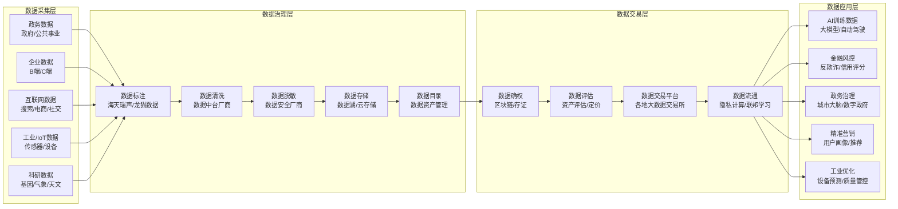
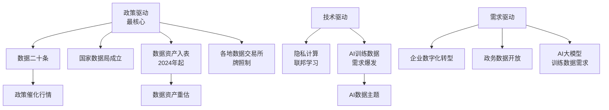
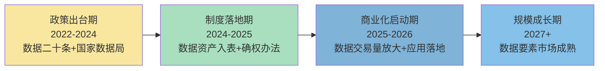

# 数据要素产业链总纲

> 产业链深度：★★★★
> 行情属性：政策驱动（制度红利）+ 早期成长
> 核心驱动：政策推动（数据二十条→国家数据局→数据资产入表）
> 当前阶段：制度框架搭建期，商业化尚在早期

## 关联节点

### 核心关联
[[A股产业研究库/03 产业链图谱/数据要素产业链/数据交易]] | [[A股产业研究库/03 产业链图谱/数据要素产业链/AI训练数据]] | [[A股产业研究库/03 产业链图谱/数据要素产业链/政务数据运营]] | [[A股产业研究库/03 产业链图谱/数据要素产业链/数据资产入表]] | [[A股产业研究库/03 产业链图谱/数据要素产业链/数据安全]]

### 交叉产业链
[[A股产业研究库/03 产业链图谱/AI产业链/总纲|AI产业链]] | [[A股产业研究库/03 产业链图谱/金融科技产业链/总纲|金融科技产业链]] | [[A股产业研究库/03 产业链图谱/半导体产业链/总纲|数字产业化]]

---

## 一、全景图

---

## 二、7个环节商业价值表

| 环节 | 商业模式 | 毛利率 | 市场空间(2026E) | 竞争格局 | A股代表性 |
|:----:|:---------|:------:|:--------------:|:--------|:---------|
| 数据采集 | 项目制/平台抽成 | 30-50% | 300亿 | 分散，政务数据垄断 | 易华录(数据湖) |
| 数据标注 | 人力密集型 | 25-40% | 150亿 | 分散，门槛低 | 海天瑞声 |
| 数据治理/中台 | 项目制/SaaS | 35-50% | 500亿 | 中集中，头部厂商确立 | 星环科技/深桑达 |
| 数据安全 | 项目制+产品 | 40-60% | 200亿 | 中集中，格局良好 | 安恒信息/奇安信 |
| 隐私计算 | 产品+方案 | 40-55% | 100亿 | 早期，多家探索 | — |

**数据来源**：中国信通院相关报告；各公司2024年年报，巨潮资讯网 www.cninfo.com.cn
| 数据交易平台 | 交易抽成+服务费 | 50-70% | 50亿 | 各地数据交易所运营中 | 广电运通/易华录 |
| 数据应用（AI） | SaaS/API | 50-80% | 800亿 | 快速变化 | 海天瑞声/拓尔思 |

**核心判断**: 当前商业化最成熟的环节是数据治理/中台（星环科技/深桑达）和数据标注（海天瑞声）。数据交易平台和隐私计算商业化程度低，处于政策催化和模式验证阶段。

---

## 三、景气度驱动因素

**当前核心驱动**: 数据资产入表（2024年起）是最重要的制度变革——数据从成本变为资产，推动企业进行数据梳理/确权/交易。2026年数据资产入表规模有望突破千亿。

---

## 四、A股全映射表

### 4.1 数据治理与中台

| 公司 | 定位 | 投资逻辑 |
|:----|:-----|:---------|
| 星环科技 | 大数据平台+AI基础软件 | 数据治理+湖仓一体+AI Infra |
| 深桑达A | 数据治理+政务云 | 中国电子旗下，政务数据运营平台 |
| 易华录 | 数据湖+数据要素 | 蓝光存储+政务数据湖，数据交易试点 |
| 每日互动 | 数据智能服务 | 移动数据+营销/公共服务 |
| 东方国信 | 工业大数据 | 电信/工业大数据平台 |

### 4.2 数据交易与运营

| 公司 | 定位 | 投资逻辑 |
|:----|:-----|:---------|
| 广电运通 | 数据交易运营 | 广州数据交易所运营方+金融机具 |
| 易华录 | 数据湖运营 | 数据湖存储+各地数据交易试点 |
| 浙数文化 | 数据交易+媒体 | 浙江大数据交易中心参与方 |
| 人民网 | 数据确权+数据安全 | 人民数保+数据确权平台 |
| 顺网科技 | 算力+数据交易 | 边缘算力+数据交易平台 |

### 4.3 AI训练数据

| 公司 | 定位 | 投资逻辑 |
|:----|:-----|:---------|
| 海天瑞声 | AI训练数据+标注 | A股最纯正AI训练数据标的，大模型需求爆发 |
| 拓尔思 | 大数据+AI | NLP数据+媒体数据，AI内容生成 |
| 慧辰股份 | 数据分析+AI | 消费者数据+AI洞察 |
| 中新赛克 | 网络数据采集 | 网络可视化+大数据采集 |

### 4.4 数据安全与隐私计算

| 公司 | 定位 | 投资逻辑 |
|:----|:-----|:---------|
| 安恒信息 | 数据安全+隐私计算 | 数据安全治理+AiLand隐私计算 |
| 奇安信 | 数据安全全栈 | 数据安全+零信任+数据防泄漏 |
| 信安世纪 | 密码+数据安全 | 加密认证+数据交易安全 |
| 绿盟科技 | 数据安全+隐私计算 | 数据分类分级+安全合规 |
| 三未信安 | 密码芯片+隐私计算 | 国产密码+数据要素安全底座 |

### 4.5 政务数据

| 公司 | 定位 | 投资逻辑 |
|:----|:-----|:---------|
| 中国软件 | 政务数据+信创 | 国产OS+数据库+政务应用 |
| 太极股份 | 政务数字化 | 数字政务+数据服务 |
| 中科曙光 | 政务云+算力 | 政务数据中心+算力调度 |
| 数字政通 | 城市管理数据 | 城管/网格化治理数据运营 |

---

## 五、投资逻辑

### 政策驱动型投资框架

数据要素是一个典型的**政策驱动型赛道**——制度红利是核心催化剂，商业化落地节奏慢于政策出台节奏。

**当前阶段（2026H1）判断**: 处于"制度落地期→商业化启动期"过渡阶段。数据资产入表已实施，各地数据交易所正在试运营，AI大模型对训练数据的需求持续爆发。2026年可能是数据要素从概念炒作走向订单验证的关键转折年。

### 投资节奏建议

| 阶段 | 关注重点 | 投资策略 |
|:-----|:---------|:---------|
| 政策催化期 | 政策文件发布 | 追逐龙头（易华录/深桑达/星环） |
| 制度落地期 | 数据交易所/入表案例 | 关注治理+交易（星环/广电运通） |
| 商业化启动期 | 订单/收入验证 | 优选有收入的公司（海天瑞声/拓尔思） |
| 规模成长期 | 利润释放 | 全链配置 |

---

## 六、核心结论

1. **数据要素是最大政策红利之一**: 数据二十条→国家数据局→数据资产入表→各地数据交易所，制度框架在3年内快速搭建完成。这是中国数字经济最底层的制度创新。

2. **当前商业化程度低，选股聚焦有收入的公司**: 多数数据要素公司仍处于投入期，收入验证是关键分水岭。海天瑞声（AI训练数据，收入清晰）、星环科技（数据治理平台，且有高增长率）是相对确定的选择。

3. **AI训练数据是弹性最大的细分**: AI大模型对高质量训练数据的需求爆发式增长。海天瑞声是A股最纯正的AI训练数据公司，受益于多模态+多语言+垂直领域模型对数据量的指数级需求。

4. **数据交易平台模式仍需时间验证**: 各地数据交易所（北京/上海/深圳/贵州等）交易量仍然较小，商业模式（抽成/服务费/数据增值）尚未完全跑通。关注广电运通（广州数据交易所运营方）的运营数据。

5. **风险关注**: 数据确权和隐私保护法规尚在完善中，政策变化可能影响数据流通效率；数据要素商业化进度可能低于市场预期，主题行情后容易回调；行业处于早期，多数公司缺乏稳定收入和利润，估值缺乏锚。

---

## 代表公司

### 数据交易与运营

| 环节 | 龙头 | 核心 | 弹性 | 核心逻辑 |
|:----:|:----:|:----:|:----:|:---------|
| 数据交易平台运营 | 广电运通 | — | — | 广州数据交易所运营方，数据交易量+交易额持续增长，数字人民币+数据交易双主线 |
| 数据湖/存储运营 | 易华录 | — | — | 蓝光存储+政务数据湖，数据资产入表核心受益标的（数据存储→数据运营→数据交易） |
| 数据确权/存证 | 人民网 | — | — | 人民数保平台+数据确权基础设施，政策驱动型标的 |
| 数据交易参与 | 浙数文化 | — | — | 浙江大数据交易中心参与方，媒体数据+数据交易 |
| 数据资产运营 | — | 每日互动 | — | 移动数据资产（用户画像/推送），数据合规前提下变现场景 |

### AI训练数据

| 环节 | 龙头 | 核心 | 弹性 | 核心逻辑 |
|:----:|:----:|:----:|:----:|:---------|
| AI训练数据/标注 | 海天瑞声 | — | — | A股最纯正AI训练数据标的，多模态数据（文本/图像/语音/视频）全品类覆盖，大模型/自动驾驶双驱动 |
| NLP/语义数据 | 拓尔思 | — | — | NLP+媒体数据+AI内容生成，政府/媒体行业大模型数据供应商 |
| 消费者数据/AI洞察 | — | 慧辰股份 | — | 消费者调研数据+AI分析，大消费行业数据洞察 |
| 网络数据采集 | — | — | 中新赛克 | 网络可视化+大数据采集，运营商/政府部门客户 |
| 工业数据 | — | 东方国信 | — | 工业大数据平台，工业AI训练数据 |

### 政务数据运营

| 公司 | 定位 | 核心逻辑 |
|:----|:-----|:---------|
| 深桑达A | 政务数据运营 | 中国电子旗下，政务数据运营平台（数字CEC），政务数据授权运营试点 |
| 太极股份 | 政务数据+数字政务 | 人大/政协/国资委等政务系统，政务数据治理+数据驾驶舱 |
| 中国软件 | 政务数据+信创 | 国产OS+数据库+政务应用，政务数据底座 |
| 数字政通 | 城市管理数据运营 | 城管/网格化治理数据运营，智慧城市数据底座 |
| 中科曙光 | 政务云+算力 | 政务数据中心+算力调度+城市云 |
| 南威软件 | 数字政府+数据服务 | 政务数据中台+城市大脑，福建/广东政务数据运营 |

### 数据安全与隐私计算

| 环节 | 龙头 | 核心 | 弹性 | 核心逻辑 |
|:----:|:----:|:----:|:----:|:---------|
| 数据安全全栈 | 奇安信 | 安恒信息 | 绿盟科技 | 数据安全+零信任+数据防泄漏，政府/金融行业数据安全合规刚需 |
| 数据安全治理 | 安恒信息 | — | — | AiLand隐私计算平台+数据安全治理，政务数据安全运营 |
| 密码/加密 | 信安世纪 | 三未信安 | 数字认证 | 国产密码算法+数据交易安全，数据要素安全流通底座 |
| 数据脱敏/分类分级 | — | 绿盟科技 | 美创科技(未上市) | 数据分类分级+脱敏，数据资产入表前置环节 |
| 网络安全+数据安全 | — | 启明星辰 | 天融信 | 网络安全+数据安全的综合方案 |

### 数据治理与中台

| 公司 | 定位 | 核心逻辑 |
|:----|:-----|:---------|
| 星环科技 | 大数据平台+数据治理 | 湖仓一体+数据中台+AI Infra，数据治理层技术壁垒最高 |
| 深桑达A | 数据治理+政务云 | 数据治理+政务数据运营双主线 |
| 易华录 | 数据湖+数据治理 | 蓝光存储+数据治理+数据运营全链布局 |
| 普元信息 | 数据中台+低代码 | 数据资产管理+低代码平台，政企数据治理 |
| 三维天地 | 数据管理平台 | 数据资产管理+实验室信息管理(LIMS)，质量数据治理 |

---

### 关键跟踪指标

| 指标 | 重要性 | 更新频率 | 数据来源 |
|:-----|:------:|:--------:|:--------|
| 国家数据局政策文件发布频率 | ★★★★★ | 季度 | 国家数据局/国务院 |
| 数据交易量（上海/北京/深圳数据交易所） | ★★★★★ | 月度 | 各数据交易所公告 |
| 数据资产入表企业数量 | ★★★★ | 季度 | 上市公司年报/公告 |
| 公共数据授权运营试点进展 | ★★★★ | 季度 | 地方政府公告 |
| 数据安全/隐私计算市场规模 | ★★★★ | 年度 | IDC/赛迪 |
| AI训练数据版权法规进展 | ★★★ | 不定 | 国家版权局/法院判例 |
| 数据要素产业基金规模 | ★★★ | 季度 | 各地政府公告 |

### 主要风险

- 数据确权和隐私保护法规尚在完善中，政策变化可能影响数据流通效率
- 数据要素商业化进度可能低于市场预期，主题行情后容易回调
- 行业处于早期，多数公司缺乏稳定收入和利润，估值缺乏锚
- 公共数据授权运营的利益分配机制尚不清晰
- 数据交易所交易量增长缓慢，未能实现规模化盈利

## 政策法规

### 数据基础制度体系（数据20条）

| 政策文件 | 时间 | 核心内容 | 影响 |
|:---------|:----|:---------|:-----|
| [《关于构建数据基础制度更好发挥数据要素作用的意见》](https://www.gov.cn)(数据20条) | 2022年12月 | 建立数据产权制度（三权分置：数据资源持有权/数据加工使用权/数据产品经营权）、数据流通交易制度、数据收益分配制度 | 数据要素市场化的纲领性文件，第一次从国家层面明确数据作为生产要素的地位，推动数据确权/交易/入表 |
| 国家数据局组建 | 2023年3月 | 新设国家数据局（副部级），统筹数据资源整合共享和开发利用 | 数据要素有了专门的管理机构，政策出台速度和执行力大幅提升 |
| 数字中国建设整体布局规划 | 2023年2月 | 将数字中国建设纳入党政干部KPI考核 | 地方政府加速推动政务数据共享和公共数据运营 |

### 数据资产入表政策

| 政策文件 | 时间 | 核心内容 | 影响 |
|:---------|:----|:---------|:-----|
| 《企业数据资源相关会计处理暂行规定》 | 2023年8月(2024年1月施行) | 企业数据资源符合资产确认条件的可作为"无形资产"或"存货"入表 | 数据从"费用"变"资产"，推动企业进行数据梳理/确权/评估，开启数据资产化进程 |
| 数据资产评估指导意见 | 2023年9月 | 规范数据资产评估方法（成本法/收益法/市场法） | 为数据资产入表提供估值依据，利好资产评估机构 |
| 数据资产入表细则进一步完善 | 2025-2026年(陆续出台) | 明确数据资产入表的核算标准、披露要求、审计程序 | 上市公司数据资产入表案例增加，2026年数据资产入表规模有望突破千亿 |

### 公共数据授权运营

| 政策 | 时间 | 核心内容 | 影响 |
|:-----|:----|:---------|:-----|
| 公共数据授权运营管理办法 | 2024-2025年(各地陆续出台) | 地方政府将公共数据授权给特定平台运营，建立"原始数据不出域、数据可用不可见"的运营模式 | 利好有政府背景的数据运营平台（深桑达/太极/数字政通），公共数据运营是数据要素市场化的第一个落地场景 |
| 政务数据共享管理办法 | 2023-2024年 | 推动政府部门之间数据共享，打破数据孤岛 | 加速政务数据汇聚，为数据运营提供数据源 |
| 公共数据定价机制 | 2025年(探索中) | 对公共数据授权运营的定价模式进行规范（成本定价/市场定价/收益分成） | 影响公共数据运营平台的商业模式和利润率 |

### 数据安全与隐私保护法律体系

| 法规 | 时间 | 核心内容 | 影响 |
|:-----|:----|:---------|:-----|
| [数据安全法](https://www.npc.gov.cn) | 2021年9月 | 数据分类分级、重要数据目录、数据安全审查 | 数据全生命周期安全合规成为刚需，利好数据安全厂商 |
| [个人信息保护法](https://www.npc.gov.cn) | 2021年11月 | 个信收集"最小必要"原则、跨境传输评估、自动化决策透明 | 影响数据交易中的个人信息流动，增加数据合规成本 |
| 网络安全法(修订) | 2022年(修订) | 关键信息基础设施保护、网络安全等级保护 | 网络数据安全合规体系进一步完善 |
| 数据出境安全评估办法 | 2022年9月 | 重要数据和个人信息出境需通过安全评估 | 影响跨国企业的数据跨境流动，利好跨境数据合规服务商 |

### 各地数据交易所管理

| 交易所 | 成立时间 | 交易模式 | 特点 |
|:-------|:--------|:---------|:-----|
| 上海数据交易所 | 2021年 | 数据产品挂牌交易 | 交易量最大，聚焦金融/航运/制造数据 |
| 北京国际大数据交易所 | 2021年 | 数据交易+数据托管 | 政务数据+金融数据，政府背景强 |
| 深圳数据交易所 | 2022年 | 数据交易+跨境数据 | 跨境数据交易试点，粤港澳大湾区 |
| 广州数据交易所 | 2022年 | 数据交易+数据资产 | 广电运通运营，聚焦工业/交通/金融 |
| 贵阳大数据交易所(升级) | 2015年/2022年升级 | 数据交易+算力交易 | 大数据交易先行者，气象/交通数据特色 |

---

## 舆论风向

### 数据确权"难以落地"vs"制度突破"的争议

**悲观派（法律/技术界）**:
- 数据确权的核心难题（数据可复制性/非竞争性/非排他性）从区块链到隐私计算都没有根本解决，"三权分置"在具体操作层面缺乏法律效力
- 数据确权在司法实践中缺乏判例支撑，数据纠纷的维权成本高、周期长，"确权不如维权"
- 即使确权完成，数据的定价机制仍是难题——同一数据对不同主体的价值差异巨大，且数据价值随时间衰减

**乐观派（政策研究/国家数据局）**:
- 数据20条开创性地提出"三权分置"，不同于传统的物权/知识产权框架，是制度创新而非简单套用
- 中央数据确权政策框架已经搭建，后续细则（数据产权登记/确权流程/纠纷解决）在2025-2026年密集出台
- 公共数据授权运营的实践正在为数据确权提供案例经验，"先运营、再确权"的务实路径正在被验证

### 地方政府数据授权运营"利益分配"问题

**核心争议**:
- 公共数据运营的核心矛盾是"政府管安全"vs"企业要效率"——政府担心数据泄露不敢开放，企业抱怨政务数据开放不足、运营价值受限
- 利益分配机制不明确：公共数据产生的收益如何在政府（公共属性）和运营平台（商业属性）之间分配？是否应该向数据源单位（各部门局）返还收益？
- 公共数据定价缺乏标准：免费开放（数据公益属性）vs 市场化定价（数据经济价值）的争论持续

**典型案例讨论**:
- 上海数据交易所"政府指导+市场化运营"模式效果良好，但其他地区的自营模式普遍交易量低
- 广州数据交易所（广电运通运营）的"数据经纪人"模式被寄予厚望，但交易量仍然偏小

### AI训练数据版权纠纷的典型案例影响

**标志性案例**:
- 美国纽约时报诉OpenAI案（2023-2025年持续审理）是AI训练数据版权纠纷的全球风向标，结果将深刻影响AI数据商业模式
- 国内类似案例：视觉中国诉AI公司图片侵权、网文作者联名抗议大模型未经授权使用作品训练
- 中文数据集"语料库版权"争议加剧，百度/阿里大模型训练数据的版权合规性受到关注

**市场影响**:
- 版权纠纷推动"付费授权数据"成为AI训练数据的主流模式，利好海天瑞声等有合规数据源的公司
- AI公司被迫转向"合成数据"和"公开数据"训练，但合成数据的质量（模型坍塌风险）引发新的技术争议
- 数据版权制度如果趋严，将提高大模型训练成本，加速AI行业洗牌

### 数据资产入表"会计处理争议"

**实务争议**:
- 数据的资产确认条件不明确：数据资产的"未来经济利益"如何可靠计量？数据资产的"使用寿命"如何确定（数据随时间贬值）？
- 数据资产的后续计量问题：成本法（初始确认后不重估）vs 公允价值法（定期重估），业界尚未形成共识
- 数据资产入表可能被滥用——企业将有选择地将数据成本资本化以美化财务报表

**投资者关注**:
- 上市公司数据资产入表案例（如某公司数据资产入表增加数亿资产）引发市场对"会计操纵"的质疑
- 审计机构对数据资产入表持谨慎态度，部分企业的数据资产入表被审计师打回
- 数据资产入表的真实经济含义是"资产负债表扩充"还是"盈利能力提升"？市场认识分歧大

## 参考资料

[1] 相关A股公司（如适用）. 2024年年度报告[R]. 巨潮资讯网.
    http://www.cninfo.com.cn

[2] 国家统计局. 中国统计年鉴[R]. 2025.
    http://www.stats.gov.cn

[3] 相关行业协会/研究机构. 行业市场研究报告[R]. 2025.
