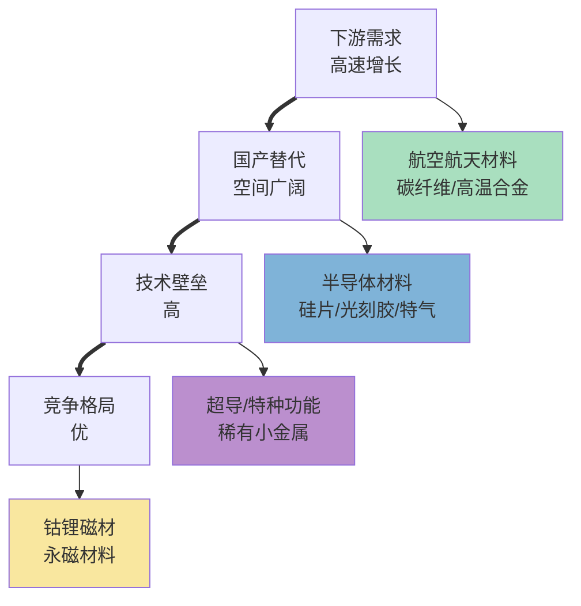

# 新材料产业链总纲

> 产业链深度：★★★★
> 行情属性：成长（前沿新材料）+ 周期（传统材料）+ 主题（国产替代）
> 核心驱动：下游需求拉动 + 国产替代 + 技术突破
> 当前阶段：国产替代加速，前沿材料产业化突破

## 关联概念

- 细分赛道:: [[A股产业研究库/03 产业链图谱/新材料产业链/碳纤维]]
- 细分赛道:: [[A股产业研究库/03 产业链图谱/新材料产业链/高温合金]]
- 细分赛道:: [[A股产业研究库/03 产业链图谱/新材料产业链/先进半导体材料]]
- 衍生应用:: [[A股产业研究库/03 产业链图谱/新材料产业链/高性能纤维]]
- 衍生应用:: [[A股产业研究库/03 产业链图谱/新材料产业链/超导材料]]
- 下游:: [[A股产业研究库/03 产业链图谱/军工产业链/总纲|军工产业链]]
- 下游:: [[A股产业研究库/03 产业链图谱/半导体产业链/总纲|半导体产业链]]
- 下游:: [[A股产业研究库/03 产业链图谱/新能源汽车产业链/总纲|新能源车]]
- 下游:: [[A股产业研究库/03 产业链图谱/新能源产业链/总纲|新能源]]
- 下游:: [[A股产业研究库/03 产业链图谱/消费电子产业链/总纲|消费电子]]

---

## 一、四大板块定义

### 板块一：先进金属材料

| 细分 | 定义 | 核心应用 | 国产化率 | 壁垒 |
|:----|:-----|:---------|:--------:|:----:|
| 高温合金 | 600℃以上保持强度/耐氧化的合金 | 航空发动机涡轮盘/叶片 | 40% | ★★★★★ |
| 钛合金 | 高比强度+耐蚀钛基合金 | 军机结构件/3C/医疗 | 60% | ★★★★ |
| 高性能铝合金 | 高强高韧铝锂合金 | 航空航天/高铁 | 65% | ★★★ |
| 镁合金 | 最轻结构金属材料 | 汽车轻量化/3C | 50% | ★★★ |
| 特种钢 | 高强钢/不锈钢/工模具钢 | 军工/核电/石化 | 70% | ★★★ |

### 板块二：高性能纤维及复合材料

| 细分 | 定义 | 核心应用 | 国产化率 | 壁垒 |
|:----|:-----|:---------|:--------:|:----:|
| 碳纤维 | 直径5-10μm碳化纤维（T700/T800/T1000） | 航空航天/风电叶片/体育 | 50% | ★★★★★ |
| 芳纶纤维 | 芳香族聚酰胺纤维（1313/1414） | 防护服/光缆增强/蜂窝 | 30% | ★★★★★ |
| 超高分子量PE纤维 | 超高强度聚乙烯纤维 | 防弹/绳缆/渔业 | 40% | ★★★★ |
| 复材预浸料 | 纤维+树脂预浸复合材料 | 航空结构件/无人机 | 45% | ★★★★ |

### 板块三：先进半导体材料

| 细分 | 定义 | 核心应用 | 国产化率 | 壁垒 |
|:----|:-----|:---------|:--------:|:----:|
| 大硅片 | 200mm/300mm抛光硅片 | 晶圆衬底 | 15% | ★★★★★ |
| 光刻胶 | ArF/KrF/EUV光刻胶 | 光刻图形化 | 10% | ★★★★★ |
| 电子特气 | 高纯气体（6N-9N） | 刻蚀/沉积/清洗 | 30% | ★★★★ |
| CMP抛光液/垫 | 化学机械平坦化材料 | 晶圆平坦化 | 25% | ★★★★ |
| 溅射靶材 | 高纯金属/合金靶材 | 物理气相沉积镀膜 | 20% | ★★★★ |
| 前驱体 | 金属有机前驱体 | 薄膜沉积 | 15% | ★★★★★ |

**数据来源**：各行业协会/赛迪顾问相关报告；中国化工信息中心

### 板块四：特种功能材料

| 细分 | 定义 | 核心应用 | 国产化率 |
|:----|:-----|:---------|:--------:|
| 超导材料 | 零电阻+抗磁性材料（YBCO/铁基） | MRI/核聚变/量子计算 | 20% |
| 磁性材料 | 钕铁硼/铁氧体永磁 | 电机/风机/新能源车 | 70% |
| 形状记忆合金 | 可恢复形变合金（NiTi） | 医疗器械/执行器 | 25% |
| 3D打印材料 | 钛合金/镍基合金粉末 | 航空件/医疗植入物 | 35% |
| 气凝胶 | 纳米多孔隔热材料 | 动力电池隔热/军事隔热 | 30% |

---

## 二、投资逻辑框架

**选股四象限**:

|  | 下游需求高增长 | 下游需求稳定 |
|:--|:-------------|:------------|
| **国产替代空间大** | 最优：碳纤维、半导体材料 | 良：特种钢、先进铝材 |
| **国产替代空间小** | 中：锂电材料、风电复材 | 差：传统合金、普通涂料 |

---

## 三、A股核心公司一览

### 3.1 先进金属材料

| 细分 | 龙头 | 核心 | 弹性 | 投资逻辑 |
|:----:|:----:|:----:|:----:|:---------|
| 高温合金 | 抚顺特钢 | 钢研高纳 | 图南股份 | 航发批产拉动高温合金需求翻倍 |
| 钛合金 | 西部超导 | 宝钛股份 | 西部材料 | 军机+3C钛合金双驱动 |
| 高温合金+复材 | 西部超导 | — | — | 超导+高温合金+钛合金三业务 |
| 镁合金 | 云海金属 | 万丰奥威(镁合金) | — | 汽车轻量化+镁价回升 |
| 特种铝材 | 南山铝业 | 中铝集团 | — | 航空板+汽车板 |

### 3.2 高性能纤维及复材

| 细分 | 龙头 | 核心 | 弹性 | 投资逻辑 |
|:----:|:----:|:----:|:----:|:---------|
| 碳纤维（航空级） | 光威复材 | 中复神鹰 | 中简科技 | 军机+风电叶片复材化 |
| 碳纤维（工业级） | 中复神鹰 | — | 吉林碳谷 | 风电+氢能瓶+体育 |
| 芳纶纤维 | 泰和新材 | — | — | 对位芳纶+间位芳纶双突破 |
| 超高分子PE | 同益中 | — | — | 防弹材料+绳缆 |
| 复材预浸料 | 中航高科 | — | — | 航空复材预浸料龙头 |

### 3.3 先进半导体材料

参见[[A股产业研究库/03 产业链图谱/半导体产业链/总纲#5.5 半导体材料]]，核心标的:

| 细分 | 龙头 | 核心 | 弹性 |
|:----:|:----:|:----:|:----:|
| 大硅片 | 沪硅产业 | 立昂微 | TCL中环 |
| 光刻胶 | 彤程新材 | 晶瑞电材 | 南大光电 |
| 电子特气 | 华特气体 | 金宏气体 | 昊华科技 |
| CMP抛光液/垫 | 安集科技 | 鼎龙股份 | — |
| 溅射靶材 | 江丰电子 | 有研新材 | 阿石创 |

### 3.4 特种功能材料

| 细分 | 龙头 | 核心 | 弹性 | 投资逻辑 |
|:----:|:----:|:----:|:----:|:---------|
| 永磁材料 | 中科三环 | 金力永磁 | 正海磁材 | 新能源车+机器人双驱动 |
| 超导材料 | 西部超导 | 永鼎股份 | 联创光电 | 核聚变+MRI+量子 |
| 气凝胶 | 华阳新材 | — | — | 动力电池隔热+工业保温 |
| 3D打印 | 铂力特 | 华曙高科 | — | 航空3D打印零件批产 |
| 形状记忆合金 | 有研新材 | — | — | 医疗支架+智能结构 |

---

## 四、核心结论

1. **新材料投资的核心是"下游需求拉动"**: 优秀的新材料公司必然绑定一个高景气的下游行业。当前最确定的下游是航空航天（碳纤维/高温合金）和半导体（硅片/光刻胶/特气）。

2. **半导体材料国产替代空间最大但壁垒也最高**: 国产化率普遍在10-30%，且认证周期长（1-3年）。一旦通过认证进入供应链，替代进程不可逆且客户黏性极强。

3. **碳纤维正处于行业拐点**: 国产碳纤维从T300级至T800级逐步突破，产能快速扩张+价格下行带动下游渗透率提升（风电叶片+航空+氢能）。光威复材和中复神鹰是核心标的。

4. **高温合金是航空发动机批产的直接映射**: 航发批产（涡扇-10/涡扇-15/长江-1000）是十四五/十五五最确定的军工产业链增量。抚顺特钢/钢研高纳/西部超导直接受益。

5. **风险关注**: 新材料从实验室到量产存在巨大的工程化不确定性（良率/成本/批次一致性）；高端新材料的客户认证周期长（1-3年），业绩释放节奏慢于市场预期；产能扩张后可能出现供需失衡导致价格战。

---

## 代表公司

### 碳纤维及复合材料

| 环节 | 龙头 | 核心 | 弹性 | 核心逻辑 |
|:----:|:----:|:----:|:----:|:---------|
| 碳纤维(航空级) | 光威复材 | 中简科技 | — | 军机碳纤维主力供应商，T800级/M40J级已实现航空应用，风电叶片预浸料民用拓展 |
| 碳纤维(工业级) | 中复神鹰 | — | 吉林碳谷、吉林化纤 | T700/T800级工业级碳纤维，风电/氢能瓶/体育休闲多下游，产能扩张+价格下行驱动渗透率提升 |
| 碳纤维(高端军用) | 中简科技 | — | — | ZT7系列航空航天碳纤维，高毛利率(70%+)，型号列装放量驱动 |
| 芳纶纤维 | 泰和新材 | — | — | 对位芳纶(1414)+间位芳纶(1313)双突破，防弹/光缆增强/蜂窝芯材 |
| 超高分子PE纤维 | 同益中 | — | — | 防弹材料+绳缆+渔业，军用防弹+民用安全双驱动 |
| 复材预浸料 | 中航高科 | — | — | 航空复材预浸料龙头，军机复材化率提升+大飞机商用复材 |
| 复材结构件 | 中航高科 | — | 新研股份 | 航空复材结构件制造，受益C919批产+军机复材化 |

### 高温合金及特种金属

| 环节 | 龙头 | 核心 | 弹性 | 核心逻辑 |
|:----:|:----:|:----:|:----:|:---------|
| 高温合金(变形) | 抚顺特钢 | 钢研高纳 | 图南股份 | 航发涡轮盘/叶片高温合金，航发批产直接受益。抚顺特钢产能瓶颈突破（扩建项目投产） |
| 高温合金(铸造) | 钢研高纳 | — | 图南股份 | 精密铸造高温合金，航发叶片+航天发动机 |
| 钛合金(航空) | 西部超导 | 宝钛股份 | 西部材料 | 军机钛合金用量提升（从5%到15%+），3C/医疗钛合金开辟新增长极 |
| 钛合金(宽幅板) | 宝钛股份 | — | — | 军用钛合金中厚板龙头，舰船/化工应用 |
| 镁合金 | 云海金属 | — | 万丰奥威(镁合金) | 汽车轻量化（一体压铸镁合金）+3C镁合金外壳，镁价回升预期 |
| 特种铝材 | 南山铝业 | 中铝集团(港股) | 明泰铝业 | 航空铝板（国产大飞机）+汽车铝板（新能源车轻量化） |

### 先进半导体材料

| 环节 | 龙头 | 核心 | 弹性 | 核心逻辑 |
|:----:|:----:|:----:|:----:|:---------|
| 大硅片(300mm) | 沪硅产业 | 立昂微 | TCL中环(半导体硅片) | 国产300mm硅片用从10%→30%+替代，沪硅最纯正、立昂微功率硅片双驱动 |
| 光刻胶(ArF/KrF) | 彤程新材 | 晶瑞电材 | 南大光电 | ArF光刻胶国产替代从0到1，彤程(北京科华)ArF胶已通过多家晶圆厂验证 |
| 电子特气 | 华特气体 | 金宏气体 | 昊华科技、中船特气 | 高纯气体国产化率不断提升，华特气体产品品类最全、认证最多 |
| CMP抛光液 | 安集科技 | — | — | CMP抛光液/清洗液龙头，14nm/7nm制程用液已量产 |
| CMP抛光垫 | 鼎龙股份 | — | — | CMP抛光垫国产替代，从8寸→12寸→先进制程逐步突破 |
| 溅射靶材 | 江丰电子 | 有研新材 | 阿石创、隆华科技 | 靶材国产替代持续突破，江丰铝靶/钛靶/铜靶已进入全球前列 |
| 前驱体 | 雅克科技 | — | — | 前驱体/SOD材料，SK海力士供应链+国产替代双驱动 |

### 其他特种功能材料

| 环节 | 龙头 | 核心 | 弹性 | 核心逻辑 |
|:----:|:----:|:----:|:----:|:---------|
| 稀土永磁(钕铁硼) | 中科三环 | 金力永磁 | 正海磁材、宁波韵升 | 新能源车+机器人+风电双驱动，人形机器人量产打开永磁材料新增长极 |
| 超导材料(LTS/HTS) | 西部超导 | 永鼎股份 | 联创光电、百利电气 | 核聚变+MRI+量子计算+可控核聚变，超导产业进入商业化早期 |
| 气凝胶 | 华阳新材 | — | 硅宝科技(气凝胶) | 动力电池隔热片+工业保温，新能源车渗透率提升驱动 |
| 3D打印金属粉末 | 铂力特 | 华曙高科 | — | 航空3D打印零件批产（C919/军机），医疗植入物3D打印 |
| 硬质合金/难熔金属 | 厦门钨业 | 中钨高新 | 章源钨业 | 数控刀具+精密模具，制造业升级拉动 |
| 形状记忆合金 | 有研新材 | — | — | 医疗支架+智能结构，医疗器械国产替代 |

---

### 关键跟踪指标

| 指标 | 重要性 | 更新频率 | 数据来源 |
|:-----|:------:|:--------:|:--------|
| 碳纤维/芳纶等关键材料国产化率 | ★★★★★ | 年度 | 赛迪/华泰研究 |
| 新材料企业产能扩张计划 | ★★★★ | 季度 | 企业公告 |
| 国产替代政策支持力度 | ★★★★★ | 不定 | 工信部/发改委政策文件 |
| 新材料企业毛利率变化 | ★★★★ | 季度 | 上市公司财报 |
| 重点新材料首批次保险补偿金额 | ★★★ | 年度 | 工信部 |
| 新材料企业研发投入占比 | ★★★ | 季度 | 上市公司财报 |
| 海外新材料巨头动态（杜邦/信越/巴斯夫） | ★★★ | 季度 | 公司公告 |

### 主要风险

- 新材料从实验室到量产存在巨大的工程化不确定性（良率/成本/批次一致性）
- 高端新材料的客户认证周期长（1-3年），业绩释放节奏慢于市场预期
- 产能扩张后可能出现供需失衡导致价格战
- 新材料公司市值小、流动性不足，估值波动大
- 国产替代逻辑可能受到海外竞争对手降价阻击

## 政策法规

### 国家新材料产业政策体系

| 政策 | 时间 | 核心内容 | 影响 |
|:-----|:----|:---------|:-----|
| 新材料产业发展指南 | 2017年发布+滚动更新 | 明确碳纤维、高温合金、半导体材料等关键新材料的战略地位和攻关方向 | 引导社会资本和科研力量向新材料领域集中，是行业长期发展纲要 |
| 新材料首批次应用保险补偿机制 | 2017年启动+持续扩围 | 对首批次新材料应用提供保险补偿（保额50-80%），降低下游用户使用国产新材料的风险 | 是新材料产业最直接的政策利好——打破"不敢用→没量产→没改进"的死循环，加速国产新材料进入供应链 |
| 重点新材料首批次应用示范指导目录 | 每年更新 | 发布需要首批次保险补偿的新材料品种目录 | 每版目录变化反映政策重点方向（2024版新增半导体材料、超导材料等品种） |
| 新材料产业"十四五"规划 | 2021年 | 提出新材料产业规模10万亿目标，碳纤维/高温合金/稀土永磁为重点方向 | 为行业提供5年仅中期增长锚，10万亿目标对应年复合增长率10%+ |
| 国家新材料产业投资基金 | 2020年成立 | 国家集成电路大基金模式复制到新材料领域，重点投向碳纤维/半导体材料/高端合金 | 为新材料企业提供直接融资渠道，加速产业化进程 |

### 进口替代与国产化政策

| 政策 | 内容 | 影响 |
|:-----|:------|:-----|
| 进口替代目录（工信部） | 每年发布新材料进口替代目录，明确国产化率目标和替代时间表 | 半导体材料（硅片/光刻胶/特气）和航空材料（碳纤维/高温合金）被列为重点替代领域 |
| 关键技术与产品攻关清单 | 将碳纤维T1000、ArF光刻胶、高纯金属靶材等列为"卡脖子"技术攻关项目 | 相关企业可获国家科研经费支持+税收优惠+优先采购 |
| 政府采购国产化要求 | 政府投资项目优先采购国产新材料 | 利好新材料企业的国内市场替代，降低海外竞争压力 |

### 军用材料认证体系

| 认证 | 内容 | 影响 |
|:-----|:------|:-----|
| GJB9001(国军标质量管理体系) | 军用材料生产企业的基本准入门槛 | 认证周期长（1-2年）、门槛高，已通过认证的企业构筑了先发优势 |
| 军用材料定型鉴定 | 新材料的军用定型需通过型号总师单位的严格评审和验证 | 军品材料认证周期3-5年，一旦列装则不可替代（超高客户黏性） |
| 军品供应链"双流水"政策 | 关键军工材料至少保持两家供应商 | 利好通过军品认证的第二供应商（如中简科技作为碳纤维二供） |

### 专精特新政策

| 政策 | 内容 | 影响 |
|:-----|:------|:-----|
| 专精特新"小巨人"认定 | 国家重点支持专业化/精细化/特色化/新颖化的中小企业 | 新材料企业是"小巨人"的主要群体，获得资金+税收+政策支持 |
| 制造业单项冠军 | 对细分领域全球领先的企业给予政策支持 | 光威复材/安集科技/华特气体等新材料企业已获认定 |
| 科技型中小企业税收优惠 | 研发费用加计扣除/所得税优惠 | 新材料企业（研发投入通常占收入10-20%）显著受益 |

---

## 舆论风向

### 碳纤维"高端不够用、低端产能过剩"的讨论

**产能过剩叙事（产业媒体/雪球）**:
- 国内碳纤维规划产能已经超过20万吨/年，而2025年实际需求约8-10万吨，产能利用率不足50%
- 低端碳纤维（T300/T700级）价格从2018年的30万元/吨暴跌至2025年的8万元/吨，大量中小碳纤维企业亏损倒闭
- 行业"军热民冷"——军用/航空航天碳纤维（T800/M40J级）需求旺盛但产能有限且认证门槛高，民用（风电/体育）需求增速跟不上产能扩张

**产业升级叙事（券商/龙头公司）**:
- 产能过剩是"结构性"而非"全行业"——低端过剩但高端（T800/M40J/T1000级）依然供不应求
- 价格下行反而有利于下游渗透率提升（风电叶片/氢能瓶/建筑补强等新场景），以价换量打开市场空间
- 行业洗牌后龙头（光威复材/中复神鹰）的市占率和定价权有望提升，类似光伏行业的发展路径

### 半导体材料国产替代进度"超预期vs低于预期"

**超预期派**:
- 安集科技CMP抛光液、华特气体电子特气、彤程新材光刻胶的国产替代进度超出预期，部分品类国产化率已从5%提升至25%+
- 国内晶圆厂（中芯/华虹/长存）大幅扩产为半导体材料国产替代提供了最好的窗口期
- 成熟制程（28nm+）的国产材料替代已基本跑通，正在向先进制程（14nm/7nm）渗透

**低于预期派**:
- 半导体材料认证周期仍然很长（1-3年），且客户切换意愿不足（风险厌恶+成本敏感）
- 高端光刻胶（ArFi/EUV）、高纯度电子特气（9N级）等仍严重依赖进口，国产替代率不到5%
- 半导体材料国产替代的大前提——国产晶圆厂工艺成熟度和产能利用率——低于市场预期，导致材料导入进度缓慢

### 新材料企业"估值泡沫"的质疑

**泡沫论**:
- 新材料上市公司平均PS 8-15倍、PE 50-100倍，远超国际同行（PS 2-5倍、PE 15-25倍），估值明显偏高
- 多数新材料企业收入体量小（10亿以下）、盈利能力弱（净利率不到10%），高估值靠的是"国产替代故事"而非业绩兑现
- 新材料公司研发投入大、产能爬坡慢，现金流转正周期长，"烧钱模式"能否持续存疑

**合理估值论**:
- 新材料公司的高估值部分反映的是"高增速+高确定性"的折价——国产替代空间大（10倍+市场空间），且技术壁垒高
- 国际新材料龙头（如日本信越化学/德国默克）在成长期也有类似高估值阶段
- 产业资本（国家大基金/地方产业基金）在持续买入，说明专业机构认可其长期价值

## 参考资料

[1] 相关A股公司（如适用）. 2024年年度报告[R]. 巨潮资讯网.
    http://www.cninfo.com.cn

[2] 国家统计局. 中国统计年鉴[R]. 2025.
    http://www.stats.gov.cn

[3] 相关行业协会/研究机构. 行业市场研究报告[R]. 2025.
