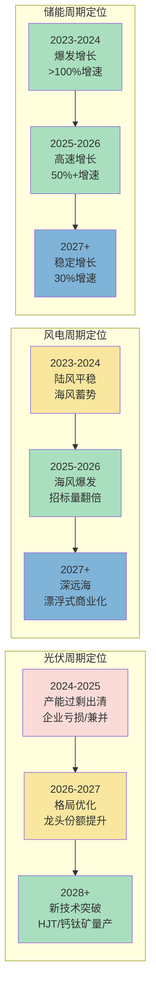

# 新能源产业链总纲

> **缩写说明**：本页出现以下专业缩写——
> - **PCS**（Power Conversion System，储能变流器）
> - **BMS/EMS**（Battery Management System/Energy Management System，电池管理系统/能量管理系统）
> - **HJT**（Heterojunction with Intrinsic Thin Layer，异质结电池）
> - **CAGR**（Compound Annual Growth Rate，复合年增长率）
> - **IRR**（Internal Rate of Return，内部收益率）
> 
> 完整术语表见 [[A股产业研究库/12 术语库/README|术语库]]

> 产业链深度：★★★★★
> 行情属性：周期成长 + 产能出清 + 结构分化
> 核心驱动：双碳目标 + 电力市场化 + 储能配套
> 当前阶段：产能过剩出清末期，行业格局加速优化

## 关联概念

- 细分赛道:: [[A股产业研究库/03 产业链图谱/新能源产业链/光伏]]
- 细分赛道:: [[A股产业研究库/03 产业链图谱/新能源产业链/风电]]
- 细分赛道:: [[A股产业研究库/03 产业链图谱/新能源产业链/储能]]
- 基础设施:: [[A股产业研究库/03 产业链图谱/新能源产业链/电网设备]]
- 基础设施:: [[A股产业研究库/03 产业链图谱/新能源产业链/特高压]]
- 核心产品:: [[A股产业研究库/03 产业链图谱/新能源产业链/逆变器]]
- 关联产业:: [[A股产业研究库/03 产业链图谱/新能源汽车产业链/总纲|新能源汽车产业链]]
- 关联产业:: [[A股产业研究库/03 产业链图谱/AI产业链/总纲|AI产业链]]
- 关联产业:: [[A股产业研究库/03 产业链图谱/数据要素产业链/总纲|电力数据要素]]
- 上游材料:: [[A股产业研究库/03 产业链图谱/新材料产业链/总纲|新能源材料]]

---

## 一、三领域全景图

```mermaid
%%{init: {"flowchart": {"nodeSpacing": 20, "rankSpacing": 30, "useMaxWidth": true}} }%%
graph LR
  subgraph 光伏产业链
    P1[硅料<br/>通威/协鑫/大全]
    P2[硅片<br/>隆基/TCL中环/弘元]
    P3[电池片<br/>通威/爱旭/钧达]
    P4[组件<br/>隆基/晶科/晶澳/天合]
    P5[逆变器<br/>阳光电源/锦浪/固德威]
    P6[电站运营<br/>正泰/三峡能源]
  end

  subgraph 风电产业链
    W1[零部件<br/>主轴/轴承/齿轮箱]
    W2[整机<br/>金风/明阳/运达/电气风电]
    W3[海缆<br/>东方电缆/中天/亨通]
    W4[海上风电运营<br/>三峡/龙源/华能]
  end

  subgraph 储能+电网
    S1[电池储能<br/>宁德/亿纬/比亚迪]
    S2[逆变器(PCS)<br/>阳光/上能/科华]
    S3[BMS/EMS<br/>派能/国电南瑞]
    S4[电网设备<br/>特高压/配电网/电表]
    S5[电力IT<br/>国电南瑞/许继/四方]
  end

  P1 --> P2 --> P3 --> P4 --> P5 --> P6
  W1 --> W2 --> W3 --> W4
  P5 --> S1
  W2 --> S1
  S1 --> S2 --> S3 --> S4
  S4 --> S5
```

---

## 二、各环节利润率/格局/景气度

### 2.1 光伏

| 环节 | 毛利率(2026E) | 竞争格局 | 景气度 | 产能状态 | 核心壁垒 |
|:----:|:------------:|:--------:|:------:|:--------|:---------|
| 硅料 | 15-25% | 集中（通威/协鑫/大全CR3>50%） | 底部磨底 | 过剩出清中 | 成本+电力 |
| 硅片 | 10-20% | 双寡头（隆基/TCL中环） | 底部 | 过剩明显 | 拉晶技术+石英坩埚 |
| 电池片 | 12-22% | 分散 | 分化 | N型紧缺P型过剩 | 转化效率+工艺 |
| 组件 | 8-15% | 分散 | 底部 | 严重过剩 | 品牌+渠道+全球布局 |
| 逆变器 | 25-35% | 中集中（阳光/锦浪/固德威CR3>40%） | 景气上行 | 供需平衡 | 大功率+储能转换 |
| 电站运营 | 50-60% | 集中（央企主导） | 稳定 | — | 资金+项目资源 |

### 2.2 风电

| 环节 | 毛利率(2026E) | 竞争格局 | 景气度 | 核心驱动 |
|:----:|:------------:|:--------:|:------:|:---------|
| 主轴 | 25-35% | 集中（金雷/通裕） | ★★★★ 高景气 | 海风放量+国产替代 |
| 轴承 | 30-45% | 集中（新强联/恒润） | ★★★★ 高景气 | 主轴轴承国产化+海风 |
| 齿轮箱 | 20-30% | 集中（南高齿/德力佳） | ★★★ 中高 | 大型化趋势+双馈机型 |
| 海缆 | 35-50% | 寡头（东方/中天/亨通CR3>70%） | ★★★★★ 高景气 | 海风爆发+技术壁垒 |
| 整机 | 12-18% | 集中 | ★★★ 中 | 价格竞争激烈大型化降本 |
| 海上风电运营 | 40-55% | 央企主导 | ★★★★ 高景气 | 海风并网加速+IRR提升 |

**数据来源**：各公司2024年年报，巨潮资讯网 www.cninfo.com.cn；中国光伏行业协会CPIA；国家能源局；中关村储能产业技术联盟CNESA

### 2.3 储能

| 环节 | 毛利率(2026E) | 竞争格局 | 景气度 | 核心驱动 |
|:----:|:------------:|:--------:|:------:|:---------|
| 电池储能 | 15-22% | 龙头集中 | ★★★★ | 新能源强制配储+独立储能电站 |
| PCS逆变器 | 20-30% | 中集中 | ★★★★ | 储能逆变器增速>光伏逆变器 |
| 系统集成 | 10-18% | 分散 | ★★★ | 竞争激烈，门槛较低 |
| 温控/消防 | 25-35% | 集中（英维克/同飞） | ★★★★ | 液冷储能渗透提升 |

**数据来源**：各公司2024年年报，巨潮资讯网 www.cninfo.com.cn；中国光伏行业协会CPIA；国家能源局；中关村储能产业技术联盟CNESA

---

## 三、市场规模

### 中国2025E新增装机/出货量预估

| 子领域 | 2025E新增 | 同比 | 2026E预估 | 核心驱动 |
|:------|:---------:|:----:|:---------:|:---------|
| 光伏新增装机 | 260GW | +10% | 280GW | 集中式大基地+分布式 |
| 风电新增装机 | 80GW | +25% | 100GW | 海风爆发（15GW→25GW） |
| 新型储能新增 | 60GWh | +50% | 90GWh | 强制配储+独立储能 |
| 电网投资 | 6500亿元 | +15% | 7500亿元 | 特高压+配电网升级 |

**数据来源**：国家能源局；中国光伏行业协会CPIA；中关村储能产业技术联盟CNESA；中国电力企业联合会

---

## 四、产业周期定位



---

## 五、三条投资主线

### 主线一：海风爆发（确定性最强）

**逻辑**: 2025-2026年是中国海上风电爆发期，海缆/轴承/整机三大环节直接受益。海风具备"高景气+高壁垒+格局优"三重属性。

**核心标的**:
- 海缆: 东方电缆（海缆毛利率>40%，订单饱满）、中天科技、亨通光电
- 轴承: 新强联（主轴轴承国产化）、恒润股份（法兰+轴承）
- 海工: 润邦股份（海上风电安装平台）

### 主线二：储能出海（成长最快）

**逻辑**: 中国储能电池+逆变器全球竞争力强，海外储能需求爆发（美国/欧洲/中东）。储能出海是新能源领域最确定的增量市场。

**核心标的**:
- 逆变器出海: 阳光电源（逆变器+PCS全球市占率第一）、锦浪科技、固德威、德业股份
- 户储出海: 派能科技（户储电池海外市场）、艾罗能源（欧洲户储）
- 大储出海: 宁德时代（海外储能电池放量）、亿纬锂能（储能电池+大圆柱）

### 主线三：光伏新技术+电网升级（结构性机会）

**逻辑**: 光伏主产业链产能过剩，投资机会集中在新技术迭代和下游配套。电网设备受益于新能源并网压力，投资确定性高。

**核心标的**:
- 光伏新技术: 钧达股份（N型TOPCon电池龙头）、爱旭股份（ABC电池）、迈为股份（HJT设备龙头）
- 光伏辅材: 石英股份（高纯石英砂）、福莱特（光伏玻璃）
- 电网设备: 国电南瑞（电力二次设备龙头）、许继电气（柔性直流/特高压）、思源电气（开关/互感器）
- 电力IT: 东方电子（电网调度+配网自动化）、四方股份（继电保护）

---

## 六、A股全映射表

### 6.1 光伏

| 环节 | 龙头 | 核心 | 弹性 | 景气判断 |
|:----:|:----:|:----:|:----:|:--------:|
| 硅料 | 通威股份 | 协鑫科技(港股) | 大全能源 | 出清末期，2026H2有望触底 |
| 硅片 | 隆基绿能 | TCL中环 | 弘元绿能 | 双寡头格局稳固，盈利磨底 |
| 电池片(TOPCon) | — | 钧达股份 | 晶科能源 | N型紧缺，盈利优于行业 |
| 电池片(HJT/BC) | — | 爱旭股份 | 东方日升 | 新技术路线，弹性大 |
| 组件 | 晶科能源 | 天合光能 | 晶澳科技 | 全球品牌渠道为王 |
| 逆变器 | 阳光电源 | 锦浪科技 | 固德威 | 海外+储能双驱动 |
| 光伏玻璃 | 福莱特 | 信义光能(港股) | — | 格局良好，盈利稳定 |
| 胶膜 | 福斯特 | 海优新材 | — | 龙头优势明显 |
| 金刚线 | — | 美畅股份 | 高测股份 | 价格战剧烈，关注成本 |
| 电站运营 | 三峡能源 | 正泰电器 | — | 稳定现金流+绿电溢价 |

### 6.2 风电

| 环节 | 龙头 | 核心 | 弹性 | 景气判断 |
|:----:|:----:|:----:|:----:|:--------:|
| 海缆 | 东方电缆 | 中天科技 | 亨通光电 | 海风爆发最直接受益 |
| 主轴 | 金雷股份 | 通裕重工 | — | 海风大型化拉动 |
| 轴承 | 新强联 | 恒润股份 | 瓦房店轴承 | 国产替代+海风双驱动 |
| 铸件 | 日月股份 | — | 吉鑫科技 | 产能过剩，盈利承压 |
| 整机 | 金风科技 | 明阳智能 | 运达股份 | 大型化降本，格局优化 |
| 塔筒 | 天顺风能 | 泰胜风能 | 大金重工 | 海风塔筒+出口 |
| 海风运营 | 三峡能源 | 龙源电力 | 华能国际 | 海风IRR>8%，央企主导 |

### 6.3 储能

| 环节 | 龙头 | 核心 | 弹性 | 景气判断 |
|:----:|:----:|:----:|:----:|:--------:|
| 储能电池 | 宁德时代 | 亿纬锂能 | 派能科技 | 海外储能放量最快 |
| 储能PCS | 阳光电源 | 上能电气 | 科华数据 | 国内+海外双市场 |
| 储能系统 | — | 比亚迪 | 海博思创 | 竞争加剧，门槛较低 |
| 温控/消防 | 英维克 | 同飞股份 | — | 液冷储能渗透提升 |
| 检测/运维 | — | 星云股份 | — | 储能电站后市场 |

### 6.4 电网设备

| 环节 | 龙头 | 核心 | 弹性 | 投资逻辑 |
|:----:|:----:|:----:|:----:|:---------|
| 电力二次设备 | 国电南瑞 | — | — | 电网自动化+调度龙头 |
| 特高压 | 国电南瑞 | 许继电气 | 中国西电 | 特高压直流集中招标 |
| 配电网 | 正泰电器 | 良信股份 | — | 配网智能化+低压电器 |
| 智能电表 | 林洋能源 | 三星医疗 | 海兴电力 | 电网投资+电表替换周期 |
| 电力IT | 东方电子 | 四方股份 | — | 调度+配电自动化 |

---

## 七、核心结论

1. **新能源最大机会在储能和风电**: 光伏主产业链产能过剩问题至少需要1-2年消化。储能（增速50%+）和海风（增速50%+）是当前景气度最高、确定性最强的子领域。

2. **出海是alpha来源**: 国内新能源制造普遍供过于求，海外市场（美国/欧洲/中东/东南亚）利润率和增速显著优于国内。逆变器（阳光电源）、储能电池（宁德时代）、海缆（东方电缆）是出海能力最强的细分。

3. **产能出清是双重机会**: 一方面，产能过剩压制股价，估值处于历史低位；另一方面，出清后龙头份额提升和盈利修复将带来戴维斯双击。关注通威股份（硅料成本最低）、隆基绿能（硅片+BC电池）。

4. **电网配套是确定性最高的配角**: 新能源装机的快速增长倒逼电网投资持续加大。特高压/配电网/电表在未来3年都将维持15-20%的复合增速，且不受产能过剩影响。

5. **风险关注**: 海外贸易壁垒升级（光伏组件关税、储能认证门槛）；电价下行影响电站IRR；储能产能过剩风险正在累积；新技术迭代（钙钛矿/HJT）可能颠覆现有格局。

---

## 代表公司

### 光伏产业链

**硅料/硅片**

| 排序 | 公司 | 代码 | 核心逻辑 |
|:----:|:----|:----:|:---------|
| 龙头 | 通威股份 | 600438 | 硅料成本全行业最低，电池片TOPCon出货量领先，硅料产能出清最受益 |
| 龙头 | 隆基绿能 | 601012 | 硅片+BC电池双龙头，HPBC电池效率领先，全球品牌力 |
| 核心 | TCL中环 | 002129 | 硅片双寡头之一，N型硅片技术领先，210大硅片 |
| 核心 | 协鑫科技 | 03800.HK | 颗粒硅技术路线，低成本硅料，CCZ连续拉晶 |
| 弹性 | 大全能源 | 688303 | 硅料新锐，产能快速扩张，弹性大 |
| 弹性 | 弘元绿能 | 603185 | 硅片+光伏设备双轮驱动 |

**电池片/组件**

| 排序 | 公司 | 代码 | 核心逻辑 |
|:----:|:----|:----:|:---------|
| 龙头 | 晶科能源 | 688223 | 组件出货全球第一，TOPCon技术领先，N型占比高 |
| 核心 | 天合光能 | 688599 | 组件+储能+分布式，全球营销网络 |
| 核心 | 钧达股份 | 002865 | TOPCon电池龙头，N型电池出货量行业前三 |
| 核心 | 晶澳科技 | 002459 | 组件一体化，海外产能布局完善 |
| 弹性 | 爱旭股份 | 600732 | ABC背接触电池，转换效率26%+，差异化路线 |
| 弹性 | 东方日升 | 300118 | HJT异质结电池+组件，技术路线弹性 |

**逆变器/辅材**

| 排序 | 公司 | 代码 | 核心逻辑 |
|:----:|:----|:----:|:---------|
| 龙头 | 阳光电源 | 300274 | 逆变器+PCS全球市占率第一，储能+光伏双驱动 |
| 核心 | 锦浪科技 | 300763 | 组串式逆变器龙头，海外渠道广泛 |
| 核心 | 福莱特 | 601865 | 光伏玻璃龙头，双玻渗透率提升受益 |
| 核心 | 福斯特 | 603806 | 胶膜全球龙头，POE胶膜+共挤EPE技术领先 |
| 弹性 | 固德威 | 688390 | 户用储能逆变器，欧洲市场为主 |
| 弹性 | 德业股份 | 605117 | 逆变器+除湿机，海外储能市场放量 |
| 弹性 | 石英股份 | 688678 | 高纯石英砂，光伏拉晶与半导体双驱动 |

### 风电产业链

**海缆/零部件**

| 排序 | 公司 | 代码 | 核心逻辑 |
|:----:|:----|:----:|:---------|
| 龙头 | 东方电缆 | 603606 | 海缆毛利率40%+，海风爆发最直接受益，订单饱满 |
| 龙头 | 金雷股份 | 300443 | 风电主轴全球龙头，海风大型化推动产品升级 |
| 核心 | 中天科技 | 600522 | 海缆+光纤通信双主业，海缆产能持续扩张 |
| 核心 | 新强联 | 300850 | 主轴轴承国产替代，三排独立变桨轴承突破 |
| 核心 | 天顺风能 | 002531 | 塔筒+叶片+海工，风电全产业链布局 |
| 弹性 | 亨通光电 | 600487 | 海缆+海底观测网，海洋通信电力协同 |
| 弹性 | 恒润股份 | 603985 | 风电法兰+轴承，海上风电大型化受益 |
| 弹性 | 大金重工 | 002487 | 海风塔筒+管桩，出口欧洲市场突破 |

**整机/运营**

| 排序 | 公司 | 代码 | 核心逻辑 |
|:----:|:----|:----:|:---------|
| 龙头 | 金风科技 | 002202 | 整机龙头，大型化+全球化，直驱永磁技术路线 |
| 核心 | 明阳智能 | 601615 | 半直驱技术路线，海上风电整机领先 |
| 核心 | 三峡能源 | 600905 | 海风运营龙头，装机量持续高增，IRR>8% |
| 弹性 | 运达股份 | 300772 | 整机新锐，市场份额上升，弹性大 |
| 弹性 | 龙源电力 | 001289 | 风电运营龙头，央企背景，绿电溢价 |

### 储能产业链

| 排序 | 公司 | 代码 | 核心逻辑 |
|:----:|:----|:----:|:---------|
| 龙头 | 宁德时代 | 300750 | 全球储能电池出货第一，海外大储放量，技术领先 |
| 龙头 | 阳光电源 | 300274 | 储能PCS+系统集成全球领先，逆变器渠道复用 |
| 核心 | 亿纬锂能 | 300014 | 大圆柱电池+储能电池双线，储能占比快速提升 |
| 核心 | 派能科技 | 688063 | 户用储能全球出货前三，海外市场占比高 |
| 核心 | 英维克 | 002837 | 储能温控龙头，液冷方案渗透率提升受益 |
| 核心 | 上能电气 | 300827 | 储能PCS+光伏逆变器，国内大储项目经验丰富 |
| 弹性 | 科华数据 | 002335 | UPS+储能逆变器，数据中心+储能双赛道 |
| 弹性 | 同飞股份 | 301012 | 储能液冷温控，客户覆盖宁德时代/阳光电源 |

### 电网设备

| 排序 | 公司 | 代码 | 核心逻辑 |
|:----:|:----|:----:|:---------|
| 龙头 | 国电南瑞 | 600406 | 电力二次设备绝对龙头，电网自动化+调度+特高压 |
| 核心 | 许继电气 | 000400 | 柔性直流+特高压换流阀+配网自动化 |
| 核心 | 思源电气 | 600184 | 开关/互感器/电容器，电网一次设备龙头 |
| 核心 | 正泰电器 | 601877 | 低压电器龙头+光伏电站运营，双轮驱动 |
| 弹性 | 中国西电 | 601179 | 特高压变压器/换流变压器，弹性大 |
| 弹性 | 东方电子 | 000682 | 电网调度+配网自动化，电力IT方向 |
| 弹性 | 林洋能源 | 601222 | 智能电表龙头，电表替换周期+充电桩 |

---

### 关键跟踪指标

| 指标 | 重要性 | 更新频率 | 数据来源 |
|:-----|:------:|:--------:|:--------|
| 光伏组件价格（元/W） | ★★★★★ | 周度 | InfoLink/EnergyTrend |
| 硅料价格（万元/吨） | ★★★★★ | 周度 | 硅业分会/百川盈孚 |
| 风电装机量（GW） | ★★★★ | 月度 | 国家能源局 |
| 新型储能装机量（GWh） | ★★★★★ | 季度 | CNESA/国家能源局 |
| 光伏/风电招投标数据 | ★★★★ | 月度 | 龙船招标网/采招网 |
| 逆变器出口数据（亿美元） | ★★★★ | 月度 | 海关总署 |
| 光伏企业开工率 | ★★★ | 月度 | 行业调研 |

### 主要风险

- 光伏产能过剩出清时间可能超预期（硅料/组件价格仍在下跌通道）
- 海外贸易壁垒升级（光伏组件关税/储能认证门槛/反倾销调查）
- 储能产能过剩风险正在累积，价格战可能压缩利润
- 电价下行影响新能源电站IRR，资本开支意愿减弱
- 新技术迭代（钙钛矿/HJT）可能颠覆现有格局

## 政策法规

### 光伏产业政策

| 政策/法规 | 发布时间 | 核心内容 | 影响 |
|:---------|:-------:|:---------|:---------|
| 可再生能源电力消纳保障机制 | 2019发布，持续修订 | 对各省级行政区设定可再生能源电力消纳权重（2025年目标约25%），未完成需购买绿证 | 保障新能源发电消纳，利好光伏/风电装机需求 |
| 光伏发电平价上网政策 | 2021起全面实施 | 工商业分布式光伏和集中式光伏不再享受国家补贴，全面进入平价时代 | 行业从政策驱动转向市场驱动，具备成本优势的龙头胜出 |
| 分布式光伏整县推进 | 2021-2025 | 全国推进整县屋顶分布式光伏开发，重点在党政机关/学校/医院/工商业屋顶 | 分布式光伏装机爆发，利好天合光能/正泰电器 |
| 光伏组件出口关税（美国反倾销/反补贴） | 2012至今持续调整 | 美国对中国光伏组件征收双反关税（反倾销+反补贴），税率各企业不同（普遍15-30%）+201关税（14.75%） | 中国组件企业通过东南亚转口/海外建厂规避关税 |
| 欧洲碳边境调节机制（CBAM） | 2026正式征收 | 对进口产品按碳排放征收调节税，光伏组件预计纳入 | 增加中国光伏组件出口欧洲成本，倒逼碳足迹管理 |
| 美国UFLPA（涉疆法案） | 2022.06 | 禁止从新疆进口光伏硅料，要求提供全供应链溯源证明 | 天合/晶科/隆基等需提供硅料溯源文件，增加合规成本 |

### 风电政策

| 政策/法规 | 发布时间 | 核心内容 | 影响 |
|:---------|:-------:|:---------|:---------|
| 海上风电补贴退坡 | 2022-2025 | 国补2022年全面退出，但广东/山东/浙江/江苏等沿海省份出台地方补贴（0.1-0.3元/kWh） | 海上风电从"抢装"进入"市场化"阶段，降本成为核心 |
| 深远海风电管理办法 | 2025征求意见 | 规范深远海（离岸30km以上）风电项目审批流程，鼓励漂浮式风电示范 | 漂浮式风电打开长期空间，利好海缆/锚链/浮体企业 |
| 风电下乡（千乡万村驭风计划） | 2024 | 推动乡村分散式风电开发，简化审批流程 | 分散式风电增量市场，利好小型整机/塔筒企业 |

### 储能与电网政策

| 政策/法规 | 发布时间 | 核心内容 | 影响 |
|:---------|:-------:|:---------|:---------|
| 新型储能发展实施方案 | 2022-2025 | 到2025年新型储能装机达30GW（实际2024年已超80GW），明确储能的独立市场主体地位 | 储能行业爆发式增长；独立储能电站获得盈利模式（调峰/调频/容量市场） |
| 新能源强制配储政策 | 2021-2025各省实施 | 各省要求新能源项目配套10-20%储能（时长2-4小时），作为并网条件 | 强制性驱动储能需求增长，但配储利用率低的问题突出 |
| 电力现货市场改革 | 2025全面推广 | 电力现货市场在全国范围内推广，储能通过"低买高卖"套利模式盈利 | 储能经济性改善，独立储能电站IRR有望突破6% |
| 特高压建设规划 | 2024-2026 | 规划建设"三交九直"特高压工程，重点解决新能源外送瓶颈 | 利好国电南瑞/许继电气/中国西电等特高压设备企业 |

---

## 舆论风向

### 核心争论一：光伏产能过剩"何时见底"的持续争论

光伏产业链自2023年以来经历严重产能过剩，各环节价格暴跌（硅料从30万/吨跌至4万/吨），市场对见底时间分歧巨大：

**乐观方（"2026H2见底"）观点**：
- "通威/协鑫等龙头的现金成本已经在支撑价格，全行业亏损不可持续。2025年已经看到部分落后产能退出。"（雪球光伏板块）
- "需求侧没有问题——全球光伏装机每年增长10-20%，过剩是阶段性的。一旦出清完成，龙头的盈利弹性极大。"
- "隆基绿能/TCL中环的股价已经跌回2019年的位置，充分反映了悲观预期。现在买的是'出清期权'。"

**悲观方（"底部还早"）观点**：
- "硅料产能过剩100%以上，即使停产一半仍然供过于求。价格要等到2027年才能回到合理水平。"（知乎@光伏产业观察）
- "这一轮周期和2018年不一样——那次是政策驱动的短暂调整，这次是产能严重过剩后的深度出清。'L型底部'概率比'V型反转'大得多。"
- "隆基CEO李振国自己都说'未来2-3年行业可能有一半以上的企业会被淘汰'。行业内的预期比资本市场更悲观。"

**企业观点分歧**：
- 隆基绿能（李振国）："光伏行业正经历史上最惨烈的产能出清，未来2-3年半数企业将退出。"（偏悲观）
- TCL中环（沈浩平）："产能出清的时间取决于价格战烈度，预计2025年底到2026年初见底。"（偏中性）
- 通威股份（刘汉元）："通威是全行业成本最低的，价格战对我们是机会不是威胁。"（偏乐观）

**争议焦点**：光伏产能过剩何时见底？是"V型反转"还是"L型底部"？哪些企业能活下来？

### 核心争论二：储能"叫好不叫座"——利用率低、盈利模式不清晰

储能是增速最快的子赛道，但行业面临盈利困境：

**行业痛点**：
- "强制配储的利用率只有6-8%，大部分配建储能沦为'晒太阳'的摆设。"（储能行业研报数据）
- "独立储能电站虽然在电力现货市场套利，但价差不足以覆盖投资成本。IRR普遍只有3-4%，远低于8%的合理回报。"
- "储能系统集成门槛低，大量企业涌入，价格战同样惨烈——储能系统均价从1.5元/Wh跌至0.6元/Wh。"

**乐观方观点**：
- "电力现货市场改革后，储能'低买高卖'的价差会扩大，IRR正在改善。"
- "容量市场的推出将给储能提供稳定的固定收益，类似抽水蓄能的容量电价。"（国家能源局已明确推进）
- "宁德时代/阳光电源等头部企业的储能业务毛利率仍维持在20%以上，说明有护城河的企业盈利能力在改善。"

**争议焦点**：储能是"万亿黄金赛道"还是"资本陷阱"？盈利拐点何时到来？

### 核心争论三：海上风电"抢装后遗"争议

2022年国补退出前海风行业经历了"抢装潮"，其后遗症至今仍在发酵：

**悲观方观点**：
- "抢装潮导致2023-2024年海风新增装机大幅下滑（从15GW跌至7GW），产业链企业订单断崖。"
- "部分抢装项目存在质量问题（风机故障/海缆损坏），增加了行业信任成本。"
- "整机价格从抢装前的7000元/kW跌至2500元/kW，金风/明阳的整机业务严重承压。"

**乐观方观点**：
- "2025年起海风招标量已经大幅回升（预计2026年新增25GW），'抢装后遗症'已经消化完毕。"
- "海风产业链的估值已经充分反映了悲观预期。东方电缆/新强联的估值回到历史低位。"
- "广东/浙江/山东的海风补贴政策保证了项目IRR，央企的装机KPI保证了需求。"

**争议焦点**：海风行业是否已经消化了"抢装后遗症"？2025-2026年的高增长是否可持续？

### 社交平台热度标签

| 平台 | 热门话题/标签 | 情绪倾向 |
|:----|:-------------|:--------|
| 雪球 | #光伏产能出清何时见底# #阳光电源还能涨吗# #储能盈利模式# | 光伏板块悲观情绪浓，海风和储能板块相对乐观 |
| 微博 | #光伏价格战# #海上风电爆发# #储能安全# | 散户情绪波动大，跟随板块涨跌快速切换 |
| 知乎 | 光伏行业产能过剩深度分析；海风产业链投资逻辑 | 偏理性分析，普遍认为光伏周期底部还需时间 |
| 光伏行业微信群 | 硅料/组件价格跟踪、招标信息、企业开工率 | 产业视角偏悲观，整体不看好2025年行情 |
| 储能行业媒体 | 各省储能政策汇总、独立储能电站盈利分析 | 中性偏乐观，政策面持续向好但盈利待验证 |

## 时间线

[[A股产业研究库/11 产业时间线/新能源产业链时间线|产业时间线]]

## 参考资料

[1] 相关A股公司（如适用）. 2024年年度报告[R]. 巨潮资讯网.
    http://www.cninfo.com.cn

[2] 国家能源局. 全国电力工业统计数据[R]. 2025.
    http://www.nea.gov.cn

[3] PVInfoLink. 光伏产业链价格跟踪[R]. 2025.
    https://www.pvinfolink.com

[4] BNEF（彭博新能源财经）. 全球能源转型展望[R]. 2025.
    https://about.bnef.com
