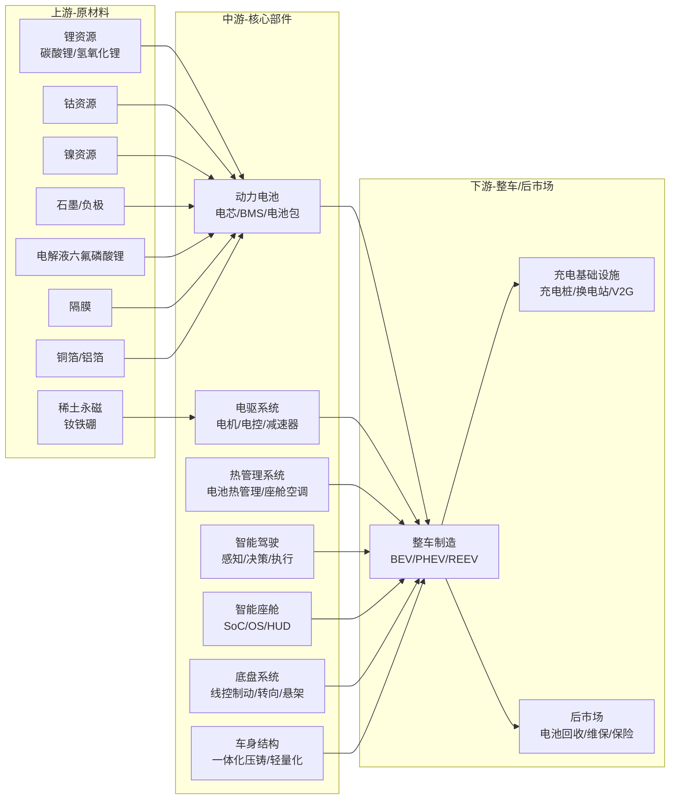
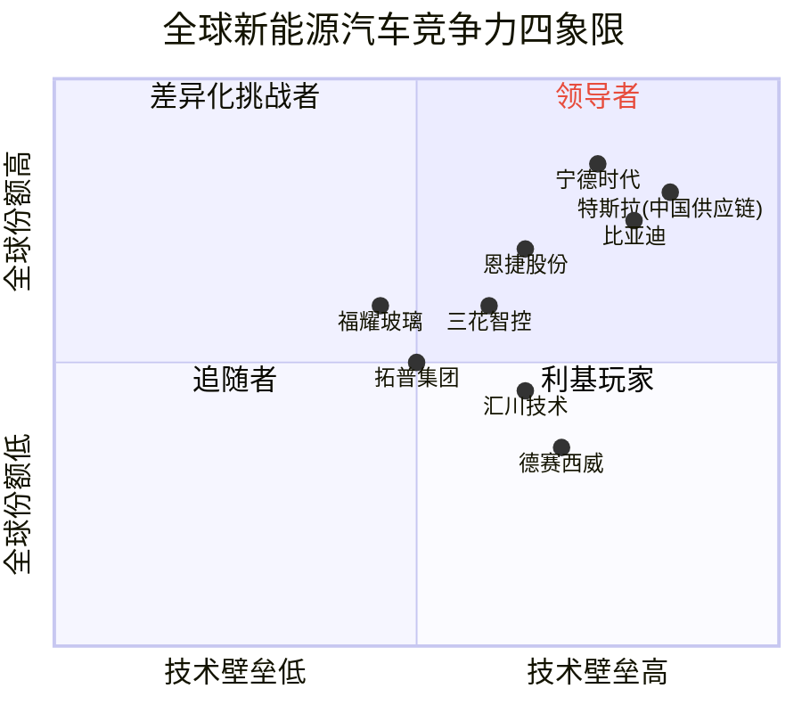

# 新能源汽车产业链总纲

> 产业链深度：★★★★★
> 行情属性：成长（早期）→ 周期成长（当前）+ 结构分化
> 核心驱动：渗透率提升 + 智能化升级 + 全球化出口
> 当前阶段：量增放缓，结构升级

## 关联概念

- 细分赛道:: [[A股产业研究库/03 产业链图谱/新能源汽车产业链/动力电池]]
- 细分赛道:: [[A股产业研究库/03 产业链图谱/新能源汽车产业链/电驱电控]]
- 细分赛道:: [[A股产业研究库/03 产业链图谱/新能源汽车产业链/智能驾驶]]
- 细分赛道:: [[A股产业研究库/03 产业链图谱/新能源汽车产业链/充电桩]]
- 散热方案:: [[A股产业研究库/03 产业链图谱/AI产业链/热管理|热管理]]
- 关联产业:: [[A股产业研究库/03 产业链图谱/新能源汽车产业链/汽车零部件]]
- 关联产业:: [[A股产业研究库/03 产业链图谱/新能源产业链/总纲|新能源产业链]]
- 关联产业:: [[A股产业研究库/03 产业链图谱/AI产业链/总纲|AI产业链]]
- 下游:: [[A股产业研究库/03 产业链图谱/消费电子产业链/总纲|消费电子]]
- 下游:: [[A股产业研究库/03 产业链图谱/机器人产业链/总纲|机器人]]
- 核心产品:: [[A股产业研究库/03 产业链图谱/半导体产业链/总纲|车规芯片]]

---

## 一、产业链完整链路



---

## 二、价值量分布与利润池

### 各环节毛利率与利润池集中度

| 环节 | 平均毛利率 | 利润池集中度 | 格局特点 | 定价权 |
|:----:|:----------:|:----------:|:---------|:------:|
| 锂资源 | 40-70% | ★★★★ 高度集中 | 全球前5控制80%锂矿产能 | 强（资源属性） |
| 电池级锂盐 | 20-35% | ★★★ 中高 | 天齐/赣锋双寡头 | 中（加工费弹性） |
| 正极材料 | 10-18% | ★★ 分散 | 竞争激烈，产能过剩 | 弱 |
| 负极材料 | 15-22% | ★★★ 中高 | 贝特瑞/璞泰来双龙头 | 中 |
| 电解液 | 15-25% | ★★★ 集中 | 天赐/新宙邦双寡头 | 中（六氟价格弹性） |
| 隔膜 | 35-45% | ★★★★ 高集中 | 恩捷/星源双龙头 | 强（技术壁垒） |
| 动力电池 | 20-25% | ★★★★★ 极高 | 宁德+比亚迪占>70% | 强（技术+规模） |
| 电驱系统 | 15-25% | ★★ 分散 | 竞争激烈，集成化趋势 | 中 |
| 智能驾驶 | 30-50% | ★★ 正集中 | 华为/德赛/百度/Mobileye | 强（算法壁垒） |
| 智能座舱 | 20-30% | ★★★ 集中 | 德赛西威/华阳/均胜 | 中 |
| 热管理 | 20-28% | ★★ 分散 | 三花/银轮引领 | 中 |
| 整车制造 | 12-18% | ★★★ 正集中 | 比亚迪/特斯拉领先 | 中（品牌溢价） |
| 充电桩 | 25-35% | ★ 分散 | 市场碎片化 | 弱 |
| 电池回收 | 15-25% | ★ 初期 | 格林美/华友布局 | 中（资源再利用） |

**数据来源**：各公司2024年年报，巨潮资讯网 www.cninfo.com.cn；SNE Research/乘联会/中汽协相关报告；中国汽车工业协会

### 利润池分布特征

```
高毛利率（>35%）：锂资源、隔膜、智能驾驶软件、智能化芯片
中毛利率（20-35%）：电池、电解液、热管理、充电桩运营
低毛利率（<20%）：正极材料、电驱、整车制造、机械零部件
```

**核心判断**: 产业链利润正从上游资源端和电池制造端，向智能化环节（智驾/座舱）迁移。随着渗透率越过50%，**结构升级**取代**总量增长**成为利润增长的核心来源。

---

## 三、全球竞争力四象限



**解读**:
- **领导者**（第一象限）：宁德时代（电池全球第一）、比亚迪（全球新能源车销量冠军）、恩捷股份（隔膜全球第一）
- **差异化挑战者**（第二象限）：德赛西威（智驾域控高壁垒但全球份额待提升）、汇川技术（电驱+工业自动化跨界）
- **追随者/利基玩家**（后两象限）：热管理（三花）、轻量化（拓普）、玻璃（福耀）等细分龙头

---

## 四、A股全映射表

### 4.1 动力电池全链条

| 环节 | 赛道评级 | 龙头公司 | 核心标的 | 弹性标的 | 投资逻辑 |
|:----:|:--------:|:--------:|:--------:|:--------:|:---------|
| 电池整包 | ★★★★★ | 宁德时代 | 比亚迪(港股) | 国轩高科 | 全球市占率>37%，技术领先+规模效应 |
| 电池整包 | ★★★★ | — | 亿纬锂能 | 欣旺达 | 二线电池中竞争力最强，大圆柱量产 |
| 正极材料 | ★★★ | 华友钴业 | 当升科技 | 容百科技 | 产能过剩周期底部，高镍+磷酸锰铁锂 |
| 负极材料 | ★★★★ | 贝特瑞 | 璞泰来 | 杉杉股份 | 天然石墨+人造石墨双龙头 |
| 电解液 | ★★★★ | 天赐材料 | 新宙邦 | 多氟多 | 六氟磷酸锂周期，龙头成本优势 |
| 隔膜 | ★★★★★ | 恩捷股份 | 星源材质 | — | 湿法+涂覆隔膜全球第一，壁垒最高 |
| 铜箔 | ★★★ | 嘉元科技 | 诺德股份 | — | 极薄铜箔技术壁垒，加工费周期 |
| 铝箔 | ★★ | 鼎胜新材 | — | — | 国产替代，电池铝箔龙头 |

### 4.2 电驱与热管理

| 环节 | 赛道评级 | 龙头公司 | 核心标的 | 弹性标的 | 投资逻辑 |
|:----:|:--------:|:--------:|:--------:|:--------:|:---------|
| 电机 | ★★★ | 汇川技术 | 方正电机 | 大洋电机 | 新能源车电驱+工业自动化 |
| 电控 | ★★★ | 汇川技术 | 英搏尔 | 菱电电控 | 电驱系统集成化趋势 |
| 热管理 | ★★★★ | 三花智控 | 银轮股份 | 盾安环境 | 电子膨胀阀+热泵+冷却模块 |
| 热泵 | ★★★ | 三花智控 | — | — | CO2热泵，全球份额>50% |

### 4.3 智能驾驶与座舱

| 环节 | 赛道评级 | 龙头公司 | 核心标的 | 弹性标的 | 投资逻辑 |
|:----:|:--------:|:--------:|:--------:|:--------:|:---------|
| 智驾域控 | ★★★★★ | 德赛西威 | 中科创达 | 经纬恒润 | IPU04/IPU02规模化量产 |
| 智驾芯片 | ★★★★ | 地平线(港股) | 黑芝麻智能 | — | 国产智驾芯片市场份额快速提升 |
| 激光雷达 | ★★★ | — | 禾赛科技(美股) | 速腾聚创(港股) | 成本快速下降，L3标配化驱动 |
| 高精地图 | ★★ | 四维图新 | — | — | 图商模式转型，智驾数据服务 |
| 智能座舱 | ★★★★ | 德赛西威 | 华阳集团 | 均胜电子 | 座舱域控+HUD+液晶仪表 |
| HUD | ★★★ | 华阳集团 | 水晶光电 | 经纬恒润 | AR-HUD渗透率从5%→30% |
| 线控制动 | ★★★★ | 伯特利 | 亚太股份 | — | One-Box线控制动，工艺壁垒高 |
| 线控转向 | ★★★ | 耐世特(港股) | — | 浙江世宝 | 电子助力转向，线控化趋势 |

### 4.4 整车厂商

| 类型 | 龙头 | 核心标的 | 投资逻辑 |
|:----:|:----:|:--------:|:---------|
| 新能源龙头 | 比亚迪 | — | 全球最大新能源车企，产业链垂直一体化 |
| 新势力 | — | 蔚来(港股) | 高端定位+换电差异化 |
| 新势力 | — | 小鹏(港股) | 智驾领先，XNGP全场景推演 |
| 新势力 | — | 理想(港股) | 增程+纯电双线，家庭定位精准 |
| 国企转型 | — | 长安汽车 | 深蓝/阿维塔品牌上量，华为智驾合作 |
| 国企转型 | — | 赛力斯 | 问界品牌爆量，华为深度赋能 |
| 出口方向 | — | 上汽集团 | 海外MG品牌快速增长 |

### 4.5 充电基础设施

| 环节 | 龙头 | 核心 | 弹性 | 投资逻辑 |
|:----:|:----:|:----:|:----:|:---------|
| 充电桩运营 | 特锐德 | 万马股份 | — | 公共充电桩市占率>25% |
| 充电模块 | 盛弘股份 | 通合科技 | 英可瑞 | 直流快充模块，800V高压 |
| 换电站 | — | 宁德时代 | — | 乘用车+商用车换电网络 |
| V2G | — | 特锐德 | 国电南瑞 | 双向充电+电网互动 |

---

## 五、投资框架切换

### 总量增长时代（2019-2024）：渗透率从5%→50%

**核心逻辑**: 行业爆发式增长，渗透率快速提升，所有环节受益

**投资策略**: β为主，龙头+周期
- 上中下游全部配置，龙头享有估值溢价
- 锂资源/电池/整车轮动
- 关注月度销量数据

### 结构升级时代（2025+）：渗透率>50%，增速放缓

**核心逻辑**: 行业增速从30%+降至10-15%，但结构性机会爆发

**投资策略**: α为主，优选结构升级方向

| 结构方向 | 核心逻辑 | 受益环节 |
|:---------|:---------|:---------|
| **智能化** | L3渗透率从10%→50%，智驾成核心差异化 | 智驾域控/芯片/激光雷达/线控制动 |
| **全球化** | 中国新能源车+电池全球出口 | 电池/隔膜/热管理/整车出海 |
| **补能网络** | 车桩比从2.5:1→1.5:1 | 充电桩/模块/换电 |
| **轻量化** | 一体化压铸降成本减重 | 压铸件/免热处理铝合金 |
| **电池回收** | 第一批新能源车进入报废期 | 回收/梯次利用 |
| **机器人复用** | 车企技术平台向人形机器人延伸 | 传感器/执行器/AI软件 |

---

## 六、核心结论

1. **总量见顶，结构为王**: 中国新能源汽车渗透率已超50%，投资逻辑从"谁在增长"切换为"谁在升级"。关注毛利率企稳和份额提升的公司，而非单纯收入增长。

2. **智能化是最大增量市场**: 智能驾驶（L3→L4）和智能座舱是产业链中技术壁垒最高、利润率最高的环节。德赛西威/地平线/华阳集团是最核心的A股标的。

3. **全球化是中国供应链的第二曲线**: 宁德时代/恩捷/三花等龙头已实现技术和成本领先，全球份额将持续提升。海外建厂和出口是核心催化剂。

4. **竞争格局恶化正在出清**: 整车和二线电池厂面临价格战压力，利润向龙头集中。投资上应聚焦格局清晰的细分赛道（隔膜/电解液/电池）。

5. **风险关注**: 欧盟/美国关税壁垒升级影响出口；碳酸锂价格波动影响上游利润；智驾法规滞后影响L3落地节奏；产能过剩导致利润率持续下行。

---

## 代表公司

### 动力电池全链条

| 排序 | 公司 | 代码 | 核心逻辑 |
|:----:|:----|:----:|:---------|
| 龙头 | 宁德时代 | 300750 | 全球动力电池市占率37%+，技术（麒麟/神行）领先，海外产能放量 |
| 龙头 | 比亚迪 | 002594 | 全球新能源车销量冠军，刀片电池+DM-i混动，垂直一体化 |
| 核心 | 亿纬锂能 | 300014 | 二线电池龙头，大圆柱4680量产，储能电池放量 |
| 核心 | 国轩高科 | 002074 | 大众入股背书，磷酸铁锂+LFP电池配套 |
| 弹性 | 欣旺达 | 300207 | 消费电池跨界动力，HEV电池突破 |
| 弹性 | 孚能科技 | 688567 | 软包电池龙头，戴姆勒供应链，高镍技术 |

**正极材料**

| 排序 | 公司 | 代码 | 核心逻辑 |
|:----:|:----|:----:|:---------|
| 龙头 | 华友钴业 | 600516 | 钴+镍+前驱体+正极一体化，资源端布局完善 |
| 核心 | 当升科技 | 300073 | 高镍正极龙头，海外客户占比高 |
| 核心 | 容百科技 | 688005 | 高镍正极出货量领先，9系NCMA突破 |
| 弹性 | 德方纳米 | 300769 | 磷酸铁锂正极龙头，产能扩张快 |
| 弹性 | 厦钨新能 | 688778 | 钴酸锂+三元正极，技术路线全面 |

**负极材料/电解液/隔膜**

| 排序 | 公司 | 代码 | 核心逻辑 |
|:----:|:----|:----:|:---------|
| 龙头 | 贝特瑞 | 835185 | 负极全球第一，天然石墨+人造石墨双龙头 |
| 龙头 | 天赐材料 | 002709 | 电解液龙头，六氟磷酸锂自供比高，成本优势 |
| 龙头 | 恩捷股份 | 002812 | 湿法隔膜全球第一，份额40%+，壁垒最高 |
| 核心 | 璞泰来 | 603659 | 负极+涂覆隔膜+设备，一体化平台 |
| 核心 | 新宙邦 | 300037 | 电解液+氟化工，海外客户占比高 |
| 核心 | 星源材质 | 300568 | 干湿法隔膜双路线，市场份额提升 |
| 弹性 | 杉杉股份 | 600884 | 负极+偏光片双主，负极出货量前三 |

### 电驱与热管理

| 排序 | 公司 | 代码 | 核心逻辑 |
|:----:|:----|:----:|:---------|
| 龙头 | 汇川技术 | 300124 | 新能源车电驱+工业自动化双驱动，乘用车电驱突破 |
| 龙头 | 三花智控 | 002050 | 热管理全球龙头，电子膨胀阀+CO2热泵，特斯拉供应商 |
| 核心 | 银轮股份 | 002126 | 热交换器龙头，电池冷却模块+热泵，客户覆盖广 |
| 弹性 | 英搏尔 | 300681 | 电驱+电源系统集成，A00级车市场领先 |
| 弹性 | 方正电机 | 002196 | 新能源车电机，扁线电机技术突破 |

### 智能驾驶与座舱

| 排序 | 公司 | 代码 | 核心逻辑 |
|:----:|:----|:----:|:---------|
| 龙头 | 德赛西威 | 002920 | 智驾域控龙头，IPU04/IPU02规模化量产，英伟达深度合作 |
| 核心 | 华阳集团 | 002906 | HUD+座舱域控+液晶仪表，AR-HUD渗透率提升受益 |
| 核心 | 中科创达 | 300496 | 智能座舱OS+智驾中间件，汽车软件平台化 |
| 核心 | 伯特利 | 603596 | One-Box线控制动，工艺壁垒高，国产替代先锋 |
| 弹性 | 经纬恒润 | 688326 | 智驾域控+底盘控制，辅助驾驶方案商 |
| 弹性 | 均胜电子 | 600699 | 安全气囊+智能座舱，全球布局 |
| 弹性 | 四维图新 | 002405 | 高精地图+智驾芯片，转型期弹性大 |

### 充电基础设施

| 排序 | 公司 | 代码 | 核心逻辑 |
|:----:|:----|:----:|:---------|
| 龙头 | 特锐德 | 300001 | 公共充电桩运营龙头，市占率25%+，充电网络效应 |
| 核心 | 盛弘股份 | 300693 | 直流快充模块+储能PCS，800V高压充电技术领先 |
| 弹性 | 万马股份 | 002276 | 充电桩制造+运营双布局 |
| 弹性 | 通合科技 | 300491 | 充电模块核心供应商，订单增速高 |

### 整车厂商

| 排序 | 公司 | 代码 | 核心逻辑 |
|:----:|:----|:----:|:---------|
| 龙头 | 比亚迪 | 002594 | 全球最大新能源车企，品牌+技术+规模三位一体 |
| 核心 | 赛力斯 | 601127 | 问界品牌爆量，华为智选模式标杆 |
| 核心 | 长安汽车 | 000625 | 深蓝/阿维塔双线发力，华为+宁德合作 |
| 弹性 | 长城汽车 | 601633 | 坦克品牌高利润，海外出口快速增长 |
| 弹性 | 江淮汽车 | 600418 | 华为尊界品牌合作，市场预期高 |

---

### 关键跟踪指标

| 指标 | 重要性 | 更新频率 | 数据来源 |
|:-----|:------:|:--------:|:--------|
| 新能源汽车渗透率 | ★★★★★ | 月度 | 乘联会 |
| 碳酸锂价格（万元/吨） | ★★★★ | 周度 | 百川盈孚/上海有色网 |
| 动力电池装机量（GWh） | ★★★★★ | 月度 | 中国汽车动力电池产业联盟 |
| 充电桩保有量及增量 | ★★★★ | 月度 | 中国充电联盟 |
| 城市NOA渗透率 | ★★★★ | 季度 | 高工智能汽车 |
| 新能源车出口量（辆） | ★★★ | 月度 | 海关总署 |
| 新能源车企月度交付量 | ★★★ | 月度 | 各车企公告 |

### 全球市场数据（来源：IEA Global EV Outlook 2025）

2024年全球电动汽车销量超过1700万辆，市场份额约20%。2025年预计超过2000万辆，市场份额突破25%。中国市场仍为全球最大单一市场，但东南亚、拉美等新兴市场增速更快——东南亚市场2024年增长50%至9%份额。中国EV出口占全球EV贸易的40%（约125万辆），主要目的地从欧洲向东南亚/拉美多元化转变。

中国EV价格在2024年下降约30%（欧美仅下降10-15%），电池级原材料价格下行是核心驱动。预计到2030年，中国EV销售份额将继续领先全球。

### 主要风险

- 欧盟/美国关税壁垒升级，出口增速可能放缓
- 整车价格战持续，产业链利润被压缩
- 智能驾驶法规滞后影响L3商业化节奏
- 碳酸锂等原材料价格波动影响盈利稳定性
- 新能源车渗透率超50%后总量增速放缓，投资逻辑从"增长"切换为"结构"

## 政策法规

### 国内产业政策

| 政策/法规 | 发布时间 | 核心内容 | 影响 |
|:---------|:-------:|:---------|:---------|
| [新能源汽车购置税减免政策](https://www.mof.gov.cn) | 2023.06发布，延续至2027 | 2024-2025年免征购置税，2026-2027年减半征收（单车不超过3万元） | 继续支撑新能源车终端需求，但边际递减；2026年减半征收后部分需求可能前置 |
| 双积分政策（CAFC+NEV） | 2017至今，持续修订 | 对车企设定油耗积分和新能源积分双重考核要求，积分不足需购买 | 驱动传统车企加速电动化转型；积分交易价格波动影响车企利润 |
| 新能源汽车产业发展规划（2021-2035） | 2020.11 | 到2035年新能源车成为主流，纯电动为技术路线主体 | 长期政策定调，确定产业发展方向 |
| 动力电池回收管理办法 | 2025修订 | 建立动力电池溯源管理平台，车企承担回收主体责任 | 利好格林美/华友钴业等电池回收企业，行业规范化加速 |
| 自动驾驶分级标准与测试规范 | 2024-2025 | 明确L3/L4级自动驾驶的测试和上路规范，允许在特定区域开展商业化运营 | 智驾产业链获得明确的政策通道，利好德赛西威/伯特利 |

### 海外贸易壁垒

| 政策/法规 | 发布时间 | 核心内容 | 对中国车企影响 |
|:---------|:-------:|:---------|:---------|
| 欧盟反补贴关税调查 | 2023.10启动，2024加征 | 对中国产纯电动车加征17-38%的额外关税（比亚迪17%+上汽38%），为期5年 | 中国电动车出口欧洲受明显冲击；比亚迪/上汽/吉利加速欧洲建厂 |
| 美国IRA法案（通胀削减法案） | 2022.08 | 提供最高7500美元/辆的电动车补贴，但要求电池关键矿物来自美国或FTA国家；2024年起限制中国实体制造的电池组件 | 中国电池企业（宁德时代/国轩高科）通过技术授权模式曲线进入美国市场 |
| 美国对华电动汽车加征关税 | 2024.05 | 对中国产电动车关税从25%提高至100%，对锂离子电池关税从7.5%提高至25% | 中国电动车直接出口美国基本无望；电池出海转技术授权模式（福特/宁德合作） |
| 电池护照/碳足迹法规（欧盟） | 2025生效 | 出口欧盟的动力电池需提供碳足迹声明、电池护照（含材料溯源信息），2027年设碳足迹阈值 | 倒逼中国电池企业使用绿电和低碳工艺；头部企业（宁德/比亚迪）有先发优势 |
| 土耳其/东南亚关税壁垒 | 2024-2025 | 土耳其对中国电动车加征40%关税；印度提高电动车进口关税 | 中国车企出口目的地被迫转向拉美/中东/非洲等替代市场 |

### 碳排放与双碳政策

| 政策 | 时间 | 核心内容 | 影响 |
|:----|:---:|:---------|:---------|
| 欧盟碳边境调节机制（CBAM） | 2026正式征收 | 对进口钢铁/铝/氢/电力等征收碳关税，目前不含整车但未来可能扩展 | 长期看增加中国制造出口成本，推动产业链低碳化 |
| 中国碳市场扩容 | 2025-2026 | 碳市场覆盖范围从电力扩展至钢铁/有色金属/水泥/航空等行业 | 影响锂电材料（正极/负极/电解液）生产企业的碳成本 |

---

## 舆论风向

### 核心争论一：价格战白热化——"比亚迪秦7.98万"引发的行业讨论

2024年比亚迪秦Plus DM-i降至7.98万元后，价格战成为新能源车市最热话题：

**支持方（"合理的市场出清"）观点**：
- "秦7.98万不是亏本卖。比亚迪垂直一体化+规模效应，7.98万仍有5-8%的毛利率，这是成本优势带来的定价权。"（雪球新能源汽车话题）
- "价格战在加速出清。二线品牌（威马/天际/爱驰）已经倒了一批，剩下的（零跑/哪吒）也在盈亏线上挣扎。最终活下来的就是强者。"
- "消费者是最大的受益者，7.98万买到插混A级车，这在5年前不可想象。这对加速油转电是好事。"

**反对方（"恶性竞争损害行业"）观点**：
- "价格战没有赢家。比亚迪虽然保住了份额但单车利润从1万降到3000，长期看研发投入会被压缩。"（微博@汽车投资人）
- "小鹏/G6降价后虽然订单回升但毛利率转负。这不是健康的状态。"
- "合资品牌（大众/丰田）在价格战中利润率跌到1-2%，有些4S店已经开始退网。整个汽车流通体系在崩坏。"
- "价格战本质是产能过剩的结果。全国乘用车产能利用率只有50%左右，不打也得打。"

**争议焦点**：价格战是"优胜劣汰的健康出清"还是"杀敌一千自损八百的恶性竞争"？底部在哪？

### 核心争论二：华为与车企合作——"灵魂论"的后续

2021年上汽董事长陈虹提出"与华为合作会失去灵魂"后，这个争论一直发酵至今：

**华为模式的成功证明**：
- "问界证明了华为智选模式的商业可行性。M7/M9月销超3万，已经超过理想L系列。"（雪球@赛力斯深度投资者）
- "华为选择不造车是对的。用ICT能力赋能车企，三种模式（零部件/HI/智选）覆盖不同层次合作方，生态越做越大。"
- "长安阿维塔、北汽极狐、江淮尊界……越来越多的车企选择华为。'灵魂论'在商业利益面前站不住脚。"

**灵魂论的支持者反思**：
- "上汽虽然嘴上说'不要灵魂'，但飞凡和智己的销量惨淡，说明自己搞智驾确实追不上华为。"
- "比亚迪和王传福才是最清醒的——垂直一体化，所有核心技术自研，不需要跟任何第三方合作。"
- "长期看，如果车企过度依赖华为的智驾和座舱方案，最终会沦为'硬件代工厂'，利润率被压缩到制造业水平。"
- "而且把核心数据交给华为，存在长期的竞争风险。"

**争议焦点**：车企"灵魂"到底应该自研还是外包？华为智选模式的可持续性如何？

### 核心争论三：小米SU7——被各路围攻的舆论战

小米SU7自发布以来一直是舆论风暴中心：

**小米支持方观点**：
- "SU7的设计/性能/生态远超同价位竞品，21.59万的价格非常有竞争力。"
- "小米的规模效应+渠道+品牌势能是别人不具备的。SU7首月锁单超10万就是证明。"
- "那些黑小米的主要是既得利益者——传统车企怕被颠覆，友商怕被抢份额。"

**小米质疑方观点**：
- "SU7外形'致敬'Taycan，本质上没有原创设计能力。"
- "小米最大的问题不是产品而是产能和品控。"（车圈自媒体@42号车库）
- "手机和汽车是两个完全不同的行业。小米在手机上的性价比策略能成功，但在汽车上行不通——因为汽车涉及生命安全。"
- "雷军的营销能力确实强，但SU7的实际体验到底如何还需要时间检验。"

**中立观察**："小米进入汽车行业带来的最大影响是——把互联网的打法和流量玩法彻底卷进了汽车行业。这比价格战更让传统车企感到不安。"（知乎高赞回答）

**争议焦点**：小米造车是"降维打击"还是"门外汉莽撞"？SU7能否复制小米手机的路径？

### 社交平台热度标签

| 平台 | 热门话题/标签 | 情绪倾向 |
|:----|:-------------|:--------|
| 雪球 | #新能源车价格战何时见底# #比亚迪估值重构# #智能化才是未来# | 分化明显，电池/智驾龙头仍受追捧，整车股分歧大 |
| 微博 | #小米SU7评测# #华为问界销量# #比亚迪秦7.98万# | 流量驱动的碎片化讨论，品牌粉丝互怼严重 |
| 知乎 | 新能源汽车产业链哪个环节最有投资价值？小米造车能否成功？ | 深度分析较多，普遍看好智能化环节，对整车价格战偏悲观 |
| 车圈自媒体 | 续航测试/智驾对比/充电测评等 | 产品导向的内容占据主流，评测结果影响具体车型销量 |
| 股吧 | 赛力斯/比亚迪/小米汽车日常讨论 | 情绪化博弈，整车股波动大时尤为激烈 |

## 参考资料

[1] 相关A股公司（如适用）. 2024年年度报告[R]. 巨潮资讯网.
    http://www.cninfo.com.cn

[2] 中国汽车工业协会. 月度汽车产销数据[R]. 2025.
    http://www.caam.org.cn

[3] 乘联会. 月度乘用车市场分析[R]. 2025.
    https://www.cpcaauto.com

[4] MarkLines. 全球汽车产业数据平台[R]. 2025.
    https://www.marklines.com

[新] IEA. Global EV Outlook 2025[EB/OL]. 2025-04.
    https://www.iea.org/reports/global-ev-outlook-2025
