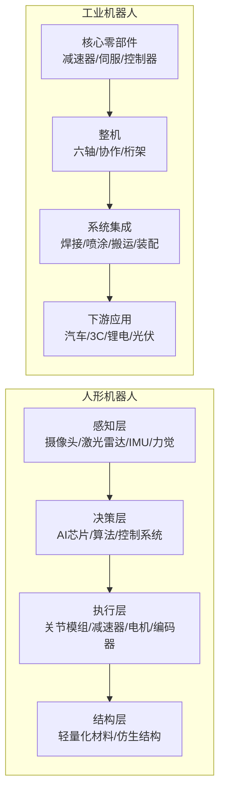

# 机器人产业链总纲

> 产业链深度：★★★★★
> 行情属性：主题成长（人形）+ 周期成长（工业）
> 核心驱动：AI赋能 + 人口结构 + 制造业升级 + 特斯拉催化
> 当前阶段：人形机器人（0→1产业化前夜），工业机器人（国产替代加速期）

## 关联节点

### 核心关联
[[A股产业研究库/03 产业链图谱/机器人产业链/人形机器人]] | [[A股产业研究库/03 产业链图谱/机器人产业链/工业机器人]] | [[A股产业研究库/03 产业链图谱/机器人产业链/核心零部件]] | [[A股产业研究库/03 产业链图谱/新能源汽车产业链/减速器]] | [[A股产业研究库/03 产业链图谱/机器人产业链/伺服系统]] | [[A股产业研究库/03 产业链图谱/机器人产业链/控制器]] | [[A股产业研究库/03 产业链图谱/机器人产业链/传感器]]

### 交叉产业链
[[A股产业研究库/03 产业链图谱/AI产业链/总纲|AI产业链]] | [[A股产业研究库/03 产业链图谱/新能源汽车产业链/总纲|新能源汽车]] | [[A股产业研究库/03 产业链图谱/消费电子产业链/总纲|消费电子]] | [[A股产业研究库/03 产业链图谱/半导体产业链/总纲|半导体]]

---

## 一、人形机器人 vs 工业机器人 对照表

| 维度 | 人形机器人 | 工业机器人 |
|:----|:-----------|:-----------|
| 市场空间 | 2030年超万亿（高盛预测） | 2026年~800亿元（中国） |
| 发展阶段 | 0→1，产业化前夜 | 成熟期，国产替代加速 |
| 核心驱动力 | AI大模型+特斯拉引领 | 汽车/3C自动化+国产化 |
| 技术难度 | ★★★★★ | ★★★ |
| 价值量分布 | 关节模组~60% 感知~15% | 减速器~35% 伺服~25% 控制~15% |
| 利润率 | 待验证（量产前） | 零部件20-40% 整机10-15% |
| 竞争格局 | 格局未定，群雄逐鹿 | 发那科/ABB/安川/KUKA+国产 |
| A股纯正度 | 低（多为民企转型） | 高（专业厂商） |
| 行情特征 | 主题驱动，脉冲式暴涨暴跌 | 业绩驱动，慢牛+周期波动 |
| 投资策略 | 选壁垒最高的零部件 | 选国产替代空间大的细分 |

---

## 二、双线结构全景图

---

## 三、选股优先级

### 人形机器人：核心零部件 > 整机 > 集成

| 优先级 | 环节 | 壁垒 | 价值量占比 | A股稀缺度 | 核心公司 |
|:----:|:----|:----:|:---------:|:---------:|:---------|
| ★★★★★ | 减速器（谐波） | 极高 | 15-20% | 高 | 绿的谐波 |
| ★★★★★ | 空心杯电机 | 高 | 10-15% | 中 | 鸣志电器、鼎智科技 |
| ★★★★ | 无框力矩电机 | 高 | 10-15% | 中 | 步科股份、伟创电气 |
| ★★★★ | 力/力矩传感器 | 极高 | 5-8% | 低 | 柯力传感、宇立仪器 |
| ★★★★ | IGBT/SiC模块 | 高 | 3-5% | 高 | 斯达半导、时代电气 |
| ★★★ | 关节模组集成 | 中高 | 40-50% | 中 | 三花智控、拓普集团 |
| ★★★ | 整机 | 中 | — | 低 | 优必选(港股) |
| ★★ | 系统集成 | 低 | — | 高 | 新时达、机器人 |

### 工业机器人：减速器 > 伺服 > 整机 > 集成

| 优先级 | 环节 | 国产化率 | 壁垒 | 核心公司 |
|:----:|:----|:--------:|:----:|:---------|
| ★★★★★ | RV减速器 | 30-35% | 极高 | 双环传动、秦川机床 |
| ★★★★★ | 谐波减速器 | 40% | 极高 | 绿的谐波 |
| ★★★★ | 伺服系统 | 40% | 高 | 汇川技术、雷赛智能 |
| ★★★★ | 控制器 | 45% | 高 | 汇川技术、埃斯顿 |
| ★★★ | 整机（国产） | 40% | 中 | 埃斯顿、埃夫特、新松 |
| ★★ | 系统集成 | — | 低 | 克来机电、科大智能 |

**数据来源**：各公司2024年年报，巨潮资讯网 www.cninfo.com.cn；高工机器人GGII；中国机器人产业联盟CRIA

---

## 四、人形机器人产业链进展

### 四阶段产业化路径

| 阶段 | 时间线 | 特征 | 标志性事件 |
|:----:|:------|:-----|:-----------|
| 概念验证期 | 2022-2023 | 技术验证，单台样机 | 特斯拉Optimus Gen1 |
| 小批量试产 | 2024-2025 | 工厂测试，数十台量产 | 特斯拉Optimus在工厂搬运 |
| 量产爬坡 | 2026-2027 | 千台级量产，成本降至2万美元 | 国内头部企业跟进量产 |
| 规模商用 | 2028-2030 | 万台级，通用功能成熟 | 家庭/服务场景商业化 |

### 当前阶段（2026H1）判断

人形机器人处于**小批量试产→量产爬坡**的过渡阶段。特斯拉Optimus已在超级工厂执行简单物流搬运任务，国内企业（优必选/宇树/傅利叶等）陆续发布量产计划。产业链进入"标的选择"阶段——谁能进入特斯拉/国内龙头供应链谁就能获得估值溢价。

**核心催化剂**:
- 特斯拉Optimus公开更新（行走/抓握/平衡等能力提升）
- 国内人形机器人政策（工信部人形机器人创新发展意见）
- 核心零部件企业获得量产订单

---

## 五、A股全映射表

### 5.1 减速器（产业链壁垒最高的环节）

| 细分 | 龙头 | 核心 | 弹性 | 投资逻辑 |
|:----:|:----:|:----:|:----:|:---------|
| 谐波减速器 | 绿的谐波 | 来福谐波(未上市) | 汉宇集团(持股) | 全球第二，机器人关节核心 |
| RV减速器 | 双环传动 | 秦川机床 | 中大力德 | RV减速器国产化突破，规模放量 |
| 精密减速器 | 中大力德 | — | — | 微型减速电机，AGV/自动化 |

### 5.2 电机与驱动

| 细分 | 龙头 | 核心 | 弹性 | 投资逻辑 |
|:----:|:----:|:----:|:----:|:---------|
| 伺服系统 | 汇川技术 | 雷赛智能 | 伟创电气 | 工业机器人伺服国产第一 |
| 空心杯电机 | 鸣志电器 | 鼎智科技 | 江苏雷利 | 人形机器人手指关节关键部件 |
| 无框力矩电机 | 步科股份 | 伟创电气 | 昊志机电 | 直驱电机，人形机器人关节 |
| 步进电机 | 雷赛智能 | 东方马达 | — | 细分应用 |

### 5.3 传感器

| 细分 | 龙头 | 核心 | 弹性 | 投资逻辑 |
|:----:|:----:|:----:|:----:|:---------|
| 力/力矩传感器 | 柯力传感 | — | 昊志机电 | 人形机器人力控核心传感器 |
| 六维力矩传感器 | 宇立仪器(未上市) | — | — | 高壁垒，企业尚未上市 |
| IMU/陀螺仪 | 星网宇达 | — | 芯动联科 | 姿态控制，机器人平衡 |
| 编码器 | 汇川技术 | — | — | 位置/速度反馈核心 |

### 5.4 整机

| 类型 | 龙头 | 核心 | 弹性 | 投资逻辑 |
|:----:|:----:|:----:|:----:|:---------|
| 工业机器人整机 | 埃斯顿 | 埃夫特 | 新松机器人 | 国产替代+出海，年增速25%+ |
| 协作机器人 | — | 节卡机器人(未上市) | 新时达 | 协作机器人渗透率提升 |
| 人形机器人整机 | 优必选(港股) | — | — | 人形教育机器人+Walker |
| 塑料机械 | 拓斯达 | — | — | 注塑机+工业机器人 |

### 5.5 关节模组与系统集成

| 公司 | 定位 | 投资逻辑 |
|:----|:-----|:---------|
| 三花智控 | 执行器关节模组 | 特斯拉Optimus供应商，热管理+关节双驱动 |
| 拓普集团 | 底盘+关节集成 | 特斯拉供应链延伸至人形机器人 |
| 卧龙电驱 | 电机+驱动集成 | 收购GE工业电机，向机器人驱控延伸 |
| 新时达 | 工业机器人集成 | 机器人搬运/焊接系统集成 |

### 5.6 上游材料

| 公司 | 定位 | 投资逻辑 |
|:----|:-----|:---------|
| 金力永磁 | 高性能钕铁硼 | 机器人电机核心永磁材料 |
| 中科三环 | 钕铁硼磁材 | 工业+人形机器人电机用磁材 |
| 宝武镁业 | 镁铝合金 | 轻量化结构件材料 |

---

## 六、核心结论

1. **核心零部件是人形机器人最确定的机会**: 减速器（绿的谐波/双环传动）、电机（鸣志电器/步科股份）、传感器（柯力传感）是人形机器人壁垒最高的环节。无论哪家整机厂商最终胜出，核心零部件都会受益。

2. **人形机器人是2024-2026年最强的AI主题**: 特斯拉Optimus不断迭代+国内政策密集出台，人形机器人从0到1的产业趋势确定。但投资节奏需把握——实际量产进度往往慢于市场预期，脉冲行情后容易回调。

3. **工业机器人国产替代空间仍大**: 国产工业机器人市占率约40%，RV减速器国产化率仅30-35%，高端伺服国产替代空间广阔。双环传动（RV）和汇川技术（伺服）是工业机器人最确定的龙头。

4. **特斯拉供应链是最重要的α来源**: 目前人形机器人行情高度依赖特斯拉Optimus催化。进入特斯拉供应链的企业（三花/拓普/绿的/双环）享有确定性的估值溢价。

5. **风险关注**: 人形机器人量产进度可能低于预期（技术瓶颈+成本过高）；人形机器人行情高度主题化，估值泡沫风险大；工业机器人面临下游资本开支放缓的周期性压力。

---

## 代表公司

### 减速器（产业链壁垒最高的环节）

| 排序 | 公司 | 代码 | 核心逻辑 |
|:----:|:----|:----:|:---------|
| 龙头 | 绿的谐波 | 688017 | 谐波减速器全球第二（仅次于哈默纳科），人形机器人关节核心，国产替代绝对龙头 |
| 龙头 | 双环传动 | 002472 | RV减速器国产化领军，工业机器人关节核心，规模化放量中 |
| 核心 | 秦川机床 | 000837 | RV减速器+数控机床双主业，RV减速器技术积累深厚 |
| 核心 | 中大力德 | 002896 | 精密减速器+微型减速电机，AGV/移动机器人驱动 |
| 弹性 | 昊志机电 | 300503 | 电主轴+机器人关节模组，弹性和风险并存 |

### 电机与驱动

| 排序 | 公司 | 代码 | 核心逻辑 |
|:----:|:----|:----:|:---------|
| 龙头 | 汇川技术 | 300124 | 伺服系统国内第一，工业机器人驱动核心，人形机器人驱控布局 |
| 核心 | 鸣志电器 | 603728 | 空心杯电机龙头，人形机器人手指关节关键部件，英伟达生态合作伙伴 |
| 核心 | 步科股份 | 688160 | 无框力矩电机+低压伺服，人形机器人关节电机 |
| 核心 | 雷赛智能 | 002979 | 步进+伺服驱动，工业机器人自动化配套 |
| 弹性 | 鼎智科技 | 873593 | 微特电机+空心杯电机，人形机器人应用拓展中 |
| 弹性 | 伟创电气 | 688698 | 伺服+变频器，向机器人关节电机拓展 |
| 弹性 | 江苏雷利 | 300660 | 微型电机+医疗电机，人形机器人应用探索 |

### 传感器

| 排序 | 公司 | 代码 | 核心逻辑 |
|:----:|:----|:----:|:---------|
| 核心 | 柯力传感 | 603662 | 力/扭矩传感器龙头，人形机器人力控核心，六维力传感器突破中 |
| 弹性 | 芯动联科 | 688582 | MEMS陀螺仪/IMU惯性测量，机器人姿态控制 |
| 弹性 | 星网宇达 | 002829 | 惯性导航+IMU，军用+机器人双赛道 |
| 弹性 | 奥迪威 | 832491 | 超声波传感器+触觉传感器，机器人感知 |

### 工业机器人整机

| 排序 | 公司 | 代码 | 核心逻辑 |
|:----:|:----|:----:|:---------|
| 龙头 | 埃斯顿 | 002747 | 国产工业机器人整机龙头，完整产业链（伺服+控制器+本体），Cloos焊接协同 |
| 核心 | 埃夫特 | 688165 | 工业机器人+焊接系统集成，海外并购整合 |
| 核心 | 拓斯达 | 300607 | 注塑机+工业机器人+自动化集成，多元布局 |
| 弹性 | 新松机器人 | 300024 | 中科院系，军用+特种机器人，弹性标的 |
| 弹性 | 新时达 | 002527 | 电梯+工业机器人+运动控制，多元化发展 |

### 人形机器人关节模组/系统集成

| 排序 | 公司 | 代码 | 核心逻辑 |
|:----:|:----|:----:|:---------|
| 龙头 | 三花智控 | 002050 | 特斯拉Optimus执行器关节供应商，热管理+机器人关节双驱动 |
| 核心 | 拓普集团 | 601689 | 特斯拉供应链延伸至人形机器人，底盘+关节集成 |
| 弹性 | 卧龙电驱 | 600580 | 电机+驱动集成，收购GE电机后向机器人拓展 |
| 弹性 | 银轮股份 | 002126 | 热管理+机器人散热系统 |

### 上游材料

| 排序 | 公司 | 代码 | 核心逻辑 |
|:----:|:----|:----:|:---------|
| 核心 | 金力永磁 | 300748 | 高性能钕铁硼磁材，机器人电机核心永磁材料 |
| 核心 | 中科三环 | 000970 | 钕铁硼磁材龙头，工业+人形机器人电机用磁材 |
| 弹性 | 大地熊 | 688077 | 钕铁硼磁材弹性标的 |
| 弹性 | 宝武镁业 | 002182 | 镁铝合金轻量化结构件，机器人减重材料 |

---

### 关键跟踪指标

| 指标 | 重要性 | 更新频率 | 数据来源 |
|:-----|:------:|:--------:|:--------|
| 工业机器人月度产量 | ★★★★★ | 月度 | 国家统计局 |
| 人形机器人产业化进展（Optimus/Figure/优必选） | ★★★★★ | 不定 | 官方公告/视频更新 |
| 谐波减速器出货量 | ★★★★ | 季度 | 绿的谐波/哈默纳科公告 |
| 国产伺服系统市占率 | ★★★★ | 年度 | MIR睿工业/行业研报 |
| 机器人企业融资额 | ★★★ | 季度 | IT桔子/Crunchbase |
| 特斯拉Optimus量产时间表 | ★★★★★ | 不定 | 马斯克公开讲话 |
| 工业机器人出口数据 | ★★★ | 月度 | 海关总署 |

### 主要风险

- 人形机器人量产进度可能大幅低于预期（技术瓶颈+成本过高）
- 人形机器人行情高度主题化，估值泡沫风险大
- 工业机器人面临下游制造业资本开支放缓的周期性压力
- 核心零部件（减速器/伺服/传感器）国产替代进度慢于预期
- 特斯拉/Figure等标杆企业的技术路线变化可能导致供应链重构

## 政策法规

### 国家层面机器人产业政策

| 政策/文件 | 发布时间 | 核心内容 | 市场影响 |
|:---------|:-------:|:---------|:---------|
| ["机器人+"应用行动实施方案](https://www.miit.gov.cn) | 2023.01 | 工信部等17部门联合发布，提出到2025年制造业机器人密度翻倍，聚焦十大应用场景（制造/农业/物流/医疗/养老等） | 工业机器人中长期需求获得政策保障，利好整机和零部件龙头 |
| [人形机器人创新发展指导意见](https://www.miit.gov.cn) | 2023.11 | 工信部发布，提出到2025年人形机器人创新体系初步建立，到2027年形成安全可靠的产业链供应链 | 首次从国家部委层面明确人形机器人产业路线，重大主题催化 |
| "十四五"机器人产业发展规划 | 2021.12 | 到2025年机器人产业营业收入年均增速>20%，制造业机器人密度实现翻番 | 奠定工业机器人国产替代的政策基调 |
| 智能制造试点示范行动 | 2021-2025 | 工信部/发改委等开展智能制造试点，推广工业机器人/智能产线/数字孪生等应用 | 批量催化工业自动化需求，利好埃斯顿/拓斯达 |

### 各省市机器人产业规划

| 地区 | 规划内容 | 时间 | 核心目标 |
|:----|:---------|:---:|:---------|
| 北京 | 北京市机器人产业创新发展行动方案 | 2023 | 到2025年机器人产业规模达500亿元，重点发展人形/医疗/特种机器人 |
| 上海 | 上海市促进智能机器人产业高质量发展行动方案 | 2023 | 到2025年产业规模达1000亿元，打造"上海智造"品牌 |
| 深圳 | 深圳市培育发展智能机器人产业集群行动计划 | 2023 | 到2025年产业增加值达300亿元，聚焦工业/服务/特种机器人 |
| 浙江 | 浙江省机器人产业发展规划 | 2023 | 到2025年产业规模达1000亿元，打造长三角机器人产业核心区 |
| 广东 | 广东省制造业高质量发展"十四五"规划 | 2022 | 重点发展工业机器人/特种机器人，建设珠三角机器人产业带 |

### 核心零部件专项政策

| 政策/措施 | 时间 | 核心内容 | 影响 |
|:---------|:---:|:---------|:---------|
| 机器人精密减速器突破工程 | 2022-2025 | 国家重点研发计划，支持RV减速器/谐波减速器关键技术攻关和产业化 | 绿的谐波/双环传动等核心企业获得专项支持 |
| 伺服系统/控制器国产化专项 | 2022-2025 | 鼓励国产伺服系统和控制器在工业机器人领域的应用替代 | 汇川技术/埃斯顿受益最大 |
| 机器人用传感器研发专项 | 2023-2026 | 鼓励力矩传感器/六维力传感器/柔性触觉传感器研发和应用 | 柯力传感等传感器企业获得研发补贴 |

---

## 舆论风向

### 核心争论一：人形机器人"炒作泡沫"vs"产业拐点"

**"炒作泡沫"方观点**：
- "人形机器人目前最大的应用场景就是'演示'。去工厂搬运箱子和在实验室里走路，距离真正的商业价值十万八千里。"（知乎机器人话题高赞回答）
- "特斯拉Optimus发布了几年了，到现在还是在工厂里'蹒跚学步'。Boston Dynamics做了30年都没有商业化。"
- "A股的人形机器人概念股基本面没有实质变化，纯粹是主题炒作。绿的谐波炒到几百倍PE，一旦情绪退潮后果严重。"
- "产业界的人心里清楚——目前的人形机器人在成本（2万美元+）、可靠性、智能性三个方面都远达不到商用标准。"

**"产业拐点"方观点**：
- "AI大模型（特别是多模态模型）让机器人的'大脑'能力出现了质的飞跃——过去是编程控制，现在是自然语言理解和环境感知。"（雪球机器人板块）
- "特斯拉的量产能力不容低估。Cyberquad的量产经验证明马斯克能说到做到。"
- "国内优必选Walker已经在工厂实测，宇树H1在2025年冬奥会展示。产业进展比大多数人想象的要快。"
- "光伏/锂电/3C行业已经大量使用工业机器人，人形机器人是'从专用到通用'的必然延伸。这一趋势不可逆。"

**争议焦点**：人形机器人是"下一个电动车"还是"下一个VR"？量产时间表和商业化路径还有多远？

### 核心争论二：特斯拉Optimus进展与国内人形机器人对比

**市场主流叙事**：
- "特斯拉Optimus仍然是全球人形机器人的'锚'。每一次视频更新（行走优化/抓取能力/电池包组装）都带来一轮A股行情。"
- "国内人形机器人企业（优必选/宇树/傅利叶/智元）在硬件能力上已经接近甚至部分超越Optimus（优必选Walker的行走稳定性），差距主要在AI算法和数据闭环。"

**分歧点**：
- "优必选虽然概念纯正但连年亏损，人形机器人业务占比不高，主要是教育机器人贡献收入。A股优必选概念股的风险在于估值和真实业绩的脱节。"
- "宇树科技虽然机器狗做得好，但人形机器人才刚开始研发，技术水平需要观察。"
- "实际上最有可能做出人形机器人的是中国企业是华为/小米——AI+供应链+制造能力三重优势。"

### 核心争论三：核心零部件国产替代的技术可行性

**乐观方（"国产替代已成趋势"）观点**：
- "绿的谐波在谐波减速器上已经做到全球第二，性能接近哈默纳科，价格只有1/3。国产替代的逻辑已经兑现。"
- "双环传动的RV减速器已经批量供货埃斯顿/埃夫特等国产整机厂，2025年出货量翻倍。"
- "汇川技术的伺服系统在国内市场市占率已超日系（安川/松下），性能差距基本消除。"

**怀疑方（"高端仍依赖进口"）观点**：
- "绿的谐波在高端精度/寿命/噪音方面与哈默纳科仍有差距。高端工业机器人仍然首选日本减速器。"
- "国产伺服在高响应频率/精度上仍然落后日系品牌。在高端应用（半导体/精密制造）领域，国产伺服渗透率极低。"
- "六维力矩传感器全球只有ATI（美国）/SCHUNK（德国）等少数公司能做。国内企业（宇立仪器）虽然突破了但尚未上市。"
- "核心零部件国产替代的'低垂果实'已经摘完——剩下的都是硬骨头。"

**争议焦点**：机器人核心零部件的国产化率何时能突破50%？高端应用替代还需要多久？

### 社交平台热度标签

| 平台 | 热门话题/标签 | 情绪倾向 |
|:----|:-------------|:--------|
| 雪球 | #人形机器人是泡沫还是革命# #绿的谐波还能拿吗# #机器人核心零部件# | 多空激烈博弈，长期看好但短期观望情绪重 |
| 微博 | #特斯拉Optimus最新进展# #人形机器人# #优必选# | 科技媒体和自媒体主导，关注单个产品发布和视频 |
| 知乎 | 人形机器人未来五年投资机会分析；A股机器人概念股深度梳理 | 偏理性分析，普遍认可零部件环节机会，对整机偏谨慎 |
| 产业技术论坛 | 减速器技术路线对比（谐波vsRV）、伺服系统国产化现状 | 技术讨论为主，信息含量高，偏乐观 |
| 股吧 | 机器人概念股涨停板分析、题材轮动追踪 | 短期博弈为主，关注政策催化节奏 |

## 参考资料

[1] 相关A股公司（如适用）. 2024年年度报告[R]. 巨潮资讯网.
    http://www.cninfo.com.cn

[2] IDC. 中国加速计算市场跟踪报告[R]. 2025.
    https://www.idc.com

[3] NVIDIA Corporation. FY2025 10-K[R]. SEC.
    https://www.sec.gov

[4] TrendForce集邦咨询. AI服务器与GPU市场展望[R]. 2025.
    https://www.trendforce.com
