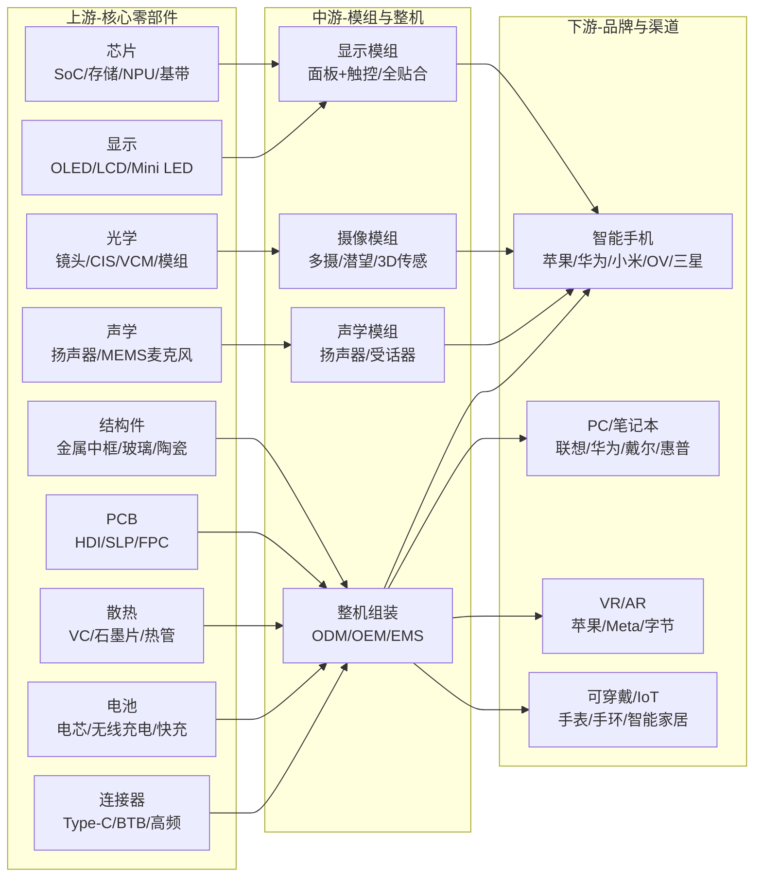
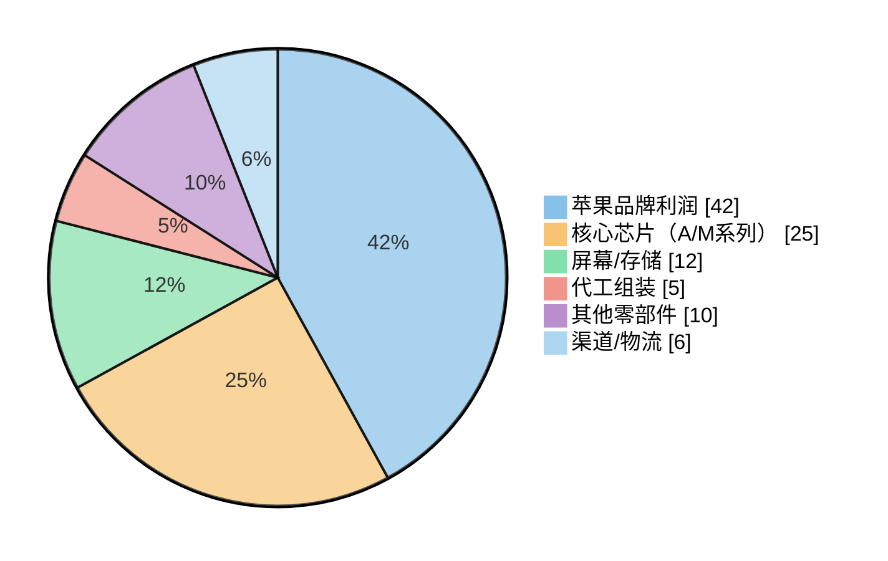

# 消费电子产业链总纲

> 产业链深度：★★★★★
> 行情属性：周期成长（换机周期）+ 主题驱动（AI终端）
> 核心驱动：AI终端渗透 + 换机周期启动 + 华为回归
> 当前阶段：AI终端驱动的换机周期初期

## 关联概念

- 细分赛道:: [[A股产业研究库/03 产业链图谱/消费电子产业链/AI手机]]
- 细分赛道:: [[A股产业研究库/03 产业链图谱/消费电子产业链/AI PC]]
- 细分赛道:: [[A股产业研究库/03 产业链图谱/消费电子产业链/AR-VR]]
- 衍生应用:: [[A股产业研究库/03 产业链图谱/消费电子产业链/可穿戴设备]]
- 衍生应用:: [[A股产业研究库/03 产业链图谱/消费电子产业链/TWS耳机]]
- 关联产业:: [[A股产业研究库/03 产业链图谱/AI产业链/总纲|AI产业链]]
- 关联产业:: [[A股产业研究库/03 产业链图谱/半导体产业链/总纲|半导体产业链]]
- 下游:: [[A股产业研究库/03 产业链图谱/新能源汽车产业链/总纲|汽车电子]]

---

## 一、上中下游全景图

---

## 二、子赛道出货量与增速

| 子赛道 | 2024年出货量 | 2025E出货量 | 2026E预测 | 核心驱动 |
|:------|:-----------:|:-----------:|:---------:|:---------|
| 全球智能手机 | 12.0亿部 | 12.5亿部 | 13.2亿部 | AI手机渗透率10%→30% |
| 其中AI手机 | 1.5亿部 | 3.8亿部 | 6.5亿部 | 端侧大模型，NPU升级 |
| 全球PC | 2.6亿台 | 2.7亿台 | 2.9亿台 | AI PC（Copilot+）换机 |
| 其中AI PC | 5000万台 | 1.2亿台 | 2.0亿台 | Intel/AMD/高通AI处理器 |
| VR/AR | 1500万台 | 2000万台 | 3000万台 | Vision Pro二代+Meta Quest |
| TWS耳机 | 3.5亿副 | 3.8亿副 | 4.2亿副 | AI语音助理+降噪 |
| 智能手表 | 2.0亿只 | 2.2亿只 | 2.5亿只 | 健康监测+AI分析 |
| IoT/AI终端 | 8亿台 | 12亿台 | 18亿台 | AI音箱/眼镜/家居 |

**数据来源**：IDC/Canalys/Counterpoint相关报告

---

## 三、苹果链利润分配表

| 环节 | 利润率 | 附加价值 | 代表供应商 | A股标的 |
|:----:|:------:|:--------:|:-----------|:--------|
| 品牌（苹果） | 35-42% | 品牌+系统+生态 | — | — |
| 应用商店 | 70-80% | 软件生态抽成 | — | — |
| 自研芯片(A/M系列) | 50-60% | SoC设计 | 台积电(代工) | — |
| 存储芯片 | 25-40% | NAND/DRAM | 三星/SK海力士/美光 | — |
| 屏幕 | 20-30% | OLED/LTPO | 三星/京东方/LG | 京东方 |
| 摄像模组 | 15-25% | CIS+Lens | 索尼/大立光 | 韦尔股份(部分) |
| 中框/结构件 | 10-20% | 金属+玻璃 | 长盈/蓝思/比亚迪电子 | 长盈精密、蓝思科技 |
| PCB/SLP | 20-30% | 高多层HDI | AT&S/鹏鼎/东山 | 鹏鼎控股、东山精密 |
| 电池 | 10-15% | 电芯+Pack | 欣旺达/德赛/ATL | 欣旺达、德赛电池 |
| 声学模组 | 15-25% | 扬声器/MEMS | 歌尔/瑞声 | 歌尔股份 |
| 精密连接器 | 20-30% | BTB/FPC | 立讯/安费诺 | 立讯精密 |
| 整机组装 | 3-5% | 整机代工 | 立讯/鸿海/和硕 | 立讯精密 |

**数据来源**：Counterpoint/IDC相关报告；各公司2024年年报，巨潮资讯网 www.cninfo.com.cn

**核心结论**: 苹果品牌拿走40%+的利润，供应链利润率最高的环节是芯片(50%+)/屏幕(20-30%)/精密连接器(20-30%)，组装环节利润率最低（3-5%）。进入苹果供应链的A股公司赚的不是高利润率，而是确定性的收入和规模效应。

---

## 四、投资主线

### 主线一：苹果链（Apple Intelligence驱动换机）

**逻辑**: 苹果AI功能（包括ChatGPT集成）推动iPhone 17超级换机周期。2026年出货量有望突破2.5亿部。Apple Vision Pro二代降价+产能提升，VR/AR产业链受益。

**核心标的**:
- 立讯精密（整机组装+连接器+声学，iPhone/Max/VR三大业务）
- 鹏鼎控股（PCB+SLP，iPhone主板）
- 东山精密（FPC+结构件）
- 蓝思科技（玻璃盖板+结构件）
- 歌尔股份（声学+VR/AR整机组装）
- 欣旺达（手机电池，电池涨价弹性）

### 主线二：安卓链（华为回归+国产替代）

**逻辑**: 华为手机（Mate/P系列）回归带动国产手机产业链升级。国产SoC/OS/屏幕/CMOS等替代加速。

**核心标的**:
- 韦尔股份（华为CIS主力供应商）
- 京东方（华为旗舰OLED屏幕）
- 汇顶科技（屏下指纹+触控）
- 长盈精密（钛合金中框，华为星闪）
- 兆易创新（NOR Flash，华为供应链）
- 卓胜微（射频前端，安卓手机）

### 主线三：AI终端（SoC/散热/存储升级）

**逻辑**: AI手机和AI PC的端侧AI能力带来硬件升级需求——NPU算力提升、散热方案升级、存储容量翻倍。这是2025-2027年最确定的增量方向。

**核心标的**:
- 散热: 中石科技（人工石墨）、飞荣达（VC均温板）、思泉新材（热管理材料）
- 存储: 兆易创新（NOR Flash+DRAM）
- SiP封装: 环旭电子（SiP模组，苹果A系列+AI芯片封装）
- 连接器: 立讯精密（高频连接器，AI终端升级）

### 主线四：VR/AR（空间计算平台）

**逻辑**: Vision Pro二代价格降至2000-2500美元区间，Meta Quest 4发布，字节PICO跟进。VR/AR从游戏设备向空间计算平台切换。

**核心标的**:
- 歌尔股份（VR/AR整机组装，Meta+苹果客户）
- 舜宇光学（VR/AR光学镜片）
- 水晶光电（AR光波导+光学元件）
- 兆威机电（VR瞳距调节）
- 三利谱（Pancake光学膜）

---

## 五、A股全映射表（14个环节）

| 环节 | 龙头 | 核心 | 弹性 | 投资逻辑 |
|:----:|:----:|:----:|:----:|:---------|
| 整机组装 | 立讯精密 | 闻泰科技 | 华勤技术 | 苹果+安卓双线，AI终端放量 |
| 声学模组 | 歌尔股份 | 瑞声科技(港股) | — | VR/AR+AI语音入口 |
| 显示面板 | 京东方 | TCL科技 | 维信诺 | OLED渗透率提升 |
| 摄像模组 | 韦尔股份 | 欧菲光 | 联合光电 | 华为回归+多摄升级 |
| 光学镜头 | 舜宇光学(港股) | 联合光电 | — | VR/AR光学+手机潜望 |
| 玻璃盖板 | 蓝思科技 | 比亚迪电子(港股) | — | 苹果+华为双供应 |
| 金属中框 | 长盈精密 | 领益智造 | 科森科技 | 钛合金中框渗透 |
| PCB/SLP | 鹏鼎控股 | 东山精密 | 崇达技术 | AI终端高频高速 |
| FPC | 东山精密 | 弘信电子 | 景旺电子 | 苹果链+安卓链 |
| 电池 | 欣旺达 | 德赛电池 | 珠海冠宇 | 电池容量提升+快充 |
| 散热材料 | 中石科技 | 飞荣达 | 思泉新材 | AI终端功耗增长 |
| 连接器 | 立讯精密 | 长盈精密 | 电连技术 | 高频高速连接器 |
| SiP封装 | 环旭电子 | 长电科技 | — | AI芯片SiP模组 |
| 被动元件 | 顺络电子 | 三环集团 | 风华高科 | 电感/MLCC需求提升 |

---

## 六、核心结论

1. **AI终端是消费电子未来3年最大的增量**: AI手机和AI PC带来的换机周期确定性高。2025-2027年全球AI手机渗透率将从10%快速提升至50%+，带来SoC/存储/散热/PCB全链条升级。

2. **苹果链赚确定性，安卓链赚弹性**: 苹果链（立讯/鹏鼎/蓝思）收入确定性强但弹性有限，适合稳健配置。安卓链（韦尔/京东方）受益于华为回归和国产替代，弹性更大但波动也更大。

3. **VR/AR是非共识但潜力最大的方向**: Vision Pro二代降价+Meta/字节投入，VR/AR出货量有望从2025年的2000万台增长至2028年的1亿台。歌尔股份和舜宇光学是核心标的。

4. **组装环节利润率最低但最确定**: 立讯精密组装利润率仅3-5%，但苹果供应链的深度绑定+AI终端放量带来的规模效应，使其在消费电子领域具有最强的业绩确定性。

5. **风险关注**: 智能手机市场已进入存量竞争，换机周期低于预期将直接影响全链景气度；中美科技博弈升级影响苹果供应链布局；VR/AR产品体验和用户接受度仍存在不确定性。

---

## 代表公司

### 手机产业链上市公司全景表

| 环节 | 苹果链 | 安卓链(华为) | 安卓链(小米/OV) | 核心逻辑 |
|:----:|:-------|:------------|:---------------|:---------|
| **整机组装** | 立讯精密(EMS/整机)、闻泰科技(ODM) | 比亚迪电子(华为组装) | 华勤技术(小米ODM)、龙旗科技(小米ODM) | 立讯深度绑定苹果，比亚迪电子受益华为回归；ODM模式利润薄但确定性高 |
| **SoC/主芯片** | —(苹果自研,台积电代工) | 海思(未上市) | 联发科(港股)、高通(美股) | 海思回归是最大变量，但A股无直接标的 |
| **存储芯片** | 兆易创新(NOR Flash备货) | 兆易创新、北京君正(DRAM) | 兆易创新 | AI手机驱动存储容量翻倍，NOR Flash受益于TWS/可穿戴 |
| **CIS图像传感器** | 韦尔股份(部分苹果机型) | 韦尔股份(华为主力) | 韦尔股份、格科微(低端) | 韦尔股份华为份额提升+50M像素升级周期 |
| **光学镜头** | 舜宇光学(港股) | 舜宇光学、联合光电(潜望) | 舜宇光学、瑞声科技(港股) | 潜望式/玻塑混合镜头渗透 |
| **显示面板** | 京东方(OLED)、深天马(部分) | 京东方(华为P/Mate OLED主力) | 京东方、维信诺、TCL华星 | 国产OLED份额从30%→50%+ |
| **玻璃盖板** | 蓝思科技 | 蓝思科技 | 蓝思科技 | 苹果+华为双核心供应商，玻璃+陶瓷+蓝宝石 |
| **金属中框** | 长盈精密(钛合金)、领益智造 | 长盈精密(钛合金)、比亚迪电子 | 长盈精密、领益智造 | 钛合金中框从苹果向安卓渗透 |
| **PCB/SLP** | 鹏鼎控股、东山精密(FPC) | 鹏鼎控股、东山精密 | 鹏鼎控股、景旺电子 | 鹏鼎苹果主板主力，东山FPC双线受益 |
| **电池** | 欣旺达、德赛电池 | 欣旺达 | 欣旺达、珠海冠宇 | 电池容量年增10%+，快充/无线充电升级 |
| **声学模组** | 歌尔股份、瑞声科技(港股) | 歌尔股份 | 歌尔股份 | AI语音交互+空间音频 |
| **散热材料** | 中石科技、飞荣达 | 中石科技、思泉新材 | 中石科技 | AI SoC功耗提升驱动散热方案升级 |
| **连接器** | 立讯精密、电连技术 | 立讯精密、电连技术 | 电连技术 | 高频高速连接器需求随AI终端增长 |
| **射频前端** | — | 卓胜微(华为)、唯捷创芯 | 卓胜微、唯捷创芯 | 5G/6G频段增加驱动BAW/FEM需求 |
| **指纹/触控** | — | 汇顶科技(华为) | 汇顶科技 | 超声波指纹/侧边指纹渗透 |
| **SiP封装** | 环旭电子 | 环旭电子 | 环旭电子 | AI芯片SiP模组需求增长 |

### AI PC专用环节

| 环节 | 代表公司 | 核心逻辑 |
|:----:|:---------|:---------|
| NPU/AI处理器 | 瑞芯微(RK3588)、全志科技 | 端侧AI推理芯片，AI PC NPU协处理器 |
| 内存接口 | 澜起科技 | AI PC DDR5内存接口芯片，受益PC换机 |
| SSD存储 | 江波龙(存储模组)、佰维存储 | AI PC标配1TB+SSD，存储容量升级 |
| 散热模组 | 飞荣达(VC均温板)、中石科技 | AI PC TDP提升至80W+，散热需求翻倍 |
| 笔电代工 | 闻泰科技(笔电ODM)、华勤技术 | AI PC换机潮拉动ODM出货量 |

### VR/AR专用环节

| 环节 | 代表公司 | 核心逻辑 |
|:----:|:---------|:---------|
| VR整机组装 | 歌尔股份(Meta+苹果)、立讯精密(苹果) | Vision Pro二代降价放量，Meta Quest 4 |
| 光学(Pancake) | 舜宇光学(港股)、三利谱(光学膜) | Pancake方案成为VR标配 |
| 光学(光波导) | 水晶光电、苏大维格 | AR光波导镜片是AR轻量化的关键 |
| 瞳距调节 | 兆威机电 | VR瞳距自动调节精密传动 |
| 微显示屏 | 京东方(OLEDoS)、视涯(未上市) | 硅基OLED/MicroLED，VR高PPI显示 |
| 空间定位 | 韦尔股份(TOF模组)、奥比中光 | 3D视觉/手势识别传感器 |

### 可穿戴设备专用环节

| 环节 | 代表公司 | 核心逻辑 |
|:----:|:---------|:---------|
| TWS组装 | 歌尔股份(苹果)、立讯精密(苹果) | AI语音助手+降噪升级驱动换机 |
| 智能手表 | 立讯精密(苹果组装)、歌尔股份 | 健康监测芯片+AI分析功能增加 |
| 穿戴芯片 | 恒玄科技(蓝牙SoC)、中科蓝讯 | AI端侧语音处理，低功耗蓝牙SoC升级 |
| 传感器 | 敏芯股份(MEMS麦克风) | MEMS传感器用量随可穿戴增长 |

---

### 关键跟踪指标

| 指标 | 重要性 | 更新频率 | 数据来源 |
|:-----|:------:|:--------:|:--------|
| 全球智能手机出货量 | ★★★★★ | 季度 | IDC/Counterpoint |
| iPhone/iPad/PC出货量 | ★★★★★ | 季度 | Apple财报/IDC |
| 苹果供应链收入指引 | ★★★★ | 季度 | 立讯/歌尔/鹏鼎财报 |
| AI手机渗透率 | ★★★★ | 季度 | Canalys/Counterpoint |
| VR/AR出货量 | ★★★★ | 季度 | IDC/Wellsenn XR |
| 华为手机出货量 | ★★★★ | 季度 | IDC/华为官方 |
| 消费电子出口数据 | ★★★ | 月度 | 海关总署 |

### 主要风险

- 智能手机存量市场换机周期拉长，总量增长乏力
- 中美科技博弈升级影响苹果供应链布局（产能外迁压力）
- VR/AR产品体验和用户接受度仍存在较大不确定性
- 代工产能向越南/印度转移对国内供应链的冲击
- 消费降级趋势下高端产品销量承压

## 政策法规

### 美国对华科技限制

| 政策/法规 | 时间 | 核心内容 | 对消费电子产业链的影响 |
|:---------|:----|:---------|:-------------------|
| BIS芯片出口管制(2022.10) | 2022年10月 | 限制对中国出口高端AI芯片/超算芯片 | 限制消费电子SoC的制程升级（麒麟芯片被迫用成熟制程） |
| BIS升级版(2023.10) | 2023年10月 | 扩大出口管制范围，限制更多AI芯片/半导体设备/EDA | 影响消费电子芯片设计工具获取，加速国产EDA替代 |
| BIS进一步收紧(2024) | 2024年 | 限制对中国出口HBM、先进封装设备 | 影响苹果链国产替代进程，但对消费电子影响小于AI芯片 |
| 实体清单新增 | 持续更新 | 华为及其关联企业被列入实体清单 | 华为手机芯片自主化加速，海思回归带动国产供应链 |

**核心影响路径**: 美国出口管制→中国消费电子SoC制程受限→国产手机被迫用国产成熟制程芯片→催生国产芯片设计/IP/封测需求→华为海思自研处理器成关键变量。

### 欧盟USB-C强制标准

| 政策 | 实施时间 | 核心内容 | 影响 |
|:-----|:--------|:---------|:-----|
| 欧盟无线电设备指令修订 | 2024年12月全面实施 | 所有在EU销售的中小型便携设备必须配备USB-C充电接口 | 苹果被迫放弃Lightning接口，利好Type-C连接器产业链（立讯精密/电连技术）；充电器/数据线厂必须统一标准，淘汰旧产线 |

### 电子产品环保法规

| 法规 | 区域 | 核心要求 | 消费电子影响 |
|:-----|:----|:--------|:------------|
| WEEE(废电子电气设备指令) | 欧盟 | 电子电气设备生产商承担回收费用，设定回收率目标 | 增加代工厂合规成本，利好电子废弃物回收企业 |
| RoHS(有害物质限制) | 欧盟 | 限制铅/汞/镉/六价铬等有害物质使用 | 推动无铅焊料/无卤素材料替代，利好材料供应商 |
| 欧盟电池法规 | 2023年8月生效 | 要求便携式电池可拆卸、可更换 | 影响手机一体化设计，推动电池模块标准化，利好欣旺达/德赛等掌握可拆卸电池方案的厂商 |
| 中国《废弃电器电子产品回收处理管理条例》 | 国内 | 建立废弃电器电子产品处理基金，生产商缴纳回收处理费 | 增加国内代工厂的合规成本，推动生产商回收体系建设 |

### 关税政策与供应链转移

| 政策 | 时间 | 内容 | 影响 |
|:-----|:----|:------|:-----|
| 美国对华301关税(消费电子品类) | 2018年+2024年复审 | 对从中国进口的消费电子(手机/PC/耳机等)加征7.5-25%关税 | 推动苹果/戴尔等品牌加速向越南/印度转移组装产能 |
| 印度PLI(生产挂钩激励)计划 | 2020年启动 | 对在印度生产智能手机提供4-6%的补贴 | 吸引苹果供应链(鸿海/纬创/和硕)在印设厂，影响A股代工企业未来的产能分布 |
| 越南欧盟自贸协定(EVFTA) | 2020年生效 | 越南出口欧盟电子产品享受零关税 | 推动消费电子代工向越南转移（立讯/歌尔在越设厂），对以国内产线为主的代工企业形成竞争 |

---

## 舆论风向

### AI手机：真爆发还是假繁荣？

**乐观派（产业资本/券商）**:
- AI手机是2025-2027年最确定的换机催化剂，高通骁龙8 Gen 4/联发科天玑9400端侧AI算力跃升5倍+，NPU升级带动全链升级
- 苹果Apple Intelligence推动用户换机意愿，2026年iPhone出货量有望达到2.5亿部（vs 2024年2.3亿部），供应链收入确定性强
- AI助手从云端走向端侧是必然趋势，2027年AI手机渗透率将超50%，这个量级足以驱动全产业链升级

**怀疑派（独立分析师/资深投资者）**:
- 消费者真愿意为AI功能多付1000-2000元吗？目前AI手机杀手级App尚未出现，端侧AI功能（实时翻译/语音助手/照片编辑）并不足以推动大规模换机
- AI手机对硬件升级的需求（更大内存/更强散热/更大电池）增加了BOM成本，在消费降级趋势下可能压制销量
- 智能手机已经是成熟存量市场，换机周期从2年拉长到4年，AI能否逆转这个趋势存疑

### 苹果Vision Pro：空间计算还是伪需求？

**看空派（科技媒体/用户体验差评）**:
- Vision Pro首年销量不到50万台，远低于苹果内部预期（300万台），证明3000美元以上的空间计算设备是伪需求
- 重量、续航、应用生态三大硬伤短期内无解，用户体验糟糕，退货率高

**看多派（苹果生态信徒）**:
- Vision Pro是iPhone级别的平台转换（从移动计算到空间计算），不能以第一代销量论英雄，iPhone第一代也只卖了600万台
- 二代价格降至2000-2500美元将大幅打开市场，叠加Apple Intelligence空间AI功能，2027年销量有望达到500万台
- 空间计算是长期趋势，Meta/字节/三星都在跟进，供应链（歌尔/舜宇/兆威）受益确定

### 华为回归：格局重塑还是昙花一现？

**乐观叙事**:
- Mate 60系列搭载麒麟9000S回归，华为手机2024年出货量重回5000万部+，2025年目标7000万部，对消费电子产业链格局形成根本性冲击
- 华为回归最大的意义是激活了国产手机供应链，韦尔/京东方/长盈的份额提升直接受益
- 鸿蒙生态独立（HarmonyOS NEXT）创造了新的软件生态机会，鸿蒙概念股受益

**谨慎叙事**:
- 华为芯片仍受制程工艺限制（7nm vs 苹果3nm），性能差距3-4代，长期竞争压力大
- 华为手机出货量天花板约8000万-1亿部，难以回到2019年2.4亿部的高点
- 华为回归的主要受益者是华为链公司，对苹果链形成分流而非增量

### 代工厂越南/印度转移：焦虑还是机遇？

**焦虑叙事**:
- 苹果要求供应链向越南/印度转移产能，立讯/歌尔/鸿海均在越南和印度设厂，国内消费电子代工产业面临"空心化"风险，就业岗位流失
- 越南/印度工人效率和良率低于国内，短期影响供应链效率和成本
- 中美科技脱钩加速，代工产能外移是长期不可逆趋势

**理性叙事**:
- 苹果转移产能主要影响的是组装环节（低利润率3-5%），高附加值的上游零部件（芯片/屏幕/光学/连接器）仍以国内为主
- 龙头代工厂（立讯/歌尔）在越南/印度设厂本身也是受益者，产能全球化分散风险反而是利好
- Apple供应链转移速度被高估了，中国在消费电子制造领域的全产业链优势（效率+良率+配套）短期内难以替代

## 参考资料

[1] 相关A股公司（如适用）. 2024年年度报告[R]. 巨潮资讯网.
    http://www.cninfo.com.cn

[2] 国家统计局. 中国统计年鉴[R]. 2025.
    http://www.stats.gov.cn

[3] 相关行业协会/研究机构. 行业市场研究报告[R]. 2025.
