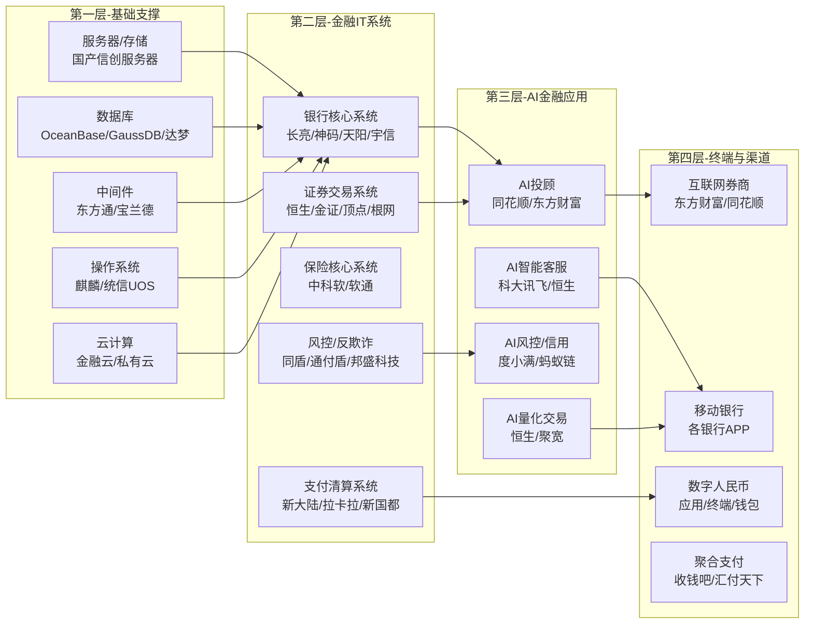

# 金融科技产业链总纲

> **缩写说明**：本页出现以下专业缩写——
> - **UOS**（Unity Operating System，统信操作系统）
> 
> 完整术语表见 [[A股产业研究库/12 术语库/README|术语库]]

> 产业链深度：★★★★
> 行情属性：成长驱动 + 政策驱动 + 周期成长
> 核心驱动：金融信创 + AI金融 + 资本市场改革
> 当前阶段：信创替代加速，AI应用爆发

## 关联概念

- 细分赛道:: [[A股产业研究库/03 产业链图谱/金融科技产业链/银行IT]]
- 细分赛道:: [[A股产业研究库/03 产业链图谱/金融科技产业链/证券IT]]
- 细分赛道:: [[A股产业研究库/03 产业链图谱/金融科技产业链/保险IT]]
- 核心应用:: [[A股产业研究库/03 产业链图谱/金融科技产业链/AI金融]]
- 配套技术:: [[A股产业研究库/03 产业链图谱/金融科技产业链/金融信创]]
- 衍生应用:: [[A股产业研究库/03 产业链图谱/金融科技产业链/数字人民币]]
- 关联产业:: [[A股产业研究库/03 产业链图谱/AI产业链/总纲|AI产业链]]
- 关联产业:: [[A股产业研究库/03 产业链图谱/数据要素产业链/总纲|数据要素]]
- 核心产品:: [[A股产业研究库/03 产业链图谱/半导体产业链/总纲|半导体]]

---

## 一、四层全景图

---

## 二、4个子赛道增速表

| 子赛道 | 2024市场规模 | 2025E增速 | 2026E增速 | 核心驱动 |
|:------|:-----------:|:--------:|:--------:|:---------|
| 银行IT | 1200亿元 | 15% | 18% | 信创替代（核心系统国产化） |
| 证券IT | 350亿元 | 20% | 25% | 交易系统升级+量化需求 |
| 保险IT | 400亿元 | 12% | 15% | 数字化+AI核保理赔 |
| AI金融 | 80亿元 | 60% | 80% | AI投顾/风控/客服爆发 |
| 支付/数字人民币 | 300亿元 | 20% | 25% | 数字人民币试点扩围 |

**数据来源**：IDC/赛迪顾问相关报告；各公司2024年年报，巨潮资讯网 www.cninfo.com.cn

---

## 三、5种商业模式对比

| 商业模式 | 代表公司 | 利润率 | 可扩展性 | 客户黏性 | 投资评价 |
|:--------|:---------|:------:|:--------:|:--------:|:---------|
| B2B项目制 | 长亮/天阳/宇信 | 15-25% | 低（人力驱动） | 高 | 稳定但低弹性 |
| B2B产品化 | 恒生电子 | 35-50% | 中 | 极高 | 最优质金融IT标的 |
| B2B SaaS | 恒生轻量/用友金融 | 40-60% | 高 | 中 | 起步阶段 |
| B2C流量变现 | 东方财富/同花顺 | 50-70% | 极高 | 中 | 最高利润率 |
| B2B2C平台 | 蚂蚁集团/度小满 | 30-50% | 极高 | 中 | A股无纯正标的 |

**核心判断**: 恒生电子（产品化模式+极高客户黏性+AI金融入口）是金融科技领域最优质的A股公司。东方财富（B2C流量+券商牌照+基金代销）具有最强的盈利能力和商业模式。

---

## 四、A股全映射表

### 4.1 银行IT

| 细分 | 龙头 | 核心 | 弹性 | 投资逻辑 |
|:----:|:----:|:----:|:----:|:---------|
| 核心系统 | 长亮科技 | 神州信息 | 天阳科技 | 银行核心系统信创替代，大单持续落地 |
| 信贷系统 | 宇信科技 | — | — | 信贷+风控，大行客户稳定 |
| 数据治理 | 宇信科技 | 高伟达 | 润和软件 | 银行数据中台+监管报送 |
| 银行渠道 | 科蓝软件 | — | — | 移动银行+智能网点 |
| 银行运营 | 神州信息 | — | — | 银行IT综合方案 |

### 4.2 证券IT

| 细分 | 龙头 | 核心 | 弹性 | 投资逻辑 |
|:----:|:----:|:----:|:----:|:---------|
| 交易系统 | 恒生电子 | 金证股份 | 顶点软件 | 证��交易系统绝对龙头，AI+量化 |
| 证券IT | — | 金证股份 | 恒银科技 | 证券+基金IT，受益资本市场改革 |
| 登记结算 | — | 中科金财 | — | 中登公司系统对接 |

### 4.3 AI金融

| 公司 | 定位 | 投资逻辑 |
|:----|:-----|:---------|
| 同花顺 | AI投顾+金融数据 | 问财AI投顾MAU爆发，金融数据流量变现 |
| 东方财富 | 互联网券商+基金 | AI研报+智能交易，最完整的金融科技闭环 |
| 恒生电子 | AI金融基础设施 | AI投研+量化平台+风控，金融AI入口 |
| 财富趋势 | 证券信息终端 | 通达信金融终端，AI+行情数据 |

### 4.4 支付与数字人民币

| 公司 | 定位 | 投资逻辑 |
|:----|:-----|:---------|
| 新大陆 | POS终端+支付服务 | 数字人民币硬钱包+智能POS |
| 新国都 | 支付终端 | 跨境支付+数字人民币终端 |
| 拉卡拉 | 第三方支付 | 聚合支付+商户SaaS服务 |
| 广电运通 | 数字人民币+金融机具 | 数字人民币ATM+钱包+智能柜台 |
| 四方精创 | 数字人民币技术 | 数字货币钱包+跨境支付技术 |

### 4.5 金融信创（基础软件）

| 公司 | 定位 | 投资逻辑 |
|:----|:-----|:---------|
| 达梦数据(科创板) | 国产数据库 | 金融核心系统信创替代首选 |
| 东方通 | 中间件 | 金融行业中间件国产化替代 |
| 宝兰德 | 中间件 | 证券+银行中间件信创 |
| 创意信息 | 数据库+大数据 | 国产数据库（GreatDB）金融落地 |

---

## 五、三条投资主线

### 主线一：金融信创（确定性最高）

**逻辑**: 2027年金融核心系统全面国产化是国家要求。银行核心系统信创替代处于加速期，长亮科技/神州信息/达梦数据直接受益。确定性强，可预测性高。

**核心标的**: 长亮科技、神州信息、达梦数据、东方通
**催化剂**: 金融信创招投标大单、核心系统信创替换案例

### 主线二：AI+金融（弹性最大）

**逻辑**: AI金融是AI应用商业化最快的垂直领域。金融行业IT预算充足+数据丰富+AI变现路径清晰。同花顺问财、东方财富AI研报、恒生AI投研等产品已验证商业价值。

**核心标的**: 同花顺（AI投顾）、恒生电子（AI金融入口）、东方财富（AI量化）
**催化剂**: AI金融产品MAU数据、付费用户渗透率、AI金融监管政策

### 主线三：资本市场改革（事件驱动）

**逻辑**: 注册制全面深化、交易机制改革、T+0预期、资本市场对外开放等改革持续催化证券IT需求。恒生电子/金证股份/顶点软件直接受益。

**核心标的**: 恒生电子、金证股份、顶点软件
**催化剂**: 资本市场改革政策、交易量放大、IPO回暖

---

## 六、核心结论

1. **恒生电子是金融科技最核心的A股标的**: 产品化商业模式（35-50%利润率）+ 极高客户黏性（证券/基金核心交易系统无可替代）+ AI金融基础设施入口的三重优势，是金融科技领域的"迈瑞医疗"。

2. **AI金融是当前最大增量**: 金融行业是AI变现最快的垂直领域。同花顺（问财AI投顾）、东方财富（AI量化/研报）、恒生电子（AI投研）都已实现商业化，增速远超传统金融IT业务。

3. **银行信创超过确定性优先选择**: 2027年全面国产化目标下，银行核心系统替换是强制性的，不受经济周期影响。长亮科技/神州信息/达梦数据收入增速2025-2027年有望维持在20-30%。

4. **东方财富具备最强的商业模式**: 互联网券商（交易佣金）+ 基金代销（管理费分成）+ 金融数据（资讯/AI）三大变现路径叠加，毛利率50-70%，是金融科技领域盈利能力最强的公司。

5. **风险关注**: 金融监管政策变化（收紧AI金融合规要求、数据安全法执行）；信创替代进度受银行IT预算波动影响；资本市场成交量萎缩影响东方财富/同花顺收入；AI金融产品同质化加剧竞争。

---

## 代表公司

### 银行IT（强化版）

| 环节 | 龙头 | 核心 | 弹性 | 核心逻辑 |
|:----:|:----:|:----:|:----:|:---------|
| 核心系统 | 长亮科技 | 神州信息 | 天阳科技 | 银行核心系统信创替代龙头，华为高斯数据库深度绑定，大行（邮储/交行/招行）核心替换项目持续落地 |
| 信贷/风控系统 | 宇信科技 | — | — | 信贷+风控系统，大行（建行/工行）客户稳定，信用卡/零售信贷数字化 |
| 数据治理/监管报送 | 宇信科技 | 高伟达 | 润和软件 | 银行数据中台+监管报送（EAST/1104），监管合规刚性需求 |
| 银行渠道/移动端 | 科蓝软件 | — | — | 移动银行+智能网点，信创替代推动渠道系统改造 |
| 银行IT综合方案 | 神州信息 | — | — | 银行IT全栈方案，分布式核心+数据中台，农业银行大单 |
| 银行IT项目交付 | — | — | 银信科技 | IT运维+系统集成，大行IT服务外包 |

### 证券IT（强化版）

| 环节 | 龙头 | 核心 | 弹性 | 核心逻辑 |
|:----:|:----:|:----:|:----:|:---------|
| 交易系统 | 恒生电子 | 金证股份 | 顶点软件 | 证券核心交易系统占率80%+，资管/TA/估值也居绝对龙头。AI+量化平台（恒生聚源/恒生AI投研）打开二次增长曲线 |
| OTC/场外市场 | — | 金证股份 | 恒银科技 | 券商OTC+基金IT，受益资本市场改革 |
| 证券信息终端 | 东方财富 | 同花顺 | 财富趋势(通达信) | 东方财富/同花顺C端终端，财富趋势B端终端，AI行情+数据分析 |
| 登记结算 | — | 中科金财 | — | 中登公司系统对接+银行理财登记 |

### AI金融（强化版）

| 公司 | 细分定位 | 核心竞争力 | 核心逻辑 |
|:----|:---------|:-----------|:---------|
| 同花顺 | AI投顾+金融数据 | 问财AI投顾(MAU 2000万+)、金融数据C端流量 | AI金融最纯正标的，问财付费用户增长是核心观察指标，AI导流→增值服务变现 |
| 东方财富 | 互联网券商+基金代销 | 东方财富证券(流量变现)+天天基金(代销)+Choice(数据) | 金融科技最完整闭环，AI研报+智能交易+量化平台 |
| 恒生电子 | AI金融基础设施 | AI投研平台+量化交易+智能风控 | 金融AI入口，大模型+数据+场景的深度结合 |
| 财富趋势 | 证券信息终端 | 通达信金融终端(B端市占率高) | 通达信AI+行情数据，B端客户黏性极高 |

### 支付科技（强化版）

| 公司 | 细分定位 | 核心逻辑 |
|:----|:---------|:---------|
| 新大陆 | POS终端+支付服务 | 智能POS出货量全球前三，数字人民币硬钱包+跨境支付增长快 |
| 新国都 | 支付终端 | 支付终端海外出口（拉美/中东）+跨境支付服务平台 |
| 拉卡拉 | 第三方支付 | 聚合支付+商户SaaS（云超门店数字化），线下收单龙头 |
| 广电运通 | 数字人民币+金融机具 | 数币ATM+智能柜台+数字人民币钱包，银行渠道优势 |
| 四方精创 | 数字人民币技术 | 央行数字货币钱包+跨境支付技术，香港/东南亚布局 |
| 海联金汇 | 第三方支付+跨境 | 跨境支付牌照（美国/MSB/香港MSO），受益跨境贸易数字化 |

### 保险IT（强化版）

| 公司 | 定位 | 核心逻辑 |
|:----|:-----|:---------|
| 中科软 | 保险核心系统 | 保险IT绝对龙头（市占率60%+），寿险/财险核心系统全覆盖，AI核保理赔 |
| 软通动力 | 保险IT+金融信创 | 保险IT+数字人民币（软通金科），保险行业信创替代 |
| 众安在线(港股) | 互联网保险 | AI精算+AI理赔，保险科技商业模式验证 |

### 金融信创基础软件（强化版）

| 公司 | 定位 | 核心逻辑 |
|:----|:-----|:---------|
| 达梦数据(科创板) | 国产数据库 | 金融核心系统信创替代首选数据库，已落地数百家金融机构 |
| 东方通 | 中间件 | 金融行业中间件国产化替代主力，大行/证券/保险全面覆盖 |
| 宝兰德 | 中间件 | 证券+银行中间件信创，客户黏性强 |
| 创意信息 | 数据库+大数据 | 国产数据库GreatDB金融落地，光大银行/四川农信 |

---

### 关键跟踪指标

| 指标 | 重要性 | 更新频率 | 数据来源 |
|:-----|:------:|:--------:|:--------|
| 金融信创订单招标量 | ★★★★★ | 季度 | 采招网/银行招标公告 |
| A股日均成交额（亿元） | ★★★★★ | 日度 | 上交所/深交所 |
| 新发基金规模（亿元） | ★★★★ | 月度 | 基金业协会 |
| 券商APP月活跃用户数 | ★★★★ | 月度 | QuestMobile |
| 银行IT投入增速 | ★★★★ | 年度 | IDC/银行年报 |
| 数字人民币交易量 | ★★★ | 季度 | 央行数字货币研究所 |
| AI金融监管政策进展 | ★★★ | 不定 | 央行/金融监管总局 |

### 主要风险

- 金融监管政策变化（收紧AI金融合规、数据安全法规趋严）
- 金融信创替代进度受银行IT预算波动影响
- 资本市场成交量萎缩直接影响东方财富/同花顺收入
- AI金融产品同质化加剧竞争，利润率承压
- 数字人民币推广进度低于预期

## 政策法规

### 金融信创政策

| 政策 | 时间 | 核心内容 | 影响 |
|:-----|:----|:---------|:-----|
| 金融信创2027全面替代 | 2020-2027路线图 | 金融行业IT系统2027年实现全面国产化（CPU/OS/DB/中间件/应用全栈） | 确定性最强的金融科技驱动力，长亮/达梦/恒生直接受益；2025-2027年替代进入攻坚期（核心交易系统替代） |
| 金融信创试点扩围 | 2023年第二批试点 | OA→一般业务系统→核心系统的三阶段替代路径 | 银行核心系统信创替代在2024-2026年集中释放，相关公司收入可预测性增强 |
| 金融信创采购指导 | 2024年 | 金融信创采购纳入KPI考核 | 信创从"可选项"变为"必选项"，银行IT预算向信创倾斜 |

### 数据安全与金融数据治理

| 法规 | 时间 | 核心内容 | 影响 |
|:-----|:----|:---------|:-----|
| [数据安全法](https://www.npc.gov.cn) | 2021年9月 | 建立数据分类分级保护制度，重要数据目录管理 | 金融机构必须对客户数据进行分级分类，增加数据治理合规投入，利好数据安全厂商 |
| [个人信息保护法](https://www.npc.gov.cn) | 2021年11月 | 严格规范个人信息收集、使用、处理 | 影响金融APP数据收集（精准营销受限），增加合规成本 |
| 金融数据安全分级指南(JR/T 0197) | 2020年+修订 | 金融行业数据安全分级标准 | 金融机构必须建立数据分级管理制度，利好金融数据治理/安全厂商 |
| 征信业务管理办法 | 2021年 | 规范信用信息采集和使用 | 影响互联网信贷的信用数据以用模式，利好持牌征信机构（百行征信/朴道征信） |

### 数字人民币政策

| 政策 | 时间 | 核心内容 | 影响 |
|:-----|:----|:---------|:-----|
| 数字人民币试点扩围 | 2022-2026扩容 | 试点城市从深圳/苏州扩展到全国30+城市 | 数字人民币硬钱包/POS终端改造需求增加，利好新大陆/广电运通/新国都 |
| 数字人民币跨境支付试点 | 2024年起 | 与香港/东南亚的数字人民币跨境流通 | 四方精创/新国都跨境支付业务受益 |
| 数字人民币智能合约 | 2025年 | 数字人民币智能合约应用（预付卡/政府补贴/供应链金融） | 打开数字人民币B端应用场景，利好广电运通/四方精创 |
| 数字人民币法定地位确立 | 2022年修订 | 数字人民币与实物人民币具有同等法律地位 | 加速数字人民币推广速度 |

### 金融牌照管理

| 牌照类型 | 监管要求 | 影响 |
|:---------|:---------|:-----|
| 第三方支付牌照 | 央行严格审批，存量牌照清理(牌照数量从270+张减至200-张) | 存量支付牌照稀缺价值提升，利好拉卡拉/新大陆等持牌机构 |
| 基金销售牌照 | 证监会审批，要求代销机构具备合规能力 | 东方财富(天天基金)牌照优势，市场份额持续提升 |
| 证券投资咨询牌照 | 证监会审批，AI投顾需持牌 | 影响同花顺问财/东方财富AI研报的合规边界，利好已持牌机构 |
| 征信牌照 | 央行审批，个人征信需持牌 | 互联网征信机构必须持牌经营，利好持牌机构（百行征信/朴道征信） |

### 金融大模型监管

| 政策/文件 | 时间 | 核心内容 | 影响 |
|:---------|:----|:---------|:-----|
| 生成式AI管理办法 [资料卡片:: [[A股产业研究库/14 资料库/01 政策文件/生成式AI管理办法]]] | 2023年+2024年修订 | 生成式AI服务需备案，不得生成虚假金融信息 | 约束AI金融内容生成（投顾/研报），利好有合规能力的头部厂商（恒生/同花顺） |
| 金融行业AI应用指引 | 2025年(征求意见稿) | 金融AI应用需通过合规评估，AI投顾/风控需人工复核 | 增加AI金融应用合规成本，头部厂商受益（合规能力强+客户信任度高） |
| AI金融风险分类管理 | 2026年(即将出台) | 对AI金融应用按风险（高风险/中风险/低风险）分类管理 | 低风险AI应用（客服/推荐）可直接运行；高风险（投顾/风控）需人工介入，影响AI投顾商业化进度 |

---

## 舆论风向

### 恒生电子"垄断地位会不会被打破"的争议

**护城河派（长期持有者/机构）**:
- 恒生电子在证券核心交易系统（集中交易/融资融券/OTC）市占率80%+，基金TA/估值90%+，核心系统替换成本极高（券商全系统改造需要1-2年），客户黏性壁垒几乎不可攻破
- 恒生O45架构已经实现分布式/云原生转型，技术上领先金证/顶点至少一个身位
- 恒生AI投研+恒生聚源+恒生资管形成"数据+系统+AI"生态，防守型更强

**挑战派（科技媒体/竞争者支持者）**:
- 金证和顶点在部分细分赛道的份额在提升（顶点在券商核心交易OCX份额提升明显），"恒生永远不可替代"是认知误区
- 腾讯云/阿里云/华为云正在以"分布式核心+云原生"方案渗透金融IT，可能导致恒生在银行IT领域边缘化
- 金融信创要求"多厂商供应"（避免单一依赖），监管层有意扶持金证/顶点/长亮作为恒生的替代选项

### 金融信创"真需求vs运动式"的争论

**看多派**:
- 2027年全面国产化是国务院级别的政策要求，银行IT信创替代是硬性任务，不是在"做不做"，而是在"何时做完"
- 银行核心系统替换周期通常3-5年，替换后的运维和升级收入持续贡献，并非一次性工程
- 信创替代催生了长亮/达梦等一批国产软件公司，从长期看是培育国内IT产业的战略举措

**质疑派**:
- 银行信创替代存在"形式大于实质"的风险——部分银行只在OA/门户等非核心系统替换，核心交易系统（账务/风控/信贷）仍使用DB2/Oracle等进口产品
- 信创系统（特别是数据库）在银行核心业务场景的稳定性和性能尚未得到充分验证，替换速度和效果可能低于政策期望
- 信创替换消耗了大量银行IT预算，挤占了数字化转型和创新AI应用的投入，长期看不一定提升银行竞争力

### AI金融投顾"替代分析师"vs"辅助工具"的讨论

**替代派（AI乐观者/科技媒体）**:
- 同花顺问财的AI投顾能力已经超过初级分析师，7x24小时不间断服务+海量数据处理能力+无情绪偏见
- 大模型+金融数据的组合将重构投顾行业，卖方分析师从"写报告"变为"训练和校验AI模型"
- 东方财富/同花顺的AI研报生成能力已经在公募基金中使用，"AI+人"的混合模式是趋势

**保守派（传统金融/监管谨慎者）**:
- AI投顾面临最大的问题是合规和信任——AI不能对自己发布的投顾建议承担法律责任
- 金融投资决策涉及复杂的情景判断、博弈逻辑和监管合规，大模型目前的能力远不能替代资深分析师
- AI金融监管正在收紧，对AI投顾的要求趋严，商业化进度可能低于预期

### 同花顺/东财"流量红利见顶"的质疑

**看空逻辑（雪球/股吧讨论焦点）**:
- 同花顺MAU在2024-2025年增长放缓（接近1亿MAU天花板），流量红利见顶信号明确
- 东方财富基金代销收入受市场行情影响大（2023-2024年基金销售低迷），收入波动性高
- 竞争加剧：东财面临同花顺、万得、雪球、各券商自营APP的多面夹击

**看多逻辑**:
- 同花顺/东财的流量见顶不是问题——核心是ARPU提升，AI功能付费用户转化是第二增长曲线
- 东财的互联网券商（低佣金获客+保证金利息）模式依然是A股最优秀的商业模式之一
- 中国居民理财/投资习惯正在从银行理财向基金/股票转移，长期看金融信息服务市场还在增长

## 时间线

[[A股产业研究库/11 产业时间线/金融科技产业链时间线|产业时间线]]

## 参考资料

[1] 相关A股公司（如适用）. 2024年年度报告[R]. 巨潮资讯网.
    http://www.cninfo.com.cn

[2] 国家统计局. 中国统计年鉴[R]. 2025.
    http://www.stats.gov.cn

[3] 相关行业协会/研究机构. 行业市场研究报告[R]. 2025.
