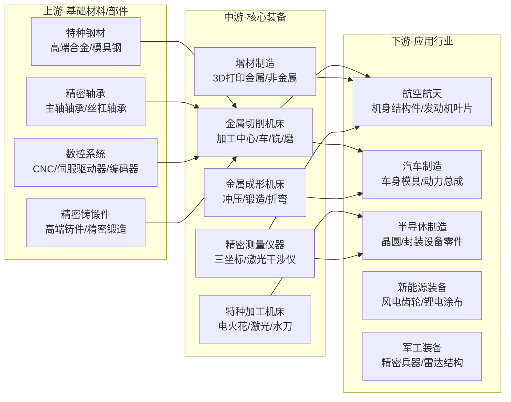

# 高端制造产业链总纲

> 产业链深度：★★★★
> 行情属性：周期成长 + 国产替代 + 政策驱动
> 核心驱动：自主可控 + 制造业升级 + 设备更新周期

## 关联节点

### 核心关联
[[A股产业研究库/03 产业链图谱/高端制造产业链/工业母机|工业母机]]

### 交叉产业链
[[A股产业研究库/03 产业链图谱/机器人产业链/总纲|机器人产业链]] | [[A股产业研究库/03 产业链图谱/半导体产业链/总纲|半导体产业链]] | [[A股产业研究库/03 产业链图谱/新能源汽车产业链/总纲|新能源汽车]] | [[A股产业研究库/03 产业链图谱/军工产业链/总纲|军工产业链]]

---

## 一、产业链全景图

---

## 二、核心投资逻辑

### 1. 工业母机国产替代（最大α）

**底层逻辑**: 中国是全球最大的机床消费国（占全球~30%），但高端数控机床国产化率仅10-15%，进口依赖度高。美国/日本/德国对中国高端装备出口管制（尤其是五轴加工中心/高端数控系统）持续加码，倒逼国产替代。

**重点突破环节**:
- **五轴联动数控机床**: 科德数控/海天精工/创世纪等已实现从0到1的突破，2024年国产五轴机床出货量同比增长50%+
- **数控系统（CNC）**: 发那科/西门子/三菱占据高端市场>90%，华中数控/科德数控在突破中
- **精密部件**: 主轴/丝杠/导轨（秦川机床/恒立液压等国产化进程加速）

### 2. 设备更新周期（β）

2024年国务院印发《推动大规模设备更新和消费品以旧换新行动方案》，推动工业母机/工程机械/农机等领域设备更新。中国机床保有量约800万台（10年+机龄占40%），存量更新需求庞大。

### 3. 智能制造+AI赋能

AI+工业视觉检测（[[A股产业研究库/03 产业链图谱/AI产业链/机器视觉|机器视觉]]）+AI工艺参数优化正在改变高端制造业的生产方式。数控机床接入工业互联网实现远程监控和预测性维护，是制造业转型升级的基础设施。

---

## 三、利润格局

| 环节 | 毛利率 | 定价权 | 竞争格局 |
|:----:|:------:|:------:|:---------|
| 高端数控机床 | 35-45% | ★★★ | 国产替代初期，定价权逐步提升 |

**数据来源**：中国机床工具工业协会；各公司2024年年报，巨潮资讯网 www.cninfo.com.cn
| 中端数控机床 | 20-30% | ★★ | 竞争激烈，海天精工/创世纪等规模竞争 |
| 低端机床 | 10-15% | ★ | 红海市场，利润微薄 |
| 数控系统（高端） | 50-60% | ★★★★★ | 发那科/西门子垄断，国产突破中 |
| 精密部件 | 25-40% | ★★★ | 高端依赖进口，国产替代空间大 |

---

## 四、A股核心映射

| 细分环节 | 龙头/核心 | 弹性标的 | 投资逻辑 |
|:--------:|:---------|:--------|:---------|
| 五轴机床 | 科德数控 | 海天精工 | 五轴国产替代最具确定性的标的 |
| 卧式/龙门 | 海天精工 | 创世纪 | 规模化量产，受益通用制造业复苏 |
| 立式/卧式 | 创世纪 | 秦川机床 | 3C加工+新能源汽车零部件赛道 |
| 数控系统 | 华中数控 | 科德数控 | 高端数控系统国产替代 |
| 精密导轨/轴承 | 秦川机床 | 恒立液压 | 核心部件国产化 |
| 刀具 | 欧科亿 | 华锐精密 | 数控刀具国产替代，消耗品属性好 |

---

## 五、行情特征

- **政策驱动性强**: 设备更新补贴/国产替代政策是主要催化剂
- **周期敏感**: 与制造业景气度（PMI/工业用电量）高度相关
- **节奏慢但持久**: 高端装备的客户认证周期长（12-24个月），一旦进入供应链合作稳定
- **估值合理**: 高端制造板块整体估值（20-35x PE）低于AI/半导体板块，更适合稳健配置

---

### 关键跟踪指标

| 指标 | 重要性 | 更新频率 | 数据来源 |
|:-----|:------:|:--------:|:--------|
| 制造业PMI指数 | ★★★★★ | 月度 | 国家统计局 |
| 工业机器人/金属切削机床产量 | ★★★★★ | 月度 | 国家统计局 |
| 设备更新政策补贴规模 | ★★★★ | 季度 | 财政部/工信部 |
| 五轴数控机床国产化率 | ★★★★ | 年度 | 行业研报/中国机床工具协会 |
| 工业母机企业订单排产周期 | ★★★ | 季度 | 科德数控/海天精工财报 |
| 高端数控系统进口数据 | ★★★ | 月度 | 海关总署 |
| 制造业固定资产投资增速 | ★★★★ | 月度 | 国家统计局 |

### 主要风险

- 制造业景气度下行风险——PMI持续低于荣枯线将压制设备投资需求
- 国产替代进度不及预期——高端数控系统/五轴机床的核心技术突破仍需时间
- 政策补贴退坡后需求可能回落
- 工业母机板块估值合理但缺乏高增长叙事，资金关注度偏低
- 出口管制升级可能影响关键零部件进口（高端轴承/丝杠/导轨）

## 关联节点

[[A股产业研究库/03 产业链图谱/高端制造产业链/工业母机|工业母机]] | [[A股产业研究库/03 产业链图谱/机器人产业链/总纲|机器人]] | [[A股产业研究库/03 产业链图谱/半导体产业链/半导体设备|半导体设备]] | [[A股产业研究库/03 产业链图谱/AI产业链/机器视觉|机器视觉]] | [[A股产业研究库/03 产业链图谱/军工产业链/总纲|军工]]

## 参考资料

[1] 相关A股公司（如适用）. 2024年年度报告[R]. 巨潮资讯网.
    http://www.cninfo.com.cn

[2] 国家统计局. 中国统计年鉴[R]. 2025.
    http://www.stats.gov.cn

[3] 相关行业协会/研究机构. 行业市场研究报告[R]. 2025.
