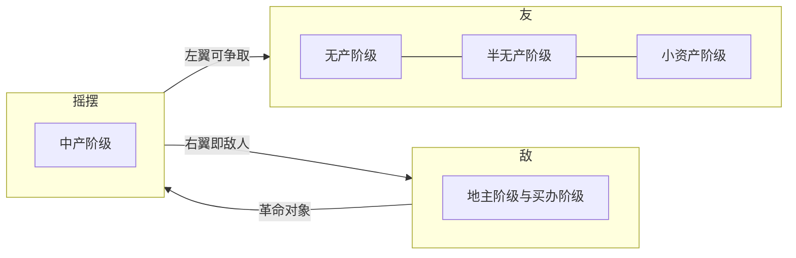
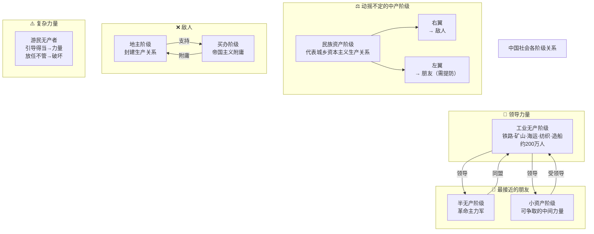
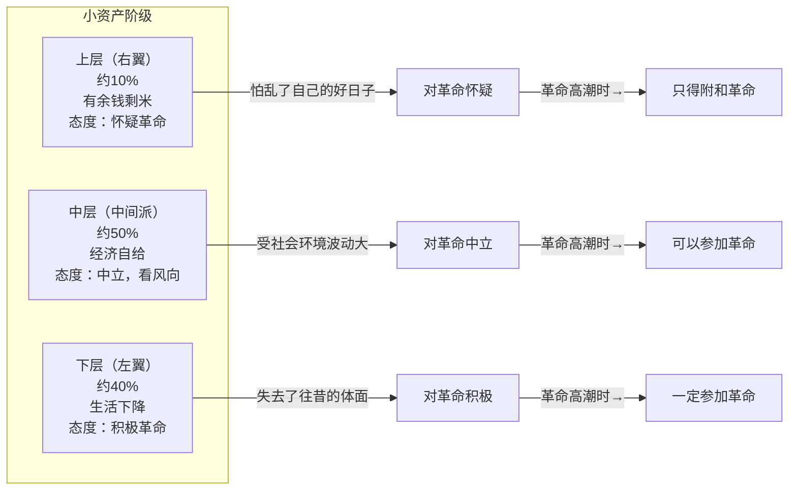
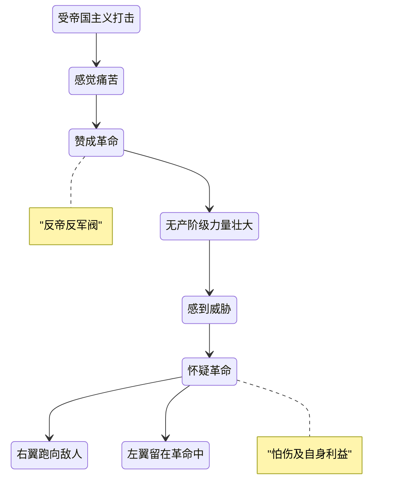
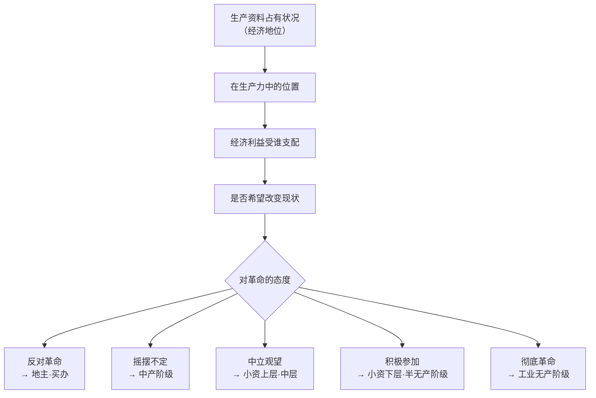

# 中国社会各阶级的关系图谱

> 基于《中国社会各阶级的分析》原文整理  
> 图谱类型：阶级关系与革命态度

---

## 一、总览：敌我光谱

---

## 二、完整阶级关系图

> **图例：** 实线 = 确定关系 · 虚线 = 不确定或分裂关系

---

## 三、小资产阶级内部分化图

原文最细致的观察就在这里——小资产阶级不是铁板一块，而是分为三个经济层次，对应三种政治态度。

---

## 四、中产阶级两面性动态模型

中产阶级（民族资产阶级）的态度不是静态的，而是随革命局势变化的函数：

---

## 五、阶级关系数据表

| 阶级 | 是否敌人 | 是否朋友 | 革命态度 | 经济特征 | 大约占比 |
|------|---------|---------|---------|---------|---------|
| 地主阶级 | ✅ 是 | ❌ 否 | 极端反革命 | 占有土地，靠地租剥削 | 极少数 |
| 买办阶级 | ✅ 是 | ❌ 否 | 反革命 | 帝国主义附庸 | 极少数 |
| 中产阶级 | 右翼是 | 左翼是 | 动摇不定 | 民族工商业/小地主 | 少数 |
| 小资产阶级·上层 | 否 | 弱 | 怀疑 | 有余钱剩米 | 约10% |
| 小资产阶级·中层 | 否 | 可争取 | 中立 | 勉强自给 | 约50% |
| 小资产阶级·下层 | 否 | ✅ 是 | 积极 | 生活下降 | 约40% |
| 半无产阶级 | 否 | ✅ 最接近 | 非常积极 | 半自耕/贫农/小手工业 | 多数 |
| 工业无产阶级 | 否 | ✅ 领导力量 | 最坚决 | 一无所有，产业工人 | 约200万人 |
| 游民无产者 | 不确定 | 不确定 | 双刃剑 | 无业流浪 | 不稳定 |

---

## 六、核心逻辑链

**底层逻辑一句话：** 一个人在当前秩序中是受益者还是受害者，决定了他是否想推翻这个秩序。

---

> 本图谱基于原文内容整理，用 Mermaid 绘制，在 Obsidian 中可自动渲染为可视化图表。
